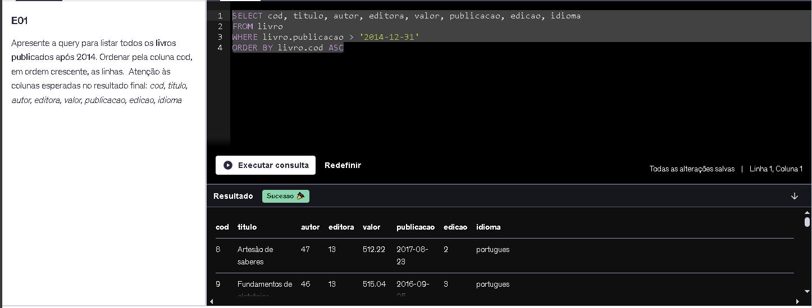
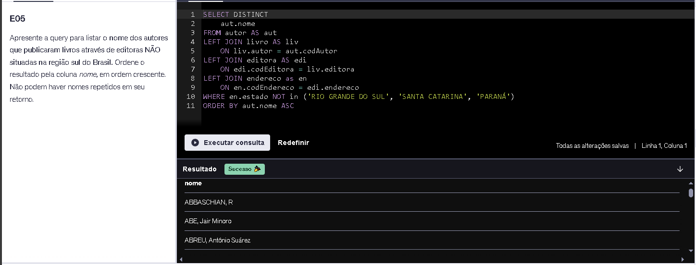
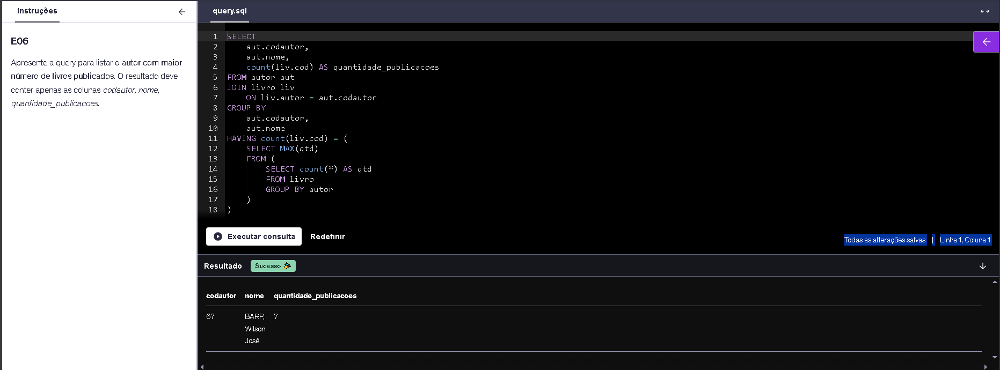
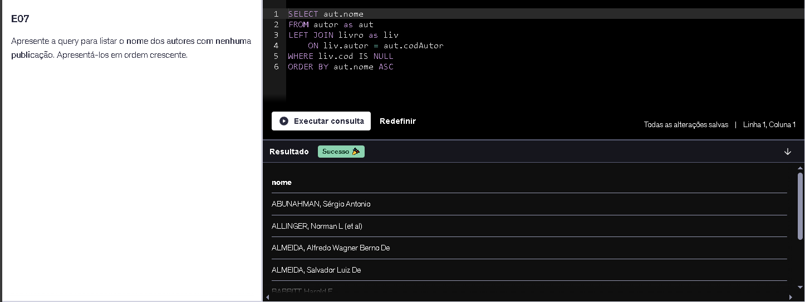

# 📝 Resumo

<div align="center">
 
|<h3 align="center">🔍ÍNDICE</h3>|
|-|
| [SQL para Análise de Dados](#-sql-para-análise-de-dados) |
| [Exercícios](#exercícios) |
| [Evidências](#evidências) |
| [Demais Pastas](#demais-pastas)|

</div>


## 📊 SQL Para Análise de Dados
### 🔧Configuração do ambiente de trabalho
Como meu pgAdmin já estava instalado na minha máquina, eu somente fiz a revisão do que foi passado para ver se não havia ausência de algum fator fundamental para a execução dos futuros exercícios;
### ⌨️ Comandos básicos
A maioria dos comandos, como Select, Where, Order By eu já conhecia, no entanto pude aprender como funcionava o Limit e o Distinct.
- Podemos utilizar o asterísco `*` quando desejamos printar todas as colunas da tabela e seus dados.
- `SELECT` usamos frequentemente na linguagem SQL, serve para selecionarmos colunas de tabelas e mostrar os dados filtrados.
  <details><summary>Exemplo:</summary>

  `SELECT usernames FROM game.users`</details>

- `WHERE` é utilizado em conjunto com o Select e serve para filtrar as linhas da tabela de acordo com a condição que você impõe.
  <details><summary>Exemplo:</summary>
  
  `SELECT email, state FROM sales.customers WHERE state = 'SC'`.
  Dessa forma, somente àqueles que corresponderem com a sigla SC será mostrado.</details>
- `DISTINCT` serve para remover linhas duplicadas, mostrando apenas as linhas que distinguem, evitando que informações se repitam. Utilizado logo após o SELECT. 
  <details><summary>Exemplo:</summary>
  
  `SELECT DISTINCT brand FROM sales.products`.</details>
- `ORDER BY` serve para ordenar de acordo com a regra definida, por exemplo decrescente, crescente e etc.
- `LIMIT` é utilizado para limitar o número de linhas da consulta. Utilizado sempre no final da linha.

Houveram demais informações e detalhes durante as aulas, como: não utilizar virgula antes do FROM e etc. Algo que observei não ser retratado foi que uma boa prática para comandos SQL é utilizar eles em maiúsculo, por exemplo: `SELECT email FROM ...` ao invés de `Select Email FROM ...`, visando a organização e formatação textual, como uma melhor compreensão e praticidade para qualquer desenvolvedor que estiver lendo.

### ➗ Operadores
Temos diversos tipos de operadores, sendo eles **aritméticos, comparação e lógicos**.
Eles servem para executarmos cálculos matemáticos, comparar valores retornando *true* ou *false* e unir expressões simples em uma composta. <br>
São muitos, mas podemos citar alguns como, respectivamente:
- ``` ||, +, -, *, /, ^, %...```
- ``` =, <=, =>, <>, >, <...```
- ``` AND, OR, NOT, IN, ON, LIKE, USING... ```

### 🔁Funções Agregadas
Existem vários tipos de funções agregadas, sendo elas: Count(), Sum(), Min(), Max(), Avg(), Group By e Having.
- `COUNT( )` serve para contabilizar
- `SUM( )` serve para somar
- `MIN( )` pega o menor/calcula o mínimo
- `MAX( )` pega o máximo/calcula o máximo
- `AVG( )` calcula a média
- `GROUP BY`: serve para agrupar os registros semelhantes da coluna. Se usado somente ele, funciona como o DISTINCT
- `HAVING`: serve para filtrar as linhas de seleção por uma coluna já agregadas. Diferente do WHERE que só pode filtrar colunas não agregadas, a função HAVING pode filtrar tanto colunas agregadas como não agregadas.

As funções agregadas não computam células NULL como zero, elas ignoram.

### ⚙️ Join
Existem 4 tipos de Join para serem utilizados no SQL, sendo eles:
- ⟗ `FULL JOIN` pega todos os dados, tanto da tabela da esquerda (tabela declarada primeiro) e tabela da direita (tabela declarada depois).
- ⟕ `LEFT JOIN` pega todos os dados da tabela da esquerda, e da tabela da direita pega somente aqueles correspondentes à tabela da esquerda.
- ⨝ `INNER JOIN` pega a intersecção de dados entre a tabela Left e a tabela Right.
- ⟖ `RIGHT JOIN` pega todos os dados da tabela da direita, mesma coisa do Left Join, porém o contrário.

São mais comumente utilizados o Left Join e o Inner Join. Além disso, baseando-se nesses 4 comandos de Join, podemos conseguir uma variação de até 8 jeitos diferentes de extrair os dados na consulta, como:
`USING, NATURAL JOIN, SELF JOIN, CROSS JOIN, OUTER JOIN`

###  Unions
O comando ``UNION`` serve basicamente para unir uma tabela sobre a outra, desde que tenham a mesma quantidade de colunas e essas colunas sejam do mesmo tipo.
Existe o `UNION ALL` e o `UNION`, sendo sua principal diferença que o UNION ALL não checa e remove as linhas duplicadas.

*É recomendado utilizar somente o UNION ALL quando sabemos que o conteúdo das tabelas são diferentes.*

### 🔀 Subqueries
As Subqueries servem para que possamos consultar os dados de outras consultas que estão embutidas, ou seja, utilizar os resultados de uma query dentro de outra query.
Existem 4 tipos de Subquery, basicamente são no: `WHERE, WITH, FROM e SELECT`.

Alguns pontos de atenção seriam:
- Sempre ao utilizar no WHERE, a Subquery deve retornar apenas um valor, não mais que uma linha ou coluna.
- Subqueries com WITH é muito mais legível e cria como se fosse uma "tabela fantasma"
- Não é recomendado utilizar Subquery no FROM, já que toda subquery no FROM pode ser substituída por uma com WITH
- A Subquery no SELECT é bem pesada, é como se estivesse rodando uma query a cada linha. Algumas vezes é o único jeito de responder uma pergunta, mas é bom evitar usar. Além disso, ela só pode retornar um dado, como no caso do WHERE.

### 🔄 Tratamento de Dados

- **Conversão de Unidades**: <br>
  Existem dois jeitos de conversão (type casting), uma das formas utiliza `::` e na outra a função `CAST()`, basicamente. Existem outras funções, que serão citadas mais a abaixo.
  - Para utilizar o `::`, devemos seguir o seguinte padrão `dado_da_tabela::formato_pretendido`. Exemplo: `112233::text`.
  - Para utilizar o Cast( ), devemos:
    ```SQL
    CAST(dado_seu AS formato_pretendido)

    Exemplo: SELECT CAST(20050124 AS DATE)
    ```

- **Tratamento Geral**:<br>
  Nesta parte utilizamos dois tipos, sendo eles CASE WHEN e COALESCE( )
  - `CASE WHEN` é usado para agrupamento de dados. No primeiro When a condição deve ser verdadeira e qual resultado esperamos caso ela seja verdadeira. A lógica é bem parecida com SWITCH CASE nas linguagens de programação. No CASE WHEN nós utilizamos os operadores lógicos e deve sempre ser finalizado com END.
  - `COALESCE( )` é usado para tratamento de dados nulos. Dentro do COALESCE pode-se colocar uma sequência de valores separados por vírgula. Primeiro, ele verifica qual é o primeiro campo não nulo de uma lista de valores e vai retornando valor por valor que não seja nulo, todos que ele considerar nulo ele vai ignorar e trocando os valores nulos pelo primeiro não nulo dentro do parênteses. 
    <details>
    <summary>
    Exemplo:
    </summary>

      ```SQL
      SELECT nome,
      COALESCE(email, telefone, 'Sem contato') AS contato
      FROM clientes;

      Se email existir → usa email
      senão, se telefone existir → usa telefone
      senão → 'Sem Contato'
      ```
      → Transformando isso:
      |nome|email|telefone|
      |:-:|:-:|:-:|
      |Joao|joao@gmail.com|999-111|
      |Ana|Null|888-222|
      |Carlos|Null|Null|
      
      → Nisso:
      |nome|contato|
      |:-:|:-:|
      |Joao|joao@gmail.com|
      |Ana|888-222|
      |Carlos|Sem Contato|
    </details>
- **Tratamento de Texto**:<br>
LOWER( ), UPPER( ), TRIM( ), REPLACE( ) são algumas das formas de tratamento de texto apresentadas.
  - `LOWER()` basicamente deixa toda a string em minúsculo
  - `UPPER()` deixa toda a string em maiúsculo
  - `TRIM()` retira os espaços em brancos das extremidades de uma string
  - `REPLACE()` substitui a parte da string passada no parâmetro, juntamente com o que queremos colocar no lugar.
    <details>
    <summary>
    Exemplo:
    </summary>

      ```SQL
      REPLACE('SAO PAULO', 'SAO', 'SÃO') = 'SÃO PAULO'
      -- irá retornar TRUE
      ```
    </details>
<br>

- **Tratamento de Datas**:<br>
Existem 4 funções muito utilizadas para tratar datas e horas, sendo elas:
  - `interval()` serve para definir um intervalo específico de tempo, por exemplo, quando você quer somar semanas, meses, horas, anos e etc, ao invés de apenas dias (default).
  - `date_trunc()` trunca as datas, por exemplo, caso queira que "corte" por mês, por ano e etc.
  - `extract()` serve para extrair as unidades de uma data, ou seja, se você quer saber qual dia da semana aquela data se refere, você pode utilizar o extract( ), onde ele retornará um número representativo.
  - `datediff()` calcula a diferença entre datas, mas diferente de apenas utilizar o operador de subtração, utilizar o datediff( ) nos dá a possibilidade e maior clareza de especificar qual diferença queremos que retorne informando o período, por exemplo, a diferença de semanas, meses, anos e etc, só de utilizar strings como *weeks*, *months* e *years*.

- **Funções**:<br>
As funções servem para criarmos comandos personalizados de scripts que serão usados comumente. No entanto, devido à sua complexidade de criação não é algo que usamos com muita frequência, mas quando precisamos é sempre mais prático.

  Para criarmos uma função, precisamos de algumas coisas antes:
  - Definir que tipo de função será e para qual finalidade
  - Criar o escopo da consulta para ter certeza do caminho que irá seguir
  - Definir um nome para ela que torne claro a sua funcionalidade e não traga ambiguidade
  - Definir quais serão as variáveis de entrada passadas por parâmetro e as variáveis de saída

  <details>
  <summary>
  Exemplo Prático:
  </summary>

    ```SQL
    --Escopo
    select datediff('weeks', '2018-06-01', current_date)

    --Função 
    --Modelo: 
      -- nome_da_função(variavel1 tipo1, variavel2 tipo2...) 
      -- RETURNS tipo_da_saida 
      -- LANGUAGE linguagem_selecionada
      -- AS $$ script_query $$

    CREATE FUNCTION datediff(unidade varchar, data_inicial date, data_final date)
    RETURNS integer
    LANGUAGE SQL
    AS $$
      SELECT CASE
        WHEN unidade IN ('d', 'day', 'days') THEN (data_final - data_inicial)
        WHEN unidade IN ('w', 'week', 'weeks') THEN (data_final - data_inicial)/7
        WHEN unidade IN ('m', 'month', 'months') then (data_final - data_inicial)/30
        WHEN unidade IN ('y', 'year', 'years') THEN (data_final - data_inicial)/365
        END AS diferenca
    $$

    --Deletar Função
    DROP FUNCTION nome_da_funcao
    ```
  </details>

### 🔣 Manipulação de Tabelas:
- **Tabelas - Criação e Deleção:**
  <details>
  <summary>
  Existem 2 formas de criar uma tabela:
  </summary>

  - A partir de uma Query: Após fazer a query, utilizamos o comando `INTO` + nome_que_queremos antes do FROM. Após isso, ao invés de sempre termos que fazer uma query para obter o mesmo resultado, podemos simplesmente invocar a tabela com o nome que colocamos.
  - A partir do Zero: Usamos o comando `CREATE TABLE nome_que_queremos(variavel1 tipo 1, variavel2 tipo2,...)`. No entanto, a tabela estará vazia, então para preenchê-la usamos:
    ```SQL
    INSERT INTO nome_que_colocamos(parâmetro1, parâmetro2,...)
    VALUES(valor1, valor1_modificado)(valor2, valor2_modificado...)
    ```
  - Para excluir a tabela usamos `DROP TABLE nome_que_usamos`

<br>

- **Linhas - Inserção, Atualização e Deleção:**
  <details>
  <summary>
  Para inserir linhas, a sintaxe é parecida, utilizamos:
  </summary>

    ```SQL
    INSERT INTO nome_da_tabela(parametro1, parametro2) VALUES (valor1, valor1_modificado...)
    ```
  </details>

  <details>
  <summary>
  Para atualizar alguma informação de uma linha, usamos:
  </summary>

    ```SQL
    UPDATE nome_da_tabela
    SET coluna = dado_modificado 
    WHERE coluna2 = dado_correspondente
    ```
  </details>

  <details>
  <summary>
  Para deletar, usamos:
  </summary>

    ```SQL
    DELETE FROM nome_da_tabela
    WHERE coluna1 = dado_correspondente
    ```
  </details>
<br>

- **Colunas - Inserção, Atualização e Deleção:**<br>
  <details>
  <summary>
  Para inserirmos colunas em uma tabela, usamos:
  </summary>

    ```SQL
    ALTER TABLE nome_da_tabela
    ADD nome_da_coluna tipo_da_coluna
    ```
  </details>

  <details>
  <summary>
  Para atualizarmos/inserirmos dados de uma coluna:
  </summary>
    ```SQL
    UPDATE nome_da_tabela
    SET nome_da_coluna = dado_que_voce_quer
    WHERE true 
    --true serve para quando queremos que todas as linhas sejam atualizadas.
    ```
    </details>

    <details>
    <summary>
    Se quisermos por exemplo atualizar o tipo da coluna ou renomeá-la:
    </summary>

    ```SQL
    --Alterar tipo
    ALTER TABLE nome_da_tabela
    ALTER COLUMN nome_da_coluna type tipo

    --Renomear
    ALTER TABLE nome_da_tabela
    RENAME COLUMN nome_da_coluna TO novo_nome
    ```
    </details>
  Para deletar uma coluna, usamos: `ALTER TABLE nome_da_tabela DROP COLUMN nome_da_coluna`

### 📒 Projeto 1 - Dashboard de Acompanhamento de Vendas
Para a criação do Dashboard, no Excel precisamos definir 3 páginas, sendo elas a janela do Dashboard que puxará os dados da janela dos Resultados e por fim uma janela para documentar as Queries.
Durante a realização do projeto utilizamos todos os conhecimentos adquiridos ao longo do curso para formar um dashboard representativo dos dados, trazendo-os de forma mais visualmente clara.

### 📒 Projeto 2 - Análise de Perfil dos Clientes
No projeto 2 exemplar utilizamos dos mesmos conhecimentos para resolver o problema e representar como gráficos. Os gráficos, como no projeto 1, foram apresentados no Excel e foi dividido da mesma forma as suas páginas.

# Exercícios

### Caso de Estudo Biblioteca
1. <details>
   <summary>
    <a href="./Exercicios/Caso-biblioteca/exercicio1.sql">Resposta Ex1</a>
   </summary>
    
    ```SQL
    SELECT cod, titulo, autor, editora, valor, publicacao, edicao, idioma
    FROM livro
    WHERE livro.publicacao > '2014-12-31'  
    ORDER BY livro.cod ASC
    ```
   </details>

2. <details>
   <summary>
    <a href="./Exercicios/Caso-biblioteca/exercicio2.sql">Resposta Ex2</a>
   </summary>
    
    ```SQL
    SELECT titulo, valor
    FROM livro
    ORDER BY valor DESC
    LIMIT 10
    ```
   </details>

3. <details>
   <summary>
    <a href="../Exercicios/Caso-biblioteca/exercicio3.sql">Resposta Ex3</a>
   </summary>
    
    ```SQL
    SELECT count(liv.cod) as quantidade, edi.nome, en.estado, en.cidade
    FROM livro AS liv
    LEFT JOIN editora AS edi
    ON edi.codEditora = liv.editora
    LEFT JOIN endereco AS en
    ON en.codEndereco = edi.endereco
    GROUP BY edi.codEditora, edi.nome, en.estado, en.cidade
    ORDER BY quantidade DESC
    LIMIT 5
    ```
   </details>

4. <details>
   <summary>
     <a href="./Exercicios/Caso-biblioteca/exercicio4.sql">Resposta Ex4</a>
   </summary>
    
    ```SQL
    SELECT
    nome, codautor,nascimento,
      (SELECT count(*)
      FROM livro
      WHERE autor = codautor) AS quantidade
    FROM autor
    ORDER BY REPLACE(nome, 'Á', 'A');
    ```
   </details>

5. <details>
   <summary>
     <a href="./Exercicios/Caso-biblioteca/exercicio5.sql">Resposta Ex5</a>
   </summary>

   > Também teria o mesmo resultado utilizando o INNER JOIN/JOIN
    
    ```SQL
    SELECT DISTINCT
        aut.nome
    FROM autor AS aut
    LEFT JOIN livro AS liv
        ON liv.autor = aut.codAutor
    LEFT JOIN editora AS edi
        ON edi.codEditora = liv.editora
    LEFT JOIN endereco as en
        ON en.codEndereco = edi.endereco
    WHERE en.estado NOT in ('RIO GRANDE DO SUL', 'SANTA CATARINA', 'PARANÁ')
    ORDER BY aut.nome ASC
    ```
   </details>

6. <details>
   <summary>
     <a href="./Exercicios/Caso-biblioteca/exercicio6.sql">Resposta Ex6</a>
   </summary>
    
    ```SQL
    SELECT
        aut.codautor,
        aut.nome,
        count(liv.cod) AS quantidade_publicacoes
    FROM autor aut
    JOIN livro liv
        ON liv.autor = aut.codautor
    GROUP BY
        aut.codautor,
        aut.nome
    HAVING count(liv.cod) = (
        SELECT MAX(qtd)
        FROM (
            SELECT count(*) AS qtd
            FROM livro
            GROUP BY autor
        )
    )
    ```
   </details>

7. <details>
   <summary>
     <a href="./Exercicios/Caso-biblioteca/exercicio7.sql">Resposta Ex7</a>
   </summary>
    
    ```SQL
    SELECT aut.nome
    FROM autor as aut
    LEFT JOIN livro as liv
        ON liv.autor = aut.codAutor
    WHERE liv.cod IS NULL
    ORDER BY aut.nome ASC
    ```
   </details>

### Caso de Estudo Loja

# Evidências

<details>
<summary>Exercício 1 - Ao resolver o exercicio, foi solicitado para:
</summary>

> "Apresente a query para listar todos os livros publicados após 2014. Ordenar pela coluna cod, em ordem crescente, as linhas.  Atenção às colunas esperadas no resultado final: cod, titulo, autor, editora, valor, publicacao, edicao, idioma"

Deste modo, minha lógica para chegar à resolução foi de primeiro identificar as colunas que eu iria utilizar, usando  o diagrama DER eu fiz o FROM e o SELECT. Após isso, fiz a condição de filtragem usando o WHERE onde só pega datas depois de 31/12/2014, mostrando os resultados ordenados de forma crescente pelo código do livro.<br>
E pode-se confirmar seguindo o link da imagem abaixo.
</details>



<details>
<summary>Exercício 2 - Ao resolver o exercicio, foi solicitado para:
</summary>

> "Apresente a query para listar os 10 livros mais caros. Ordenar as linhas pela coluna valor, em ordem decrescente.  Atenção às colunas esperadas no resultado final:  titulo, valor."

A resolução foi bem simples, para listar os mais caros utilizei um ORDER BY do valor de forma Decrescente e usei LIMIT 10 para só mostrar os 10 mais caros.<br>
E pode-se confirmar seguindo o link da imagem abaixo.
</details>


<details>
<summary>Exercício 3 - Ao resolver o exercicio, foi solicitado para:
</summary>

> "Apresente a query para listar as 5 editoras com mais livros na biblioteca. O resultado deve conter apenas as colunas quantidade, nome, estado e cidade. Ordenar as linhas pela coluna que representa a quantidade de livros em ordem decrescente."

Para a resolução, eu uni as tabelas Livro, Editora e Endereco usando o LEFT JOIN, limitei para 5 com LIMIT, contei todos os livros usando o COUNT( ) e ordenei de forma decrescente e por fim agrupei pelas colunas da tabela Editora e Endereco. Assim mostrando as 5 editoras com mais livros.<br>
E pode-se confirmar seguindo o link da imagem abaixo.
</details>


<details>
<summary>Exercício 4 - Ao resolver o exercicio, foi solicitado para:
</summary>

> "Apresente a query para listar a quantidade de livros publicada por cada autor. Ordenar as linhas pela coluna nome (autor), em ordem crescente. Além desta, apresentar as colunas codautor, nascimento e quantidade (total de livros de sua autoria). Utilize replace."

Para a resolução, fiz a contagem de livro que cada autor tinha utilizando uma subquery no select, onde usei a função COUNT( ), nomeando essa subquery como "quantidade". Apresentei as colunas desejadas e por fim ordenei de forma crescente (por padrão o ASC é opcional), com o complemento do REPLACE( ) para retirar os acentos agudos na letra A das strings.<br>
E pode-se confirmar seguindo o link da imagem abaixo.
</details>


<details>
<summary>Exercício 5 - Ao resolver o exercicio, foi solicitado para:
</summary>

> "Apresente a query para listar o nome dos autores que publicaram livros através de editoras NÃO situadas na região sul do Brasil. Ordene o resultado pela coluna nome, em ordem crescente. Não podem haver nomes repetidos em seu retorno."

Na resolução, a primeira coisa foi colocar o DISTINCT para unicidade dos dados, em seguida uni as tabelas Autor, Livro, Editora e Endereco com o JOIN. Após isso, fiz uma condição de negação lógica para que fosse mostrados todos os autores com livros em editora que não são da região sul (utilizei NOT IN), por fim, ordenei em ordem crescente pelo nome dos autores.<br>
E pode-se confirmar seguindo o link da imagem abaixo.
</details>



<details>
<summary>Exercício 6 - Ao resolver o exercicio, foi solicitado para:
</summary>

> "Apresente a query para listar o autor com maior número de livros publicados. O resultado deve conter apenas as colunas codautor, nome, quantidade_publicacoes".

Utilizei HAVING ao invés de WHERE para caso houvesse algum outro autor que pudesse empatar na maior quantidade de livros com outro autor. Eu fiz a conexão entre as tabelas usando o JOIN e agrupei por codigo do autor e nome, fazendo a contagem também de livros por cada autor. Utilizando o HAVING utilizei o comando `HAVING COUNT(liv.cod) = (...)` para que ele filtrasse apenas os autores que tivessem o resultado da subquery. Dentro dos parênteses que é o ponto chave, fiz uma subquery para selecionar o maior número `SELECT MAX(qtd)` da contagem de `SELECT count(*) AS qtd` da tabela livro agrupada por cada autor. Dessa forma, o Having( ) irá retornar algo como "depois de agrupar por autor,
mantenha apenas os autores que têm exatamente o número máximo de publicações totais".<br>
Não utilizei o WHERE, pois isso caberia utilizar o LIMIT, ao qual num empate decidiria por um dos dois e não os dois (que é o correto).<br>
E pode-se confirmar seguindo o link da imagem abaixo.
</details>



<details>
<summary>Exercício 7 - Ao resolver o exercicio, foi solicitado para:
</summary>

> "Apresente a query para listar o nome dos autores com nenhuma publicação. Apresentá-los em ordem crescente"

Para a resolução, uni as duas tabelas (Livro e Autor) usando o JOIN e condicionei com o WHERE para que somente aqueles autores que tivesse o código do livro como NULL fossem mostrados, ou seja, àqueles com nenhuma publicação. Utilizar o atributo `liv.publicacao` também funcionaria (neste caso), mas o recomendado é utilizar a Primary Key. Depois disso, ordenei crescentemente pelos nomes dos autores.
</details>



## Demais pastas:
**Certificados**: Não houve cursos externos, apenas dentro da Compass Udemy.