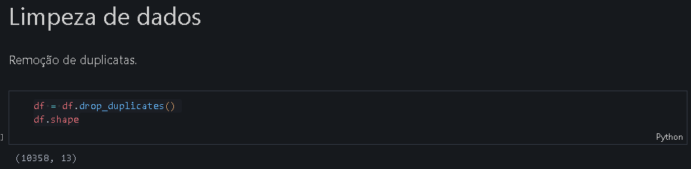
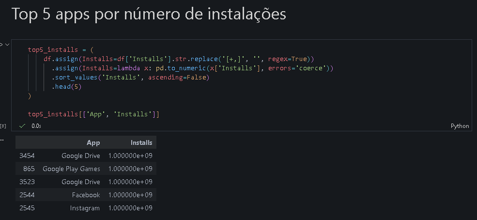
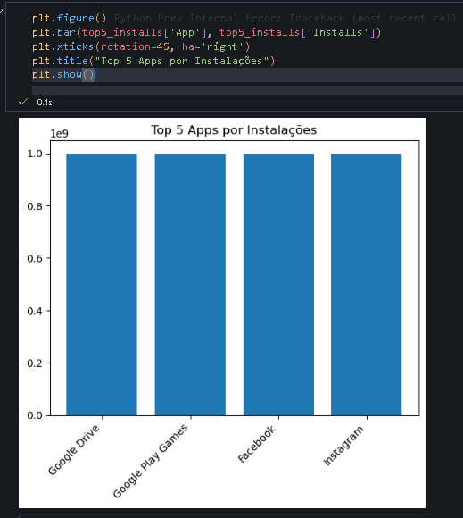
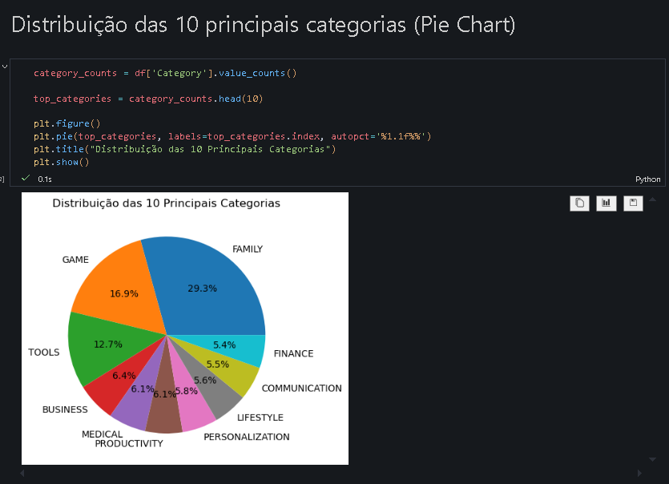
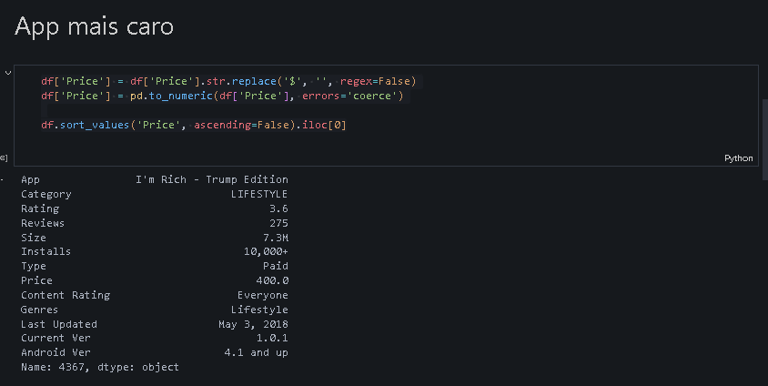
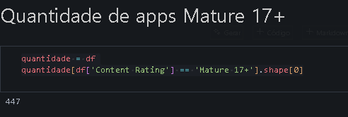
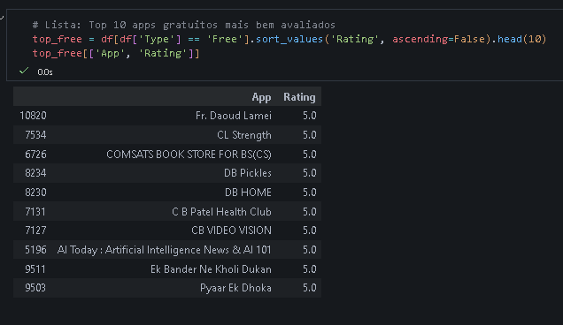
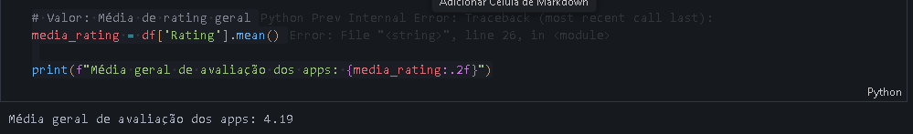
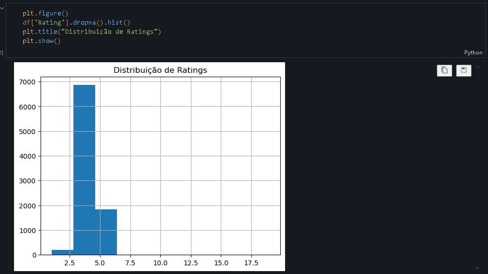
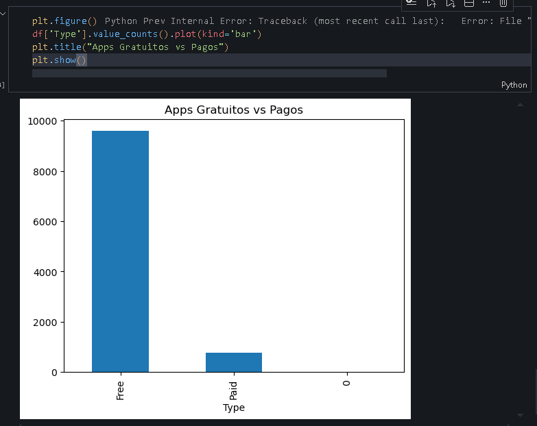

# 📊 Desafio da Sprint – Análise de Dados com Pandas e Matplotlib
## 📌 Visão Geral

Neste desafio, o objetivo foi realizar uma análise exploratória de dados (EDA) utilizando Python, com as bibliotecas Pandas e Matplotlib, a partir de um dataset da [Google Play Store.csv](./googleplaystore.csv).
A proposta envolveu limpeza, tratamento, análise e visualização dos dados, extraindo insights relevantes sobre os aplicativos disponíveis na plataforma.

## 🎯 Objetivo do Desafio

- Explorar um dataset real
- Tratar dados inconsistentes ou mal formatados
- Realizar análises descritivas
- Gerar visualizações gráficas
- Apresentar os resultados de forma clara e interpretável

## ⏬ [Etapas](./desafio.ipynb)

### [Etapa 1](../Evidencias/etapa1-ambiente.png) - Coleta e carregamento dos dados

Nesta etapa, foi realizado o carregamento do dataset da Google Play Store utilizando a biblioteca Pandas, permitindo a manipulação dos dados em formato de DataFrame.

Trecho de código utilizado:
```python
import pandas as pd
import matplotlib.pyplot as plt

df = pd.read_csv("googleplaystore.csv")
df.head()
```
Resultado Obtido: 
Visualização das primeiras linhas do dataset, confirmando que os dados foram carregados corretamente.

### [Etapa 2.1](../Evidencias/etapa2.1-limpeza.png) - Limpeza e tratamento dos dados

Nesta etapa, foram removidos registros duplicados e tratadas colunas que deveriam conter valores numéricos, mas estavam armazenadas como texto.

Trecho de código utilizado:
```python
df = df.drop_duplicates()
df.shape
```
<details><summary>Resultado Obtido:</summary>

Redução do número de registros após a remoção de linhas duplicadas, garantindo maior consistência dos dados.

</details>

### [Etapa 2.2](../Evidencias/etapa2.2-apps_mais_instalacoes.png) - Análise dos aplicativos mais populares

Nesta etapa, foi realizada a identificação dos aplicativos com maior número de instalações.

Trecho de código utilizado:
```python
top5_installs = (
    df.assign(Installs=df['Installs'].str.replace('[+,]', '', regex=True))
      .assign(Installs=lambda x: pd.to_numeric(x['Installs'], errors='coerce'))
      .sort_values('Installs', ascending=False)
      .head(5)
)

top5_installs[['App', 'Installs']]

plt.figure()
plt.bar(top5_installs['App'], top5_installs['Installs'])
plt.xticks(rotation=45, ha='right')
plt.title("Top 5 Apps por Instalações")
plt.show()
```
<details><summary>Resultado Obtido:</summary>

Lista dos cinco aplicativos com maior número de instalações.<br>
O método assign foi utilizado para criar uma versão temporária da coluna Installs já tratada, sem modificar o DataFrame original.


</details>

### [Etapa 2.3](../Evidencias/etapa2.3-principais_categorias.png) - Análise por categoria

Foi analisada a distribuição dos aplicativos por categoria, com o objetivo de identificar quais áreas concentram mais aplicativos.

Trecho de código utilizado:
```python
category_counts = df['Category'].value_counts()

top_categories = category_counts.head(10)

plt.figure()
plt.pie(top_categories, labels=top_categories.index, autopct='%1.1f%%')
plt.title("Distribuição das 10 Principais Categorias")
plt.show()
```
<details><summary>Resultado Obtido:</summary>

Gráfico de pizza mostrando a distribuição percentual das principais categorias.

</details>

### [Etapa 2.4](../Evidencias/etapa2.4-app_mais_caro.png) - Aplicativo mais caro da plataforma

Nesta etapa, foi identificado o aplicativo com maior valor de venda disponível na plataforma.

Trecho de código utilizado:
```python
df['Price'] = df['Price'].str.replace('$', '', regex=False)
df['Price'] = pd.to_numeric(df['Price'], errors='coerce')

df.sort_values('Price', ascending=False).iloc[0]
```
<details><summary>Resultado Obtido:</summary>

Identificação do aplicativo mais caro e seu respectivo preço.

</details>

### [Etapa 2.5](../Evidencias/etapa2.5-apps_mature_17.png) - Classificação etária dos aplicativos

Foi calculada a quantidade de aplicativos classificados como "Mature 17+".

Trecho de código utilizado:
```py
quantidade = df
quantidade[df['Content Rating'] == 'Mature 17+'].shape[0]
```
<details><summary>Resultado Obtido:</summary>

Quantidade total de aplicativos com classificação etária "Mature 17+".

</details>

### [Etapa 2.6](../Evidencias/etapa2.6-top10_reviews.png) - Top 10 apps por número de reviews

```py
df['Reviews'] = pd.to_numeric(df['Reviews'], errors='coerce')

top10_reviews = (df.sort_values('Reviews', ascending=False).head(10))

top10_reviews[['App', 'Reviews']]
```
<details><summary>Resultado Obtido:</summary>

Lista dos 10 aplicativos gratuitos mais bem avaliados.

</details>

## Cálculos e Gráficos Adicionais

### [Top 10 apps gratuitos mais bem avaliados](../Evidencias/top10_apps_free.png)
Nesta etapa, foram selecionados os aplicativos gratuitos com maior média de avaliação.

Trecho de código utilizado:
```py
# Lista: Top 10 apps gratuitos mais bem avaliados
top_free = df[df['Type'] == 'Free'].sort_values('Rating', ascending=False).head(10)
top_free[['App', 'Rating']]
```
<details><summary>Resultado Obtido:</summary>

Lista dos 10 aplicativos gratuitos mais bem avaliados.

</details>

### [Média de Rating Geral dos Apps](../Evidencias/media_rating.png)
Nesta etapa, foi feita a média de rating dos aplicativos no geral.

Trecho de código utilizado:
```py
# Valor: Média de rating geral
media_rating = df['Rating'].mean()
print(f"Média geral de avaliação dos apps: {media_rating:.2f}")
```
<details><summary>Resultado Obtido:</summary>

Valor flutuante da média.

</details>

### [Distribuição de Ratings](../Evidencias/distribuicao_dos_ratings.png)
Nesta parte, foi feita a distribuição das avaliações visualmente em um gráfico de barras.
```py
plt.figure()
df['Rating'].dropna().hist()
plt.title("Distribuição de Ratings")
plt.show()
```
<details><summary>Resultado Obtido:</summary>

Gráfico de Histograma com a quantidade de avaliações e suas notas referentes.

</details>

### [Apps Gratuitos Vs. Apps Pagos](../Evidencias/appsfree_vs_paid.png)
Nesta etapa, foi feito um gráfico para a comparação da quantidade de apps pagos e apps gratuitos.
```py
plt.figure()
df['Type'].value_counts().plot(kind='bar')
plt.title("Apps Gratuitos vs Pagos")
plt.show()
```
<details><summary>Resultado Obtido:</summary>

Gráfico de barras com quantidade de apps pagos e gratuitos.

</details>

## Conclusão

A análise exploratória permitiu identificar padrões interessantes sobre popularidade, avaliações e distribuição dos aplicativos na Google Play Store.  
Além disso, o uso de Pandas possibilitou um tratamento eficiente dos dados, enquanto a biblioteca Matplotlib contribuiu para uma visualização mais clara dos resultados, facilitando a interpretação dos insights obtidos.