# 📝 Resumo
 
## 🔍 Índice
- [Competências Aplicadas](#competências-aplicadas)
- [Curso: Ciência de Dados para Iniciantes com Projetos Reais](#curso-ciência-de-dados-para-iniciantes-com-projetos-reais)
- [Exercícios](#exercícios)
- [Evidências](#evidências)
- [Desafio da Sprint](#desafio-da-sprint)
- [Certificados](#certificados)


## 🧠 Competências aplicadas


## 👨‍🔬 Curso: Ciência de Dados para Iniciantes com Projetos Reais
### Seção 4: Pandas
- **O que é Pandas?**<br>
    É uma biblioteca de código aberto para Python, essencial para análise e manipulação de dados, oferecendo estruturas como DataFrame (tabela) e Series (coluna) que facilitam o trabalho com dados tabulares e séries temporais de forma rápida e intuitiva, sendo um pilar para cientistas de dados e analistas em tarefas como limpeza, transformação e exploração de dados.
- **O que ele faz?**<br>
    Em resumo, o pandas permite carregar, limpar, transformar, agregar e visualizar grandes conjuntos de dados de forma intuitiva e de alto desempenho.
- **Como usá-lo?**<br>
    Para utilizarmos, primeiramente precisamos importar a biblioteca do pandas (`import pandas as pd`), liberando assim diversas funções próprias.
    - Para ler algum arquivo, basta digitar `pd.read` e escolher qual read. 
    - Temos algumas funções que são bastante utilizadas:

    |Função|Execução|Exemplo|
    |:-:|:-:|:-:|
    |`.tail()`|se passarmos por parâmetro um número, ele irá retornar os últimos dos dados.| `dados.tail(8)`
    |`.columns`| Puxa os nomes de todas as colunas | `dados.columns`
    | `.index`| Mostra onde começa a linha (indice) e onde acaba, mostrando também o intervalo (step) | `dados.index`
    |`.iloc[]`| Serve para localizar uma informação através do seu índice respectivo. Também pode ser usado para mostrar dados em um intervalo de índices | `dados.iloc[1:3]`, `dados.iloc[1]`
    |`.loc[]` | Serve para localizar um dado, só que passando o nome da coluna | `dados.loc[dados['Age']==35]`
    |`.sort_values`| Serve para ordenar os valores| `dados.sort_values(['Name', 'Age'], ascending=False)`
    |`to_`| Serve para exportar os dados | `to_csv`, `to_html`, `to_json`...

### Seção 5: Pandas Mod
Nesta seção, pegamos um projeto real para realizarmos a consulta dos dados, utilizando estruturas lógicas (`&, |, ...`) para filtragem, Regular Expressions (`re.I`), além de outros meios de utilizar o `.groupby()`, `.loc[]`, e etc.

### Seção 6: Numpy
- **O que é Numpy?**<br>
    Numpy é uma biblioteca que adiciona suporte para `large`, arrays e matrizes multi-dimensionais com uma grande coleção de funções matemáticas high-level.

- **Por que utilizá-lo?**<br>
    Numpy trabalha com arrays (1D, 2D e 3D) e ele consegue gerenciar e manipular uma grande quantidade de itens/listas de uma forma mais eficiente do que comumente as listas padrões fazem.

- **Como usá-lo?**<br>
    - Primeiramente devemos importar: `import numpy as np`
    - Depois para criarmos arrays utilizamos `variavel = np.array()`
    - Se quisermos saber em qual dimensão ela está (1D, 2D ou 3D) utilizamos `variavel.ndim` ou `variavel.shape`
    - Se quisermos saber o tamanho de bytes utilizado, usamos `variavel.nbytes`
    - Para sabermos o tipo: `variavel.dtype`
    - Para somarmos duas listas usamos `np.add()`
    - Exemplo de Dimensões:
        ```python
        # Array 1D - Uma dimensão
        np.array([1,2,3])

        # Array 2D - Duas dimensões
        np.array([[1,2,3], [4,5,6]])

        # Array 3D - Três dimensões
        np.array([ [[1,2], [3,4]],
                   [[5,6], [7,8]] ])
        ```
### Seção 7: MatPlotLib
- **O que é <a href="https://matplotlib.org/stable/tutorials/index.html">MatPlotLib?</a>**<br>
    Biblioteca responsável por criar gráficos, onde utiliza colunas X e Y, e depois desenha os gráficos de acordo com os dados.<br>
    É possível desenhar gráficos do tipo `Line Plot`, `Multiple Subplots`, `Images`, `Contouring`, `Histograms`, `Paths`, e muitos outros.

- Durante a criação dos gráficos, é possível adicionar legendas (`label=''` + `.legend()`), alterar a visualização das métricas do eixo X e Y, mudar a cor de cada linha juntamente com o formato dela (`'r.--'`, `'y.-'`, ...)
- Utilizando a função `.savefig()` é possível escolher que tipo de figura/imagem você quer salvar o gráfico no final, sendo possível alterar o tamanho, a cor, orientação, se é transparente ou não, e etc.

# ✍ Exercícios
### Seção 6 - Básico
1. <details><summary><a href="./Exercicios/Basico/exercicio1.py">Resposta Ex1</a></summary>
    
    ```python
    a = [1, 4, 9, 16, 25, 36, 49, 64, 81, 100]
    impares = []
    for i in a:
        if i % 2 != 0:
            impares.append(i)
    """
    - OU
    impares = [n for n in a if n % 2 != 0]
    - OU
    impares = list(filter(lambda i: i % 2 != 0, a))
    """
    print(impares)
    ```
   </details>

2. <details><summary><a href="./Exercicios/Basico/exercicio2.py">Resposta Ex2</a></summary>
    
    ```python
    palavras = ['maça', 'arara', 'audio', 'radio', 'radar', 'moto']

    for palavra in palavras:
        reverse = palavra[::-1]
        
        if palavra == reverse:
            print(f"A palavra: {palavra} é um palíndromo")
        else:
            print(f"A palavra: {palavra} não é um palíndromo")
    ```
   </details>

3. <details><summary><a href="./Exercicios/Basico/exercicio3.py">Resposta Ex3</a></summary>
    
    ```python
    primeirosNomes = ['Joao', 'Douglas', 'Lucas', 'José']
    sobreNomes = ['Soares', 'Souza', 'Silveira', 'Pedreira']
    idades = [19, 28, 25, 31]

    pessoas = list(zip(primeirosNomes, sobreNomes, idades))
    for indice, (nome, sobrenome, idade) in enumerate(pessoas):
        print(f'{indice} - {nome} {sobrenome} está com {idade} anos')
    ```
   </details>

4. <details><summary><a href="./Exercicios/Basico/exercicio4.py">Resposta Ex4</a></summary>
    
    ```python
    # Método Funcional
    def remove_duplicados(lista): 
        return list(set(lista))
    lista = ['abc', 'abc', 'abc', '123', 'abc', '123', '123']
    print(remove_duplicados(lista))
    ```
   </details>

5. <details><summary><a href="./Exercicios/Basico/exercicio5.py">Resposta Ex5</a></summary>
    
    ```python
    import json

    with open('person.json', 'r') as arquivo_person:
        texto = arquivo_person.read()
        dados = json.loads(texto)

    print(dados)
    ```
   </details>

6. <details><summary><a href="./Exercicios/Basico/exercicio6.py">Resposta Ex6</a></summary>
    
    ```python
    def my_map(lista, f):
    return list(f(num) for num in lista)

    def exponenciar(num):
        return num ** 2

    inteiros = [1, 2, 3, 4, 5, 6, 7, 8, 9, 10]
    print(my_map(inteiros, exponenciar))
    ```
   </details>

7. <details><summary><a href="./Exercicios/Basico/exercicio7.py">Resposta Ex7</a></summary>
    
    ```python
    with open('arquivo_texto.txt') as file:
    conteudo = file.read()
        
    print(conteudo, end='')
    ```
   </details>

8. <details><summary><a href="./Exercicios/Basico/exercicio8.py">Resposta Ex8</a></summary>
    
    ```python
    def funcao(*args, **kwargs):
        for valor in args:
            print(valor)
        for chave, valor in kwargs.items():
            print(valor)
    funcao(1, 3, 4, 'hello', parametro_nomeado='alguma coisa', x=20)
    ```
   </details>

9. <details><summary><a href="./Exercicios/Basico/exercicio9.py">Resposta Ex9</a></summary>
    
    ```python
    class Lampada:
        def __init__(self, ligada:bool):
            self.ligada = ligada
            
        def liga(self):
            self.ligada = True
        
        def desliga(self):
            self.ligada = False
        
        def esta_ligada(self):
            return self.ligada

    if __name__ == '__main__':
        lampada = Lampada(False)
        lampada.liga()
        print(f'A lâmpada está ligada? {lampada.esta_ligada()}')
        lampada.desliga()
        print(f'A lâmpada está ligada? {lampada.esta_ligada()}')
    ```
   </details>

10. <details><summary><a href="./Exercicios/Basico/exercicio10.py">Resposta Ex10</a></summary>
    
    ```python
    numeros_string = "1,3,4,6,10,76"
    soma = sum(int(n) for n in numeros_string.split(','))
    print(soma)
    ```
   </details>

11. <details><summary><a href="./Exercicios/Basico/exercicio11.py">Resposta Ex11</a></summary>
    
    ```python
    def dividir_lista(lista):
        # Validação: necessário tamanho da lista ser múltiplo de 3
        if len(lista) % 3 != 0:
            raise ValueError("A lista precisa ter tamanho múltiplo de 3")
        # Contando a quantidade de elementos e dividindo por 3
        n = len(lista)//3
        # Retorno: lista em 3 partes
        return lista[:n], lista[n:(2*n)], lista[(2*n):]
        
    lista = [1, 2, 3, 4, 5, 6, 7, 8, 9, 10, 11, 12]
    parte1, parte2, parte3 = dividir_lista(lista)
    print(parte1, parte2, parte3)
    ```
   </details>

12. <details><summary><a href="./Exercicios/Basico/exercicio12.py">Resposta Ex12</a></summary>
    
    ```python
    speed = { 'jan': 47, 
          'feb': 52, 
        'march': 47, 
        'April': 44, 
          'May': 52, 
         'June': 53,  
         'july': 54, 
          'Aug': 44, 
         'Sept': 54}

    valores = list(set(speed.values()))
    print(valores)
    ```
   </details>

13. <details><summary><a href="./Exercicios/Basico/exercicio13.py">Resposta Ex13</a></summary>
    
    ```python
    import random
    random_list = random.sample(range(500), 50)
    random_list = sorted(random_list)
    qtd = len(random_list)

    if qtd % 2 == 1:
        mediana = random_list[qtd // 2]
    else:
        mediana = (random_list[qtd // 2 - 1] + random_list[qtd // 2]) / 2
    media = sum(random_list)/qtd
    valor_minimo = min(random_list)
    valor_maximo = max(random_list)
    print(f'Media: {media}, Mediana: {mediana}, Mínimo: {valor_minimo}, Máximo: {valor_maximo}')
    ```
   </details>

14. <details><summary><a href="./Exercicios/Basico/exercicio14.py">Resposta Ex14</a></summary>
    
    ```python
    a = [1, 0, 2, 3, 5, 8, 13, 21, 34, 55, 89]
    print(a[::-1])
    ```
   </details>

### Seção 7 - Avançado I
15. <details><summary><a href="./Exercicios/Avancado 1/exercicio15.py">Resposta Ex15</a></summary>
    
    ```python
    class Passaro:
        def voar(self):
            print('Voando...')
        def emitir_som(self):
            pass

    class Pato(Passaro):
        def emitir_som(self):
            print("Pato emitindo som...")
            print("Quack Quack")

    class Pardal(Passaro):
        def emitir_som(self):
            print("Pardal emitindo som...")
            print("Piu Piu")
            
    pato = Pato()
    print("Pato")
    pato.voar()
    pato.emitir_som()

    pardal = Pardal()
    print("Pardal")
    pardal.voar()
    pardal.emitir_som()
    ```
   </details>

16. <details><summary><a href="./Exercicios/Avancado 1/exercicio16.py">Resposta Ex16</a></summary>
    
    ```python
    class Pessoa:
        def __init__(self, id):
            self.__nome = None  # atributo privado
            self.id = id        # atributo público
            
        # Getter
        @property
        def nome(self):
            return self.__nome

        # Setter
        @nome.setter
        def nome(self, novo_nome):
            self.__nome = novo_nome
    ```
   </details>

17. <details><summary><a href="./Exercicios/Avancado 1/exercicio17.py">Resposta Ex17</a></summary>
    
    ```python
    class Calculo:
        def soma(self, x, y):
            return x+y
        def subtracao(self, x, y):
            return x-y
    x = 4; y = 5
    calc = Calculo()
    print(f'Somando: {x}+{y} = {calc.soma(x,y)}')
    print(f'Subtraindo: {x}-{y} = {calc.subtracao(x,y)}')
    ```
   </details>

18. <details><summary><a href="./Exercicios/Avancado 1/exercicio18.py">Resposta Ex18</a></summary>
    
    ```python
    class Ordenadora:
        def __init__(self, listaBaguncada):
            self.listaBaguncada = listaBaguncada
        
        def ordenacaoCrescente(self):
            return sorted(self.listaBaguncada)
            
        def ordenacaoDecrescente(self):
            return sorted(self.listaBaguncada, reverse=True)
        
    crescente = Ordenadora([3,4,2,1,5])
    decrescente = Ordenadora([9,7,6,8])
    print(crescente)
    print(decrescente)
    ```
   </details>

19. <details><summary><a href="./Exercicios/Avancado 1/exercicio19.py">Resposta Ex19</a></summary>
    
    ```python
    class Aviao:
        def __init__(self, modelo, velocidade_maxima, capacidade, cor='azul'):
            self.modelo            = modelo
            self.velocidade_maxima = str(velocidade_maxima) + ' km/h'
            self.cor               = cor
            self.capacidade        = capacidade

    aeroporto = [Aviao('BOIENG456', 1500, 400), 
                Aviao('Ebraer Praetor 600', 863, 14), 
                Aviao('Antonov An-2', 258, 12)]
    for aviao in aeroporto:
        print(f'O avião de modelo {aviao.modelo} possui uma velocidade máxima de {aviao.velocidade_maxima}, capacidade para {aviao.capacidade} e é da cor {aviao.cor}')
    ```
   </details>
   
### Seção 8 - Avançado II
20. <details><summary><a href="./Exercicios/Avancado 2/exercicio20.py">Resposta Ex20</a></summary>
    
    ```python
    with open("number.txt") as file:
        top5 = sorted(
            filter(lambda x: x % 2 == 0, map(int, file)),  # Converte para int e filtra pares
            reverse=True                                   # Ordena do maior para o menor
            )[:5]                                          # Pega os 5 primeiros (índices 0 a 4)

    print(top5)
    print(sum(top5))
    ```
   </details>

21. <details><summary><a href="./Exercicios/Avancado 2/exercicio21.py">Resposta Ex21</a></summary>
    
    ```python
    def conta_vogais(texto:str)-> int:
        return len( list( filter( lambda x: x.lower() in 'aeiou', texto ) ) )

    conta_vogais('texto')
    ```
   </details>

22. <details><summary><a href="./Exercicios/Avancado 2/exercicio22.py">Resposta Ex22</a></summary>
    
    ```python
    from functools import reduce
    def calcula_saldo(lancamentos) -> float:
        valores = map(lambda l: l[0] 
                                if l[1].lower()=='c' 
                                else -l[0],
                    lancamentos)
        return reduce(lambda total, v: total + v, valores, 0)
        

    lancamentos = [
        (200,'D'),
        (300,'C'),
        (100,'C')
    ]
    ```
   </details>

23. <details><summary><a href="./Exercicios/Avancado 2/exercicio23.py">Resposta Ex23</a></summary>
    
    ```python
    def calcular_valor_maximo(operadores, operandos):
        # Dictionary Operacoes
        operacoes = {
            '+': lambda a, b: a + b,
            '-': lambda a, b: a - b,
            '*': lambda a, b: a * b,
            '/': lambda a, b: a / b,
            '%': lambda a, b: a % b
        }
        
        resultados = map(lambda op: operacoes[op[0]](op[1][0], op[1][1]),
                    zip(operadores, operandos))

        return max(resultados)

    operadores = ['+','-','*','/','+']
    operandos  = [(3,6), (-7,4.9), (8,-8), (10,2), (8,4)]

    print(calcular_valor_maximo(operadores, operandos))  # saída: 12
    ```
   </details>

24. <details><summary><a href="./Exercicios/Avancado 2/exercicio24.py">Resposta Ex24</a></summary>
    
    ```python
    import csv
    with open('estudantes.csv', 'r') as arquivo_estudantes:
        linhas = arquivo_estudantes.read().splitlines()
            
    processar = lambda linha: ( linha.split(',')[0],                 
                                list(map(float, linha.split(',')[1:] 
                            )))      
    dados = list(map(processar, linhas))                        
    dados = sorted(dados, key=lambda x: x[0])                   

    # processa cada estudante e imprime o resultado
    for nome, notas in dados:
        top3 = list(map(int, sorted(notas, reverse=True)[:3]))  
        media = round(sum(top3) / 3, 2)                         
        print(f"Nome: {nome} Notas: {top3} Média: {media}")
    ```
   </details>

25. <details><summary><a href="./Exercicios/Avancado 2/exercicio25.py">Resposta Ex25</a></summary>
    
    ```python
    def maiores_que_media(conteudo:dict)->list:
        valores = list(map(lambda x: x[1], conteudo.items()))
        media = sum(valores) / len(valores)
        maiores = filter(lambda item: item[1] > media, conteudo.items())
        return sorted(list(maiores), key=lambda x: x[1])

    conteudo = {
                "arroz":    4.99,
                "feijão":   3.49,
                "macarrão": 2.99,
                "leite":    3.29,
                "pão":      1.99
                }

    print(maiores_que_media(conteudo))
    ```
   </details>

26. <details><summary><a href="./Exercicios/Avancado 2/exercicio26.py">Resposta Ex26</a></summary>
    
    ```python
    def pares_ate(n:int):
        return (i for i in range(2,n+1,2))
    ```
   </details>

### Seção 9 - ETL

27. <details><summary><a href="./Exercicios/ETL/etapa-1.py">Resposta: 3.1 - Etapa 1</a></summary>

    - **Enunciado**:
        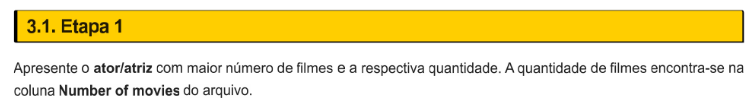

    - **Resposta**:
        ```py
        with open("Sprint 4/Exercicios/ETL/actors.csv") as actors_file:
            linhas = actors_file.read().splitlines()[1:]

        processar = lambda linha: (linha.rsplit(',', 5)[0],         # nome do ator
                                int(linha.rsplit(',', 5)[2]))    # número de filmes
        dados  = list(map(processar, linhas))
        ator_mais_filmes = max(dados, key=lambda x: x[1])

        with open("Sprint 4/Exercicios/ETL/etapa-1.txt", "w", encoding="utf-8") as arquivo_saida:
            print(f"O ator que mais possui filmes no dataset é {ator_mais_filmes[0]}, com {ator_mais_filmes[1]} filmes.", file=arquivo_saida)
        ```

    - **Resultado**:
    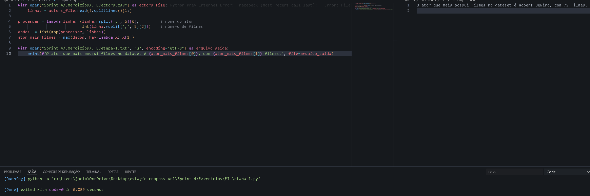
        > O ator que mais possui filmes no dataset é Robert DeNiro, com 79 filmes.
</details>

28. <details><summary><a href="./Exercicios/ETL/etapa-2.py">Resposta: 3.2 - Etapa 2</a></summary>

    - **Enunciado**:
        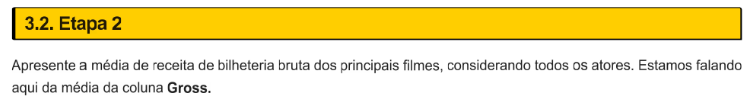

    - **Resposta**:
        ```py
        with open("Sprint 4/Exercicios/ETL/actors.csv") as actors_file:
            linhas = actors_file.read().splitlines()[1:]

        gross = map(
                    lambda linha: float(linha.rsplit(',', 5)[5]), 
                                        linhas
        )

        media = sum(gross) / len(linhas)

        with open("Sprint 4/Exercicios/ETL/etapa-2.txt", "w", encoding="utf-8") as arquivo_saida:
            print(f"O valor médio de receita bruta dos principais filmes são de U$ {media:.2f} milhões de dólares.", file=arquivo_saida)
        ```

    - **Resultado**:
    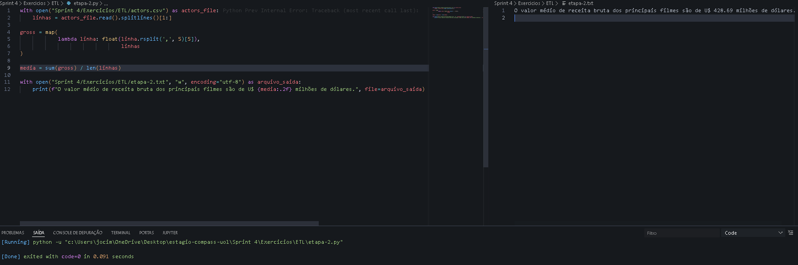
        > O valor médio de receita bruta dos principais filmes são de U$ 428.69 milhões de dólares.
</details>

29. <details><summary><a href="./Exercicios/ETL/etapa-3.py">Resposta: 3.3 - Etapa 3</a></summary>

    - **Enunciado**:
        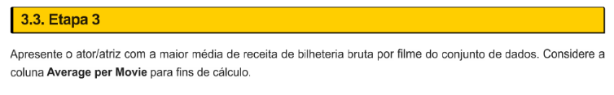

    - **Resposta**:
        ```py
        with open("Sprint 4/Exercicios/ETL/actors.csv") as actors_file:
            linhas = actors_file.read().splitlines()[1:]

        dados = map(
                    lambda linha: (
                                    linha.rsplit(',', 5)[0], float(linha.rsplit(',', 5)[3])
                                ),
                    linhas
                    )
        ator, maior_media = max(dados, key=lambda x: x[1])
        with open("Sprint 4/Exercicios/ETL/etapa-3.txt", "w", encoding="utf-8") as arquivo_saida:
            print(f"O ator/atriz com maior média de receita bruta por filme é {ator} com média de {maior_media:.2f}", file=arquivo_saida)
        ```

    - **Resultado**:
    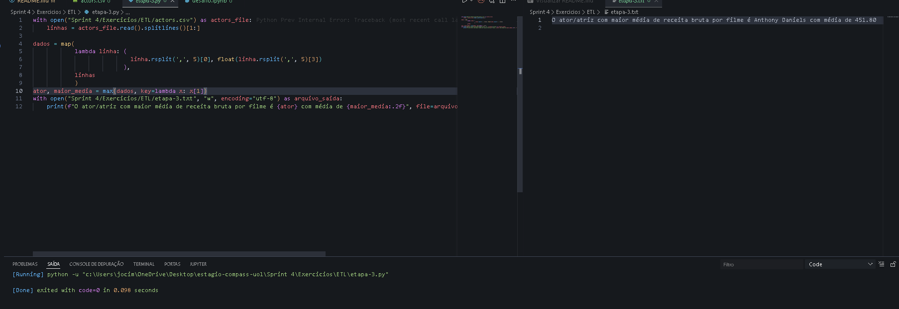
        > O valor médio de receita bruta dos principais filmes são de U$ 428.69 milhões de dólares.
</details>

30. <details><summary><a href="./Exercicios/ETL/etapa-4.py">Resposta: 3.4 - Etapa 4</a></summary>

    - **Enunciado**:
        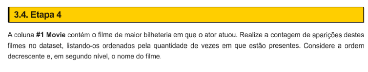

    - **Resposta**:
        ```py
        with open("Sprint 4/Exercicios/ETL/actors.csv") as actors_file:
            linhas = actors_file.read().splitlines()[1:] 

        contagem = {}
        for linha in linhas:
            filme = linha.rsplit(',', 5)[4]
            contagem[filme] = contagem.get(filme, 0) + 1

        resultado = sorted( contagem.items(), key=lambda x: (-x[1], x[0])) # usar -x[1] força a ordem decrescente da quantidade por meio da negação matemática
        with open("Sprint 4/Exercicios/ETL/etapa-4.txt", "w", encoding="utf-8") as arquivo_saida:
            for filme, qtd in resultado:
                print(f"O filme {filme} aparece {qtd} vez(es) no dataset.", file=arquivo_saida)
        ```

    - **Resultado**:
    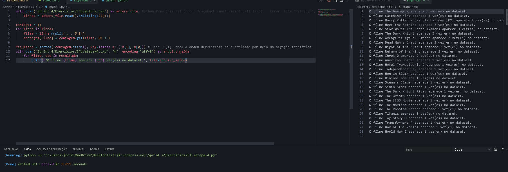
        > O filme The Avengers aparece 6 vez(es) no dataset.<br>
        O filme Catching Fire aparece 4 vez(es) no dataset.<br>
        O filme Harry Potter / Deathly Hallows (P2) aparece 4 vez(es) no dataset.<br>
        O filme Meet the Fockers aparece 3 vez(es) no dataset.<br>
        O filme Star Wars: The Force Awakens aparece 3 vez(es) no dataset.<br>
        O filme The Dark Knight aparece 3 vez(es) no dataset.<br>
        O filme Avengers: Age of Ultron aparece 2 vez(es) no dataset.<br>
        O filme Dead Man's Chest aparece 2 vez(es) no dataset.<br>
        O filme Night at the Museum aparece 2 vez(es) no dataset.<br>
        O filme Return of the King aparece 2 vez(es) no dataset.<br>
        O filme Shrek 2 aparece 2 vez(es) no dataset.<br>
        O filme American Sniper aparece 1 vez(es) no dataset.<br>
        O filme Hotel Transylvania 2 aparece 1 vez(es) no dataset.<br>
        O filme Independence Day aparece 1 vez(es) no dataset.<br>
        O filme Men in Black aparece 1 vez(es) no dataset.<br>
        O filme Minions aparece 1 vez(es) no dataset.<br>
        O filme Ocean's Eleven aparece 1 vez(es) no dataset.<br>
        O filme Sixth Sense aparece 1 vez(es) no dataset.<br>
        O filme The Dark Knight Rises aparece 1 vez(es) no dataset.<br>
        O filme The Grinch aparece 1 vez(es) no dataset.<br>
        O filme The LEGO Movie aparece 1 vez(es) no dataset.<br>
        O filme The Martian aparece 1 vez(es) no dataset.<br>
        O filme The Phantom Menace aparece 1 vez(es) no dataset.<br>
        O filme Titanic aparece 1 vez(es) no dataset.<br>
        O filme Toy Story 3 aparece 1 vez(es) no dataset.<br>
        O filme Transformers 4 aparece 1 vez(es) no dataset.<br>
        O filme War of the Worlds aparece 1 vez(es) no dataset.<br>
        O filme World War Z aparece 1 vez(es) no dataset.<br>
</details>

31. <details><summary><a href="./Exercicios/ETL/etapa-5.py">Resposta: 3.5 - Etapa 5</a></summary>

    - **Enunciado**:
        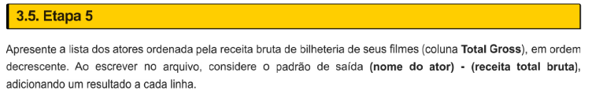

    - **Resposta**:
        ```py
        with open("Sprint 4/Exercicios/ETL/actors.csv", encoding="utf-8") as actors_file:
            linhas = actors_file.read().splitlines()[1:]
        atores = map(
            lambda linha: (linha.split('"')[1] if linha.startswith('"') else linha.split(',', 1)[0],
                            float(linha.rsplit(",", 5)[1]
                            .replace('"', '')
                            .strip())),
                            linhas)

        atores_ordenados = sorted(atores, key=lambda x: x[1], reverse=True)
        with open("Sprint 4/Exercicios/ETL/etapa-5.txt", "w", encoding="utf-8") as arquivo_saida:
            for nome, total in atores_ordenados:
                arquivo_saida.write(f"{nome} - {total}\n")
        ```

    - **Resultado**:
    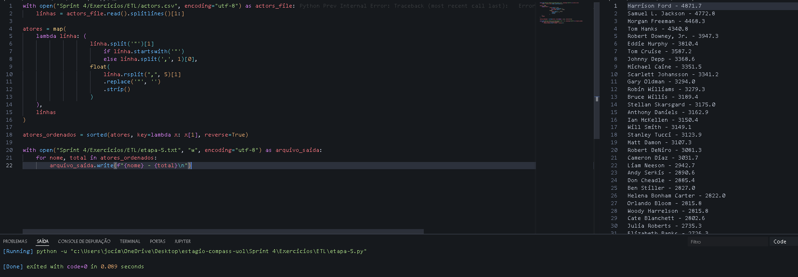
        > Harrison Ford - 4871.7<br>
        Samuel L. Jackson - 4772.8<br>
        Morgan Freeman - 4468.3<br>
        Tom Hanks - 4340.8<br>
        Robert Downey, Jr. - 3947.3<br>
        Eddie Murphy - 3810.4<br>
        Tom Cruise - 3587.2<br>
        Johnny Depp - 3368.6<br>
        Michael Caine - 3351.5<br>
        Scarlett Johansson - 3341.2<br>
        Gary Oldman - 3294.0<br>
        Robin Williams - 3279.3<br>
        Bruce Willis - 3189.4<br>
        Stellan Skarsgard - 3175.0<br>
        Anthony Daniels - 3162.9<br>
        Ian McKellen - 3150.4<br>
        Will Smith - 3149.1<br>
        Stanley Tucci - 3123.9<br>
        Matt Damon - 3107.3<br>
        Robert DeNiro - 3081.3<br>
        Cameron Diaz - 3031.7<br>
        Liam Neeson - 2942.7<br>
        Andy Serkis - 2890.6<br>
        Don Cheadle - 2885.4<br>
        Ben Stiller - 2827.0<br>
        Helena Bonham Carter - 2822.0<br>
        Orlando Bloom - 2815.8<br>
        Woody Harrelson - 2815.8<br>
        Cate Blanchett - 2802.6<br>
        Julia Roberts - 2735.3<br>
        Elizabeth Banks - 2726.3<br>
        Ralph Fiennes - 2715.3<br>
        Emma Watson - 2681.9<br>
        Tommy Lee Jones - 2681.3<br>
        Brad Pitt - 2680.9<br>
        Adam Sandler - 2661.0<br>
        Daniel Radcliffe - 2634.4<br>
        Jonah Hill - 2605.1<br>
        Owen Wilson - 2602.3<br>
        Idris Elba - 2580.6<br>
        Bradley Cooper - 2557.7<br>
        Mark Wahlberg - 2549.8<br>
        Jim Carrey - 2545.2<br>
        Dustin Hoffman - 2522.1<br>
        Leonardo DiCaprio - 2518.3<br>
        Jeremy Renner - 2500.3<br>
        Philip Seymour Hoffman - 2463.7<br>
        Sandra Bullock - 2462.6<br>
        Chris Evans - 2457.8<br>
        Anne Hathaway - 2416.5<br>
</details>

# 👁‍🗨 Evidências
<details><summary>Exercícios Básico</summary>

<details><summary>Exercício 1 - Ao resolver o exercicio, foi solicitado para:</summary>

  > "Dada a seguinte lista: a = [1, 4, 9, 16, 25, 36, 49, 64, 81, 100]<br>Faça um programa que gere uma nova lista contendo apenas números ímpares. "

  Neste exercício, havia 3 formas diferentes de fazê-lo, como mostra na imagem abaixo. No entanto, visando desempenho, claramente a lógica funcional se adequaria melhor. Para resolver, eu comecei utilizando a linguagem funcional, filtrando os números ímpares através da função anônima lambda que fazia a verificação dos números com resto diferente de 0 ao serem divididos por 2, passando então num formato de lista para uma variável (ímpares).
  </details>

  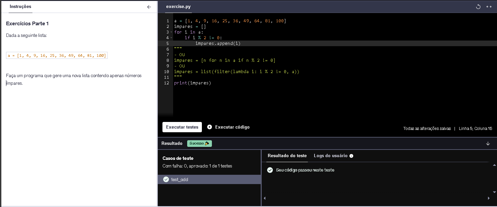

<details><summary>Exercício 2 - Ao resolver o exercicio, foi solicitado para:</summary>

  > "Verifique se cada uma das palavras da lista ['maça', 'arara', 'audio', 'radio', 'radar', 'moto'] é ou não um palíndromo.<br> Obs: Palíndromo é uma palavra que permanece igual se lida de traz pra frente. "

  Neste exercício, utilizei um `for` para percorrer a lista que continha as palavras e reverti a lista através de uma sintaxe básica `[::-1]`, após isso, fiz a comparação com a variável auxiliar que estava à percorrer a lista de palavras, caso fossem idênticas, ou seja sem alteração, retornava que era um palíndromo.
  </details>

  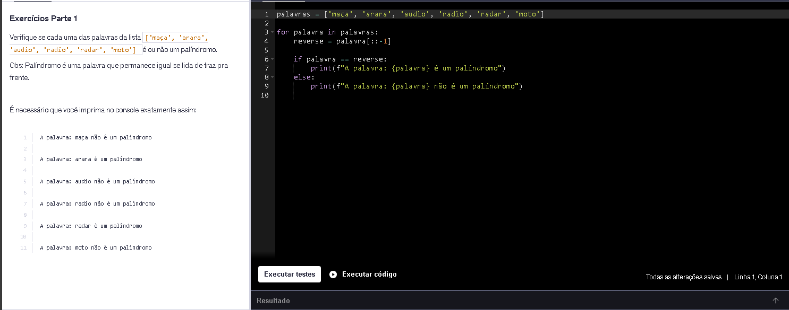

<details><summary>Exercício 3 - Ao resolver o exercicio, foi solicitado para:</summary>

  > "Faça um programa que imprima o dados na seguinte estrutura: "índice - primeiroNome sobreNome está com idade anos"

  Neste exercício, utilizei a função `zip()` para unir três listas relacionadas pelo mesmo índice, gerando tuplas com os dados correspondentes. Em seguida, converti o resultado em uma lista. Por fim, percorri essa lista com um `for`, utilizando enumerate para associar cada elemento ao seu respectivo índice.
  </details>

  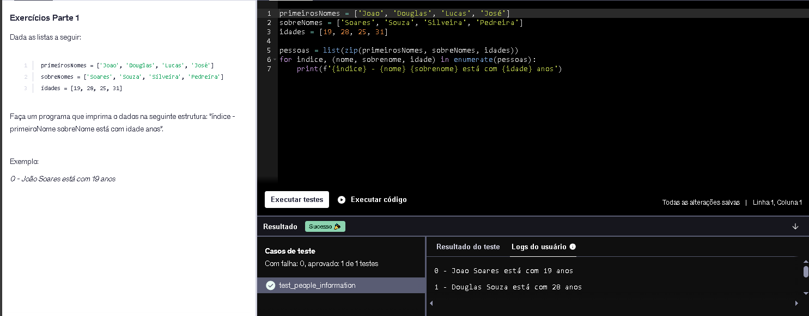

<details><summary>Exercício 4 - Ao resolver o exercicio, foi solicitado para:</summary>

  > "Escreva uma função que recebe uma lista e retorna uma nova lista sem elementos duplicados. Utilize a lista a seguir para testar sua função.<br>['abc', 'abc', 'abc', '123', 'abc', '123', '123']"

  Neste exercício, utilizei a função `set()` para transformar a lista em um conjunto, eliminando automaticamente os elementos duplicados. Em seguida, converti esse conjunto novamente em uma lista.
  </details>

  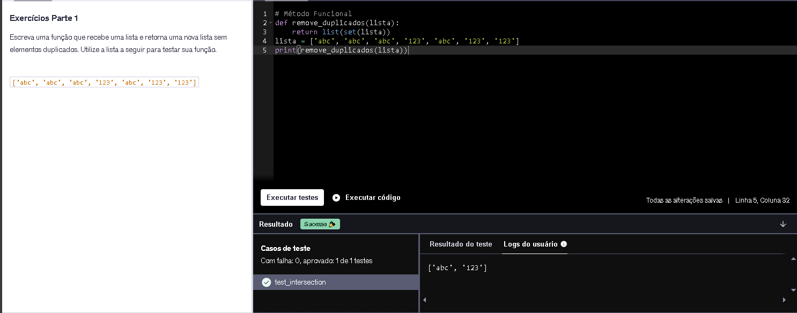

<details><summary>Exercício 5 - Ao resolver o exercicio, foi solicitado para:</summary>

  > "Leia o arquivo person.json, faça o parsing e imprima seu conteúdo"

  Neste exercício, utilizei a biblioteca `json` para manipular o arquivo `person.json`. Utilizando o `WITH open()` para abrir o arquivo de forma segura, garantindo seu fechamento automático. Em seguida, inseri as funções `.read()` para a leitura do mesmo e converti o conteúdo JSON em um objeto python utilizando o `json.loads()`.
  </details>

  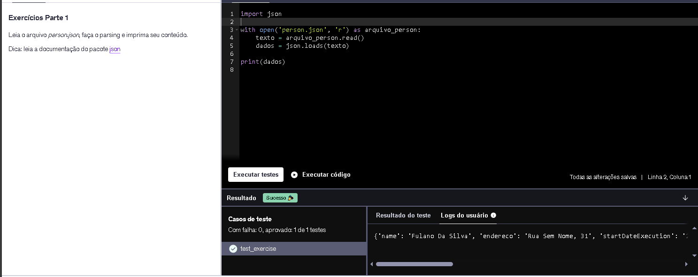

<details><summary>Exercício 6 - Ao resolver o exercicio, foi solicitado para:</summary>

  > "Implemente a função my_map(list, f) que recebe uma lista como primeiro argumento e uma função como segundo argumento. Esta função aplica a função recebida para cada elemento da lista recebida e retorna o resultado em uma nova lista."

  Neste exercício, apliquei conceitos de programação funcional ao criar uma função semelhante ao map. Utilizei uma expressão geradora para percorrer a lista e aplicar a função exponenciar a cada elemento, retornando o resultado em uma nova lista.
  </details>

  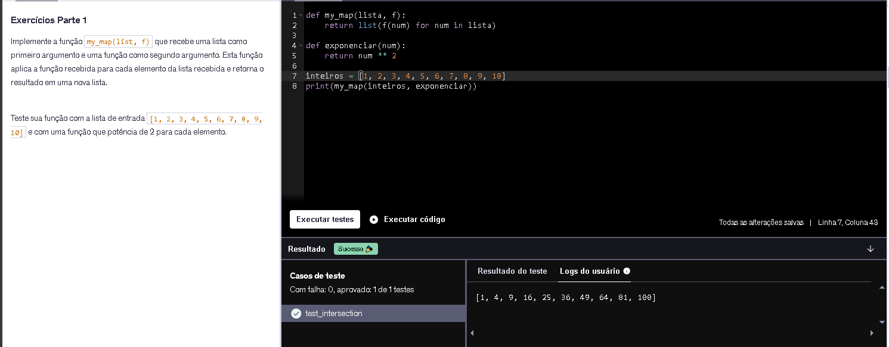

<details><summary>Exercício 7 - Ao resolver o exercicio, foi solicitado para:</summary>

  > "Escreva um programa que lê o conteúdo do arquivo texto arquivo_texto.txt e imprime o seu conteúdo."

  Neste exercício, utilizei o `with` para abrir o arquivo `arquivo_texto.txt` e a função `.read()` para fazer a leitura de seu conteúdo.
  </details>

  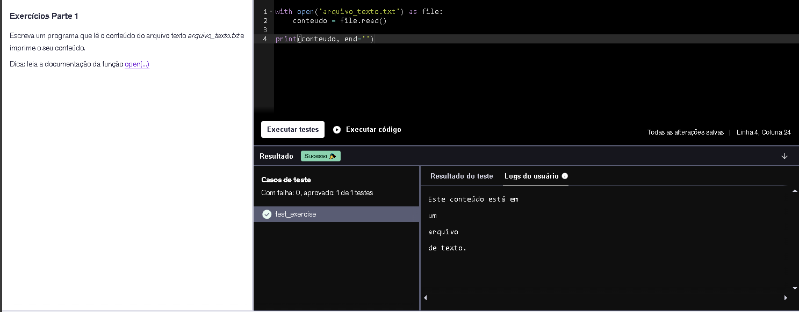

<details><summary>Exercício 8 - Ao resolver o exercicio, foi solicitado para:</summary>

  > "Escreva uma função que recebe um número variável de parâmetros não nomeados e um número variado de parâmetros nomeados e imprime o valor de cada parâmetro recebido."

  Neste exercício, utilizei o conceito de múltiplos parâmetros posicionais e nomeados (`*args`, `**kwargs`) e imprimi seus conteúdos utilizando um `for` normal e um `for` com a função `.items()` para pegar os elementos do dicionário.
  </details>

  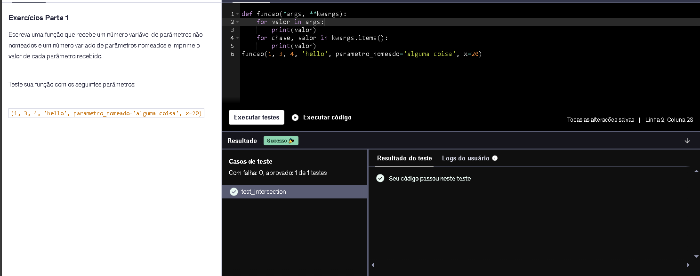

<details><summary>Exercício 9 - Ao resolver o exercicio, foi solicitado para:</summary>

  > "Implemente a classe Lampada. A classe Lâmpada recebe um booleano no seu construtor, Truese a lâmpada estiver ligada, False caso esteja desligada. A classe Lampada possuí os seguintes métodos:<br>liga(): muda o estado da lâmpada para ligada<br>desliga(): muda o estado da lâmpada para desligada<br>esta_ligada(): retorna verdadeiro se a lâmpada estiver ligada, falso caso contrário"

  Neste exercício, criei a classe Lâmpada e defini seus métodos `liga(), desliga()` e `esta_ligada()`.
  </details>

  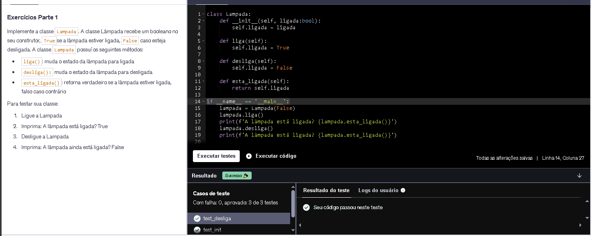

<details><summary>Exercício 10 - Ao resolver o exercicio, foi solicitado para:</summary>

  > "Escreva uma função que recebe uma string de números separados por vírgula e retorne a soma de todos eles. Depois imprima a soma dos valores.<br>A string deve ter valor  "1,3,4,6,10,76""

  Neste exercício, para realizar a soma dos valores na string, utilizei a função `.split()` para transformar cada "pedaço" da string em um elemento.
  </details>

  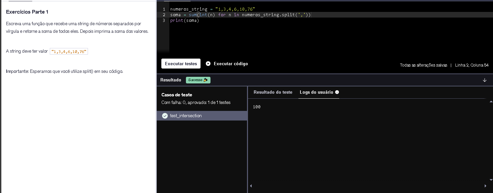

<details><summary>Exercício 11 - Ao resolver o exercicio, foi solicitado para:</summary>

  > "Escreva uma função que recebe como parâmetro uma lista e retorna 3 listas: a lista recebida dividida em 3 partes iguais. Teste sua implementação com a lista abaixo<br>lista = [1, 2, 3, 4, 5, 6, 7, 8, 9, 10, 11, 12]""

  Neste exercício, para dividir a lista eu calculei o tamanho da lista usando o `len()` e dividi por inteiro o seu tamanho, sendo possível sempre dividi-la por 3, independente da sua quantidade de elementos. 
  Para retornar as listas divididas em 3 partes, fiz 3 returns.
  </details>

  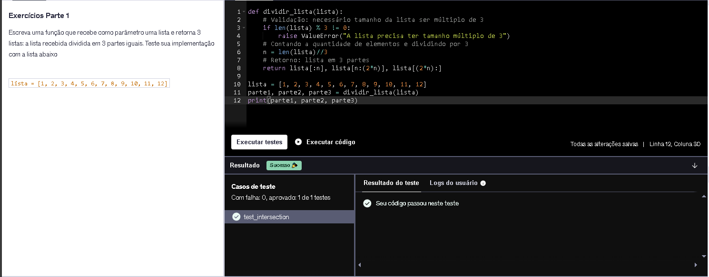

<details><summary>Exercício 12 - Ao resolver o exercicio, foi solicitado para:</summary>

  > "Dado o dicionário a seguir:<br>speed = {'jan':47, 'feb':52, 'march':47, 'April':44, 'May':52, 'June':53, 'july':54, 'Aug':44, 'Sept':54}<br>Crie uma lista com todos os valores (não as chaves!) e coloque numa lista de forma que não haja valores duplicados.""

  Neste exercício, utilizei a função `set()` para eliminar valores duplicados do dicionário, a partir de `speed.values()`. Em seguida, converti o conjunto resultante em uma lista usando `list()`.
  </details>

  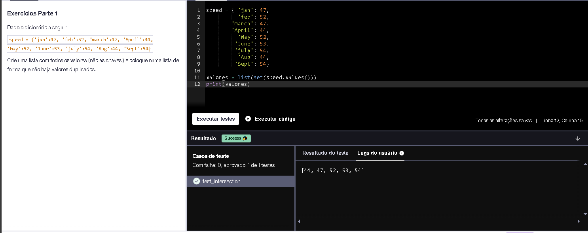

<details><summary>Exercício 13 - Ao resolver o exercicio, foi solicitado para:</summary>

  > "Calcule o valor mínimo, valor máximo, valor médio e a mediana da lista gerada na célula abaixo:""

  Neste exercício, para calcular os valores, ordenei a lista com `sorted()` e utilizei funções como `sum()`, `min()`, `max()`.
  </details>

  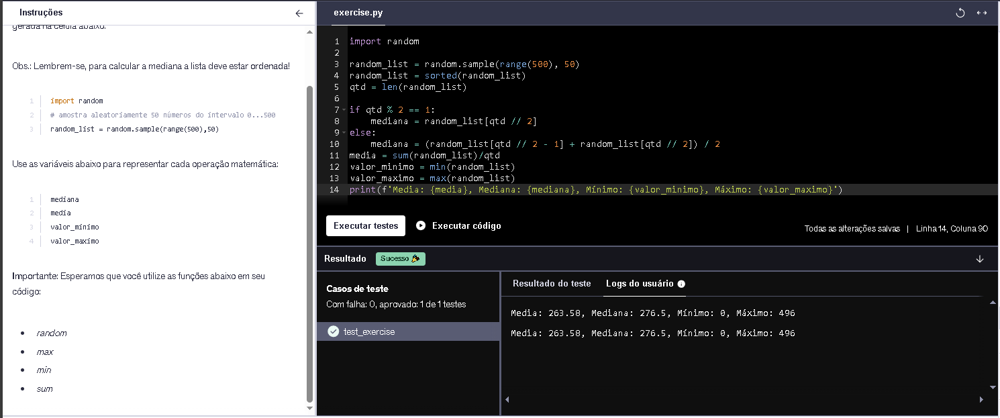

<details><summary>Exercício 14 - Ao resolver o exercicio, foi solicitado para:</summary>

  > "Imprima a lista abaixo de trás para frente.<br>a = [1, 0, 2, 3, 5, 8, 13, 21, 34, 55, 89]"

  Neste exercício, para imprimir a lista utilizei um slice com passo negativo, percorrendo a sequência inteira de trás pra frente.
  </details>

  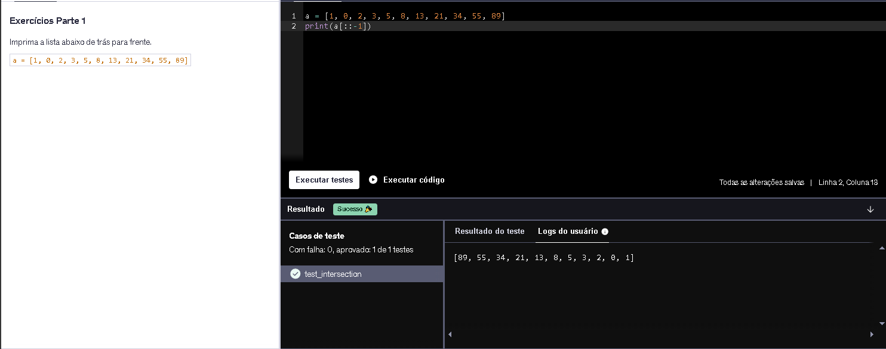

</details><br>

<details><summary>Exercícios Avançado I</summary>

<details><summary>Exercício 15 - Ao resolver o exercicio, foi solicitado para:</summary>

  > "Imprima a lista abaixo de trás para frente.<br>a = [1, 0, 2, 3, 5, 8, 13, 21, 34, 55, 89]"

  Neste exercício, criei a classe Passaro e defini os métodos `voar()` e `emitir_som()` na qual continha apenas uma instrução `pass`, pois a verdadeira implementação dessas funcionalidades ocorreriam nas classes filhas Pato e Pardal.
  </details>

  

<details><summary>Exercício 16 - Ao resolver o exercicio, foi solicitado para:</summary>

  > "Crie uma classe chamada Pessoa, com um atributo privado chamado nome (declarado internamente na classe como __nome) e um atributo público de nome id.<br>Adicione dois métodos à classe, sendo um para definir o valor de __nome e outro para retornar o valor do respectivo atributo.<br>Lembre-se que o acesso ao atributo privado deve ocorrer somente através dos métodos definidos, nunca diretamente.  Você pode alcançar este comportamento através do recurso de properties do Python."

  Neste exercício, criei a classe pessoa e no seu método construtor adicionei o atributo privado `__nome` e o atributo público `id`. Após isso, usei o recurso de properties para fazer o Getter e Setter do atributo nome.
  </details>

  

<details><summary>Exercício 17 - Ao resolver o exercicio, foi solicitado para:</summary>

  > "Crie uma classe  Calculo  que contenha um método que aceita dois parâmetros, X e Y, e retorne a soma dos dois. Nessa mesma classe, implemente um método de subtração, que aceita dois parâmetros, X e Y, e retorne a subtração dos dois (resultados negativos são permitidos)."

  Neste exercício, criei a classe Calculo que continha os métodos `soma()` e `subtracao()`, depois declarei uma variável chamada `calc` que recebia a classe `Calculo()`.
  </details>

  

<details><summary>Exercício 18 - Ao resolver o exercicio, foi solicitado para:</summary>

  > "Crie uma classe Ordenadora que contenha um atributo listaBaguncada e que contenha os métodos ordenacaoCrescente e ordenacaoDecrescente.<br>Instancie um objeto chamado crescente dessa classe Ordenadora que tenha como listaBaguncada a lista [3,4,2,1,5] e instancie um outro objeto, decrescente dessa mesma classe com uma outra listaBaguncada sendo [9,7,6,8]. <br>Para o primeiro objeto citado, use o método ordenacaoCrescente e para o segundo objeto, use o método ordenacaoDecrescente."

  Neste exercício, criei a classe Ordenadora que continha em seu método construtor passado como parâmetro a listaBaguncada, além dos métodos `ordenacaoCrescente()` que usa `sorted()` para ordená-la e `ordenacaoDecrescente()` que utiliza da mesma função, porém reversa.
  </details>

  

<details><summary>Exercício 19 - Ao resolver o exercicio, foi solicitado para:</summary>

  > "Crie uma classe Avião que possua os atributos modelo, velocidade_maxima, cor e capacidade.<br>Defina o atributo cor de sua classe , de maneira que todas as instâncias de sua classe avião sejam da cor “azul”.<br>Após isso, a partir de entradas abaixo, instancie e armazene em uma lista 3 objetos da classe Avião.<br>Ao final, itere pela lista imprimindo cada um dos objetos no seguinte formato:<br>“O avião de modelo “x” possui uma velocidade máxima de “y”, capacidade para “z” passageiros e é da cor “w”. Sendo x, y, z e w cada um dos atributos da classe “Avião”."

  Neste exercício, criei a classe Aviao e seus atributos, inicializando-os por meio do método construtor, definindo a cor padrão como "azul".
  Em seguida, criei uma lista onde cada elemento é uma instância da classe Aviao, representando um avião com seus respectivos dados.
  Por fim, percorri essa lista utilizando um for, acessando os atributos específicos de cada objeto para exibir suas informações.
  </details>

  

</details><br>

<details><summary>Exercícios Avançado II</summary>

<details><summary>Exercício 20 - Ao resolver o exercicio, foi solicitado para:</summary>

  > "Você está recebendo um arquivo contendo 10.000 números inteiros, um em cada linha. Utilizando lambdas e high order functions, apresente os 5 maiores valores pares e a soma destes"

  Neste exercício, utilizei o gerenciador de contexto `WITH` para abrir o arquivo .txt e para a implementação utilizei linguagem funcional. Dentro do With utilizei as funções `sorted()`, `filter()`, `lambda` e `map()` para filtrar somente os números pares ordenados decrescentemente e convertidos para o tipo `int`.
  </details>

  

<details><summary>Exercício 21 - Ao resolver o exercicio, foi solicitado para:</summary>

  > "Utilizando high order functions, implemente o corpo da função conta_vogais. O parâmetro de entrada será uma string e o resultado deverá ser a contagem de vogais presentes em seu conteúdo."

  Neste exercício, implementei a função conta_vogais, que recebe uma string e retorna a quantidade de vogais presentes no texto.
  Para isso, utilizei o paradigma funcional com as funções `filter()`, `lambda`, `list()` e `len()`. O `filter()` percorre cada caractere da string, aplicando uma função lambda que converte a letra para minúscula e verifica se ela pertence ao conjunto de vogais (aeiou).
  Por fim, os caracteres filtrados são convertidos em uma lista e seu tamanho é obtido com len(), resultando na quantidade de vogais.
  </details>

  

<details><summary>Exercício 22 - Ao resolver o exercicio, foi solicitado para:</summary>

  > "A função calcula_saldo recebe uma lista de tuplas, correspondendo a um conjunto de lançamentos bancários. Cada lançamento é composto pelo seu valor (sempre positivo) e pelo seu tipo (C - crédito ou D - débito). <br>Abaixo apresentando uma possível entrada para a função."

  Neste exercício, implementei a função conta_vogais, que recebe uma string e retorna a quantidade de vogais presentes no texto.
  Para isso, utilizei o paradigma funcional com as funções `filter()`, `lambda`, `list()` e `len()`. O `filter()` percorre cada caractere da string, aplicando uma função lambda que converte a letra para minúscula e verifica se ela pertence ao conjunto de vogais (aeiou).
  Por fim, os caracteres filtrados são convertidos em uma lista e seu tamanho é obtido com len(), resultando na quantidade de vogais.
  </details>

  

<details><summary>Exercício 23 - Ao resolver o exercicio, foi solicitado para:</summary>

  > "A função calcular_valor_maximo deve receber dois parâmetros, chamados de operadores e operandos. Em operadores, espera-se uma lista de caracteres que representam as operações matemáticas suportadas (+, -, /, *, %), as quais devem ser aplicadas à lista de operadores nas respectivas posições. Após aplicar cada operação ao respectivo par de operandos, a função deverá retornar o maior valor dentre eles."

  Neste exercício, utilizei um Dictionary para quando a função fosse chamada a string do operador correspondesse à operação imposta pelo lambda no valor do dicionário. Para o retorno do maior resultado, mapeei a variável `resultados` com a função `map()` através da função lambda o `zip()` que juntou as duas listas (operandos e operadores)
  </details>

  

<details><summary>Exercício 24 - Ao resolver o exercicio, foi solicitado para:</summary>

  > "Um determinado sistema escolar exporta a grade de notas dos estudantes em formato CSV. Cada linha do arquivo corresponde ao nome do estudante, acompanhado de 5 notas de avaliação, no intervalo [0-10]. É o arquivo estudantes.csv de seu exercício.<br>Precisamos processar seu conteúdo, de modo a gerar como saída um relatório em formato textual contendo as seguintes informações:"

  Neste exercício, realizei a leitura do arquivo `estudantes.csv` utilizando `with open()`, armaze pnando cada linha do arquivo em uma lista por meio do método `.read().splitlines()`.
  Em seguida, utilizei uma função `lambda` para processar cada linha, separando o nome do estudante das suas notas por meio do método `.split(',')`, convertendo as notas para valores numéricos `float`.
  Os dadosrocessados foram armazenados em uma lista de tuplas e ordenados alfabeticamente pelo nome do estudante.
  Por fim, percorri essa estrutura utilizando um for, extraindo as três maiores notas de cada estudante, calculando a média dessas notas e exibindo os resultados formatados.
  </details>

  

<details><summary>Exercício 25 - Ao resolver o exercicio, foi solicitado para:</summary>

  > "Você foi encarregado de desenvolver uma nova feature  para um sistema de gestão de supermercados. O analista responsável descreveu o requisito funcional da seguinte forma:<br>Para realizar um cálculo de custo, o sistema deverá permitir filtrar um determinado conjunto de produtos, de modo que apenas aqueles cujo valor unitário for superior à média deverão estar presentes no resultado. Vejamos o exemplo:"

  Neste exercício, para identificar os produtos cujo valor unitário é superior à média, inicialmente extraí os preços do dicionário e calculei a média dos valores. Em seguida, utilizei a função `filter()` em conjunto com uma função lambda para selecionar apenas os produtos cujo preço fosse maior que a média calculada. Por fim, os produtos filtrados foram ordenados de forma crescente com base no valor do item e retornados como uma lista de tuplas contendo o nome do produto e seu respectivo preço.
  </details>

  

<details><summary>Exercício 26 - Ao resolver o exercicio, foi solicitado para:</summary>

  > "Generators são poderosos recursos da linguagem Python. Neste exercício, você deverá criar o corpo de uma função, cuja assinatura já consta em seu arquivo de início (def pares_ate(n:int):)<br>O objetivo da função pares_ate é retornar um generator para os valores pares no intervalo [2,n] . Observe que n representa o valor do parâmetro informado na chamada da função."

  Neste exercício, fiz um generator onde a variável passa num alcance iniciando em 2, indo até n+1 (ex: se n=10, vai parar exatamente em 10, pois n+1=11), num intervalo de 2 em 2.
  </details>

  


</details><br>

<details><summary>ETL</summary>

  <details><summary>Etapa 1 - Explicação</summary>
  
    Nesta etapa, o arquivo actors.csv foi lido desconsiderando o cabeçalho, garantindo apenas os dados relevantes.
    Cada linha foi processada com rsplit para extrair o nome do ator e o número de filmes, evitando problemas com vírgulas nos nomes.
    Os valores numéricos foram convertidos para inteiro para permitir comparações.
    Em seguida, foi identificado o ator com maior quantidade de filmes no dataset.
    O resultado final foi gravado em um arquivo de saída, concluindo a etapa.
  </details>

  

  <details><summary>Etapa 2 - Explicação</summary>
  
    Nesta etapa, foi calculada a média da receita bruta dos filmes presentes no dataset.
    Para isso, o valor de faturamento de cada registro foi extraído do CSV e convertido para número decimal.
    Os dados foram processados de forma funcional com map, permitindo um cálculo direto e eficiente.
    A média foi obtida a partir da soma das receitas dividida pelo total de registros analisados.
    O valor final foi registrado em arquivo, consolidando o resultado da etapa.
  </details>

  

<details><summary>Etapa 3 - Explicação</summary>
  
    Nesta etapa, os dados foram organizados em pares contendo o nome do ator/atriz e a média de receita bruta por filme.
    Os valores de receita foram convertidos para formato numérico para permitir comparação direta.
    Em seguida, foi aplicada uma função de ordenação para identificar o maior valor de média de faturamento.
    O ator/atriz com melhor desempenho médio foi determinado a partir dessa comparação.
    O resultado obtido foi armazenado em arquivo como saída final da etapa.
  </details>

  

<details><summary>Etapa 4 - Explicação</summary>
  
    Nesta etapa, foi realizada a contagem de ocorrências dos filmes presentes no dataset.
    Cada registro contribuiu para um contador associado ao nome do filme, permitindo identificar quantas vezes ele aparece.
    Os resultados foram organizados em ordem decrescente de frequência e, em caso de empate, em ordem alfabética.
    Essa ordenação facilitou a visualização dos filmes mais recorrentes no conjunto de dados.
    Por fim, as informações consolidadas foram gravadas em arquivo como saída da etapa.
  </details>

  

<details><summary>Etapa 5 - Explicação</summary>
  
    Nesta etapa, foi realizado o tratamento avançado dos nomes dos atores, considerando casos com aspas e vírgulas no texto.
    Os dados foram organizados em pares contendo o nome do ator e o valor total de receita bruta.
    Em seguida, os registros foram ordenados de forma decrescente com base no faturamento total.
    Essa ordenação permitiu a criação de um ranking dos atores mais lucrativos do dataset.
    O ranking final foi exportado para um arquivo de saída, concluindo o processo.
  </details>

  

</details><br>


# 🎯 Desafio da Sprint
O desenvolvimento do desafio da sprint e seus respectivos arquivos relacionados encontram-se em sua pasta, assim como seu README que fora usado para dissertar sobre os passos executados e resultados.
O Desafio foi desenvolvido em subdidivido etapas fundamentais: Modelo Relacional e Modelo Dimensional.
- 📁[Pasta do Desafio](../Sprint%204/Desafio/)
- 📝[README do Desafio](../Sprint%204/Desafio/README.md)

# ✅ Certificados
Não houve cursos externos, apenas dentro da Compass Udemy.