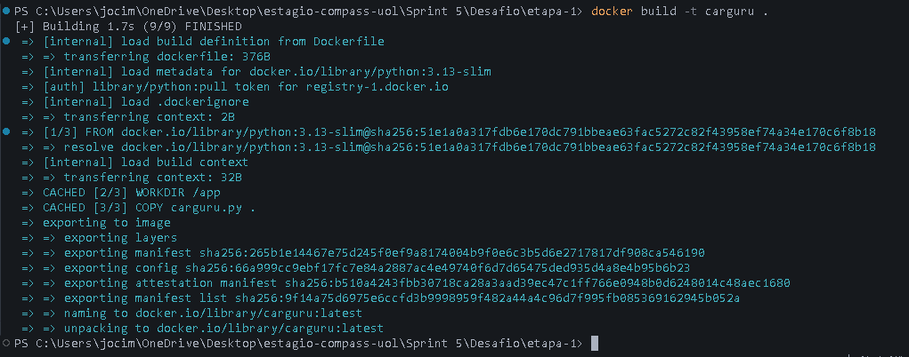
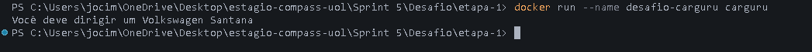
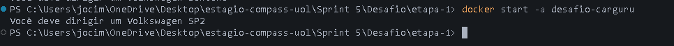
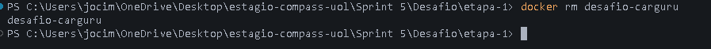
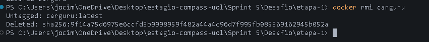
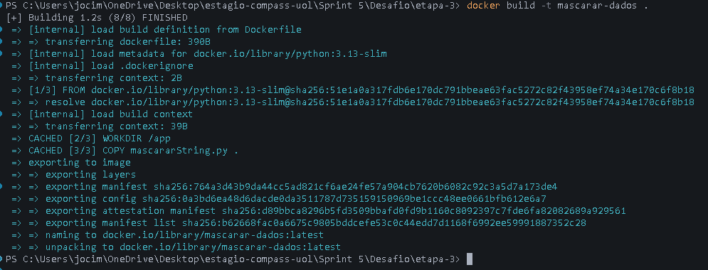
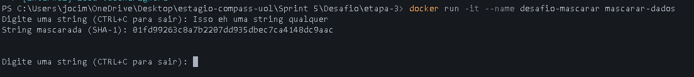
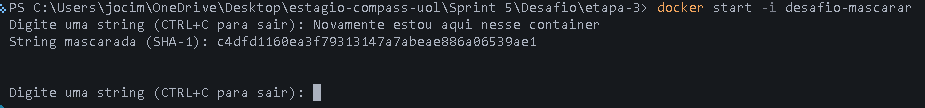
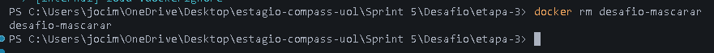
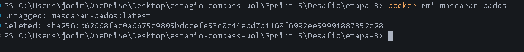

# 📊 Desafio da Sprint – Docker para Desenvolvedores (com Docker Swarm e Kubernetes)
## 📌 Visão Geral
Este desafio faz parte da Sprint 5 e tem como objetivo aplicar conhecimentos em Python e Docker para a criação de containers, imagens e a execução de scripts. O trabalho envolve criar imagens Docker, rodar containers, manipular dados e apresentar resultados de forma organizada.

## 🎯 Objetivo do Desafio
O objetivo é demonstrar a capacidade de:
- Criar e configurar containers Docker para rodar scripts Python.
- Construir imagens a partir de arquivos Dockerfile.
- Executar e reutilizar containers de forma eficiente.
- Responder ao questionamento sobre ser possível reutilizar containers.

## ⏬ Etapas
Antes de tudo, fica enfatizado que os serviços Carguru e Mascarar foram colocados no mesmo `docker-compose.yml` para facilitar o gerenciamento dos containers. Apesar de serem projetos totalmente diferentes, usar o Compose permite construir e rodar ambos com poucos comandos, evitando a necessidade de executar vários docker build e docker run. Dessa forma, o workflow fica mais rápido, organizado e replicável, sem comprometer o isolamento entre os containers. Portanto, a seguir apresento duas maneiras de criar as imagens e os containers: **Com o Compose e Sem o Compose.**  
Para rodar os arquivos manualmente pelo terminal, siga exatamente a mesma ordem apresentada.


### [Etapa 1](../Desafio/etapa-1/) - Criação de uma Imagem e Container 

Nesta primeira etapa, conferi a execução do arquivo [carguru.py](../Desafio/etapa-1/carguru.py) e construí uma imagem que executasse o seu código, por meio de instruções de um arquivo Dockerfile. As instruções utilizadas foram: `FROM, WORKDIR, COPY e CMD`, aos quais serviram para definir qual versão python rodaria o código, copiar o script python para um diretório específico dentro do container e fazer o container rodar ele através do comando `python carguru.py`.  

<details><summary>Script Python</summary>

```py
import random

carros = [
        'Chevrolet Agile','Chevrolet C-10','Chevrolet Camaro','Chevrolet Caravan','Chevrolet Celta','Chevrolet Chevette','Chevrolet Corsa','Chevrolet Covalt','Chevrolet D-20','Chevrolet Monza','Chevrolet Onix','Chevrolet Opala','Chevrolet Veraneio','Citroën C3',
        'Fiat 147','Fiat Argo','Fiat Cronos','Fiat Mobi','Fiat Panorama',
        'Ford Corcel','Ford Escort','Ford F-1000','Ford Ka','Ford Maverick',
        'Honda City','Honda Fit',
        'Hyundai Azera','Hyundai HB20','Hyundai IX-35','Hyundai Veloster',
        'Peugeot 2008','Peugeot 206','Peugeot 208','Peugeot 3008','Peugeot 306','Peugeot 308',
        'Renault Kwid','Renault Logan','Renault Sandero','Renault Twingo','Renault Zoe',
        'Toyota Etios','Toyota Yaris ',
        'Volkswagen Apolo','Volkswagen Bora','Volkswagen Brasilia','Volkswagen Fusca','Volkswagen Gol','Volkswagen Kombi','Volkswagen Parati','Volkswagen Passat','Volkswagen Polo','Volkswagen SP2','Volkswagen Santana','Volkswagen Voyage','Volkswagen up!'
        ]

random_carros = random.choice(carros)

print('Você deve dirigir um '+ random_carros)
```
</details>

<details><summary>Dockerfile</summary>

```dockerfile
# imagem base do Python 3.13 em sua versão slim (mais recomendada em 2026)
FROM python:3.13-slim

# define o diretório de trabalho dentro do container        
WORKDIR /app

# copia o arquivo carguru.py para o diretório de trabalho
COPY carguru.py .

# comando para executar o script carguru.py
CMD ["python", "carguru.py"]
```
</details>

<details><summary>Execução</summary>

#### **Sem o Docker Compose**:
```bash
# Acessar pasta do Dockerfile
cd "./Sprint 5/Desafio/etapa-1/"

# Criar a imagem
docker build -t carguru .
# Confira:
docker images

# Criar um container com nome fixo (na primeira vez)
docker run --name desafio-carguru carguru
# Confira:
docker ps -a

# Para rodar de novo:
docker start -a desafio-carguru 
# "-a" é usado para anexar ao terminal e ver a saída do container
```

Para parar a execução, digite:
```bash
# Deletar o container
docker rm desafio-carguru

# Deletar a imagem
docker rmi carguru
```

#### **Utilizando o Docker Compose:**
```bash
# Acessar a pasta raiz do Compose
cd './Sprint 5/Desafio/'

# Iniciar o container "desafio-carguru"
docker compose up --build carguru
```

Para parar a execução, digite:
```bash
# Deletar o Container
docker compose down carguru

# Deletar a imagem
docker rmi carguru
```
</details>

<details><summary>Resultado das Execuções</summary>

- Build Image:

    
---
- Run Container:
    
---

- Reiniciando Container:
    
---

- Removendo Container:
    
---
- Removendo Imagem:
    
</details>

### Etapa 2 - É possível reutilizar containers?
> É possível reutilizar containers? Em caso positivo, apresente o comando necessário para reiniciar um dos containers parados em seu ambiente Docker. Não sendo possível reutilizar, justifique sua resposta.

**Resposta:**  
Sim, containers parados podem ser reutilizados sem precisar criar outro. Isso acontece porque o Docker mantém o estado do container, mesmo após ele ser parado, permitindo que ele seja reiniciado posteriormente. Para reiniciar um container existente, podemos usar o comando: `docker start <nomeDoContainer ou ID>` 


### [Etapa 3](../Desafio/etapa-3/) - Container que receba Inputs
Nesta etapa, foi criado o script python no arquivo [mascararString.py](./etapa-3/mascararString.py), em seguida construí uma imagem que executasse esse script, usando as instruções de um arquivo Dockerfile. As instruções utilizadas foram: `FROM, WORKDIR, COPY e CMD`, onde defini no FROM qual versão do python executaria após aplicar o comando do CMD e para qual lugar seria copiado o script, por meio do WORKDIR, após o COPY ser executado.

<details><summary>Script Python</summary>

```py
import hashlib as hl

while True:
    # Recebe a string
    entrada = input("Digite uma string (CTRL+C para sair): ")

    # Converte a string em Bytes (UTF-8) e gera o hash
    sha1_hash = hl.sha1(entrada.encode('utf-8')).hexdigest()

    # Exibe o hash gerado
    print("String mascarada (SHA-1):", sha1_hash)
    print("\n")
```
</details>

<details><summary>Dockerfile</summary>

```dockerfile
# imagem base do Python 3.13 em sua versão slim (mais recomendada em 2026)
FROM python:3.13-slim

# define o diretório de trabalho dentro do container        
WORKDIR /app

# copia o arquivo carguru.py para o diretório de trabalho
COPY mascararString.py .

# comando para executar o script carguru.py
CMD ["python", "mascararString.py"]
```
</details>

<details><summary>Execução</summary>

#### **Sem o Docker Compose**:
```bash
# Acessar pasta do Dockerfile
cd "../etapa-3/"

# Criar a imagem
docker build -t mascarar-dados .
# Confira:
docker images

# Rodar interativamente para poder digitar input
docker run -it --name desafio-mascarar mascarar-dados

# Verificar containers existentes
docker ps -a

# Para rodar de novo (caso precise)
docker start -i desafio-mascarar
```
Para parar a execução, digite:
```bash
# Deletar o container
docker rm desafio-mascarar

# Deletar a imagem
docker rmi mascarar-dados
```

#### **Utilizando o Docker Compose:**

```bash
# Acessar a pasta raiz do Compose
cd './Sprint 5/Desafio/'

# utilize a versão v2.20+ do Docker para este comando funcionar
docker-compose run --build --rm -it mascarar
# senão:
docker-compose up --build mascarar
docker-compose run --rm -it mascarar
```

Para parar a execução, digite:
```bash
# Deletar o container
docker compose down mascarar

# Deletar a imagem
docker rmi carguru
```
</details>

<details><summary>Resultado das Execuções</summary>

- Build Image:

    
---
- Run Container:
    
---

- Reiniciando Container:
    
---

- Removendo Container:
    
---
- Removendo Imagem:
    
</details>