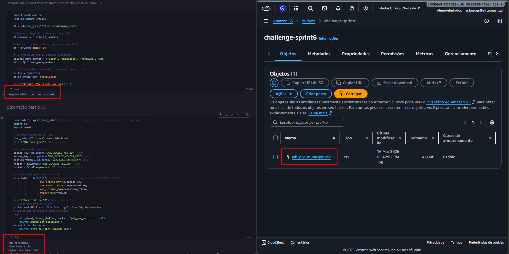
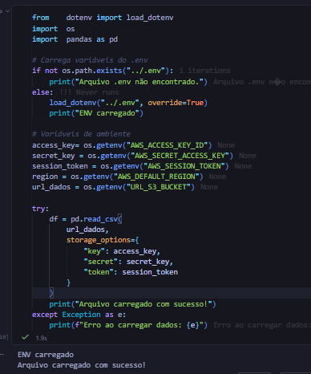
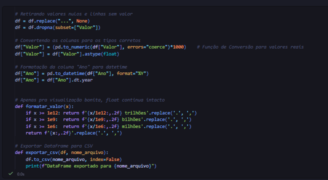
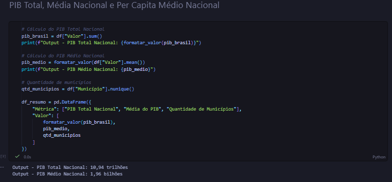
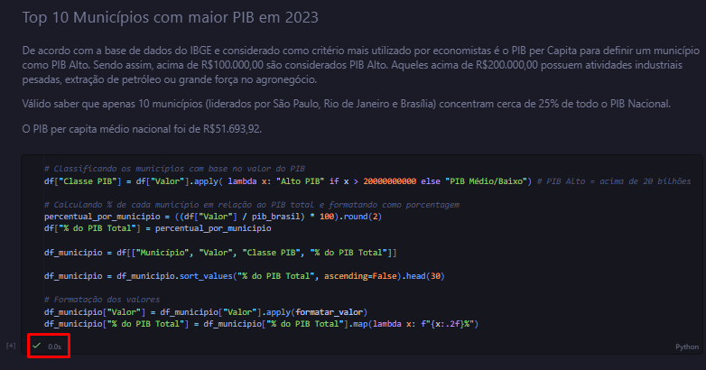
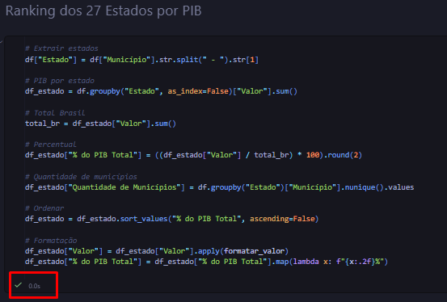
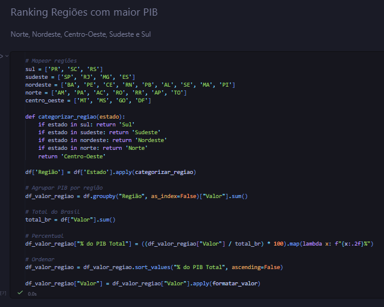
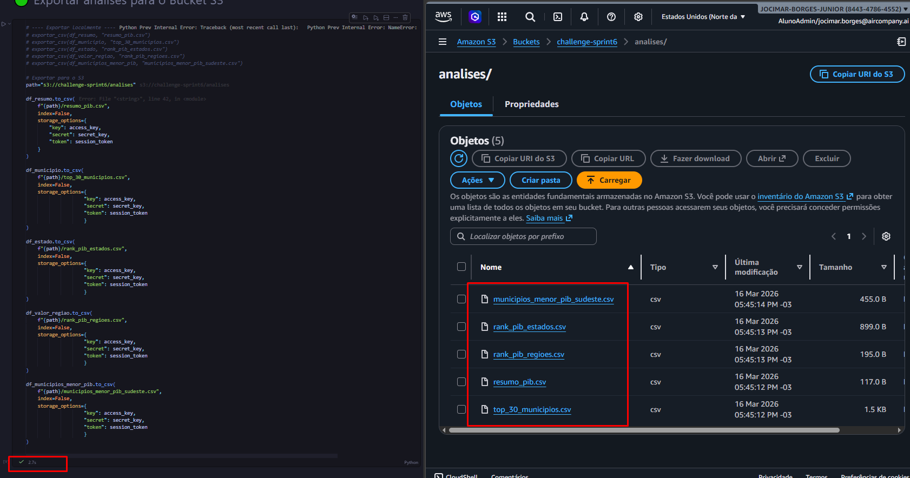

# 📊 Desafio da Sprint – AWS + Desafio Final

## 📌 Visão Geral
Este desafio faz parte da Sprint 6 e tem como objetivo aplicar conhecimentos em Python, ETL e análise de dados em conjunto com serviço S3 da AWS. O trabalho envolve fazer análise de dados de um dataset público do [Site do Gov](https://dados.gov.br), usar arquivos .ipynb para realizar os scripts e documentação e armazenar em um bucket do S3, apresentando os resultados em formatos de arquivo .csv.

## ⏬ Etapas

### [Etapa 1](../Desafio/etapa-1/) - Definir as análises e script de upload
Nesta etapa, acessei o [site de dados do gov](https://dados.gov.br) e desenvolvi os questionamentos baseados nos dados analisados visualmente. Depois, fiz uma pequena formatação ao [banco de dados original](./etapa-1/PIB-por-municipio.json), eliminando colunas desnecessárias e convertendo-o para um tipo CSV, ao qual evita possíveis problemas posteriores.  

Para a prevenção e segurança dos dados, criei um arquivo [.env](.env) para armazenar as variáveis de ambiente e utilizando a biblioteca _dotenv_ fiz o carregamento delas nos arquivos Interactive Python Notebook (.ipynb).  

Para futuras atualizações, criei o arquivo [.env.example](.env.example) ao qual contém os exemplos de variáveis utilizado no .env original.

<details><summary>Script Python</summary>

Nesta parte eu via a leitura do dataset em seu formato de entrada .json, retirei a primeira linha e defini a segunda como seu cabeçalho. Além disso, mantive apenas as colunas que utilizaria e por fim fiz a conversão desses dados para o tipo .csv, usando a função _to_csv()_ da biblioteca pandas.
- Formatação do Arquivo Original
```py
import pandas as pd

df = pd.read_json("PIB-por-municipio.json")

# Define a segunda linha como cabeçalho
df.columns = df.iloc[0].values

# Remove a primeira linha (que era metadado)
df = df.drop(index=[0])

# Seleciona apenas as colunas desejadas
colunas_para_manter = ["Valor", "Município", "Variável", "Ano"]
df = df[colunas_para_manter]

df.to_csv("pib_por_municipio.csv", index=False)
```

- Exportação para o bucket do S3
```py

from dotenv import load_dotenv
import os
import boto3

# Carrega variáveis do .env
load_dotenv("../.env", override=True)
print("ENV carregado")

# Variáveis de ambiente
access_key= os.getenv("AWS_ACCESS_KEY_ID")
secret_key = os.getenv("AWS_SECRET_ACCESS_KEY")
session_token = os.getenv("AWS_SESSION_TOKEN")
region = os.getenv("AWS_DEFAULT_REGION")
bucket = "challenge-sprint6"

# credenciais para acessar o S3
s3 = boto3.client("s3",
                  aws_access_key_id=access_key,
                  aws_secret_access_key=secret_key,
                  aws_session_token=session_token,
                  region_name=region
                  )
print("Conectado ao S3")
# voltar cursor pro início
buffer.seek(0)
# Faz upload do arquivo para o bucket
try:
    s3.upload_fileobj(buffer, bucket, "pib_por_municipio.csv")
    print("Upload bem-sucedido!")
except Exception as e:
    print(f"Erro ao fazer upload: {e}")
```
</details>


<details><summary>Resultado Obtido</summary>

Arquivo gerado e exportado para o bucket "challenge-sprint6"

</details>

### [Etapa 2](../Desafio/etapa-2/) - Script das análises e ETL
Nesta etapa, foi realizado a implementação dos scripts das análises, ao qual compõem:
- PIB Total, PIB Médio Nacional e PIB per capita Médio
- Top 10 Municípios com mais PIB
- Ranking dos 27 estados no PIB
- Ranking das regiões
- 10 Municípios da Região Sudeste com menos de 10 milhões

O primeiro script realiza a busca do arquivo no bucket do S3 e faz sua leitura na variável `df`.  
<details><summary>Script Python</summary>

```py
from    dotenv import load_dotenv
import  os
import  pandas as pd

# Carrega variáveis do .env
if not os.path.exists("../.env"):
    print("Arquivo .env não encontrado.")
else:
    load_dotenv("../.env", override=True)
    print("ENV carregado")

# Variáveis de ambiente
access_key= os.getenv("AWS_ACCESS_KEY_ID")
secret_key = os.getenv("AWS_SECRET_ACCESS_KEY")
session_token = os.getenv("AWS_SESSION_TOKEN")
region = os.getenv("AWS_DEFAULT_REGION")
url_dados = os.getenv("URL_S3_BUCKET")

try:
    df = pd.read_csv(
        url_dados,
        storage_options={
            "key": access_key,
            "secret": secret_key,
            "token": session_token
        }
    )
    print("Arquivo carregado com sucesso!")
except Exception as e:
    print(f"Erro ao carregar dados: {e}")
```
</details><br>



O segundo script cria faz a formatação da tabela carregada, retirando valores nulos e converte as colunas para seus tipos certos, pois todas as colunas eram do tipo String na tabela original. Além disso, há uma função que, puramente criada por estética, faz com que números inexpressivos com término em "1e6, 1e9, 1e12" sejam visualmente transformados para "milhões, bilhões, trilhões", mantendo ainda como tipo float internamente.  
<details><summary>Script Python</summary>

```py
# Retirando valores nulos e linhas sem valor
df = df.replace("...", None)
df = df.dropna(subset=["Valor"])

# Convertendo as colunas para os tipos corretos
df["Valor"] = (pd.to_numeric(df["Valor"], errors="coerce")*1000)    # Função de Conversão para valores reais
df["Valor"] = df["Valor"].astype(float)             

# Formatação da coluna "Ano" para datetime
df["Ano"] = pd.to_datetime(df["Ano"], format="%Y")                  
df["Ano"] = df["Ano"].dt.year                                       


# Apenas pra visualização bonita, float continua intacto
def formatar_valor(x):
    if x >= 1e12: return f'{x/1e12:,.2f} trilhões'.replace('.', ',')
    if x >= 1e9:  return f'{x/1e9:,.2f} bilhões'.replace('.', ',')
    if x >= 1e6:  return f'{x/1e6:,.2f} milhões'.replace('.', ',')
    return f'{x:,.2f}'.replace('.', ',')

# Exportar DataFrame para CSV
def exportar_csv(df, nome_arquivo):
    df.to_csv(nome_arquivo, index=False)
    print(f"DataFrame exportado para {nome_arquivo}")
```
</details><br>



No terceiro script se inicia as análises. Nesse script fiz um resumo do PIB, contendo o PIB Total do Brasil, a Média Nacional.  
Posteriormente utilizei o cálculo do PIB Total do Brasil para outros cálculos.  
<details><summary>Script Python</summary>

```py
# Cálculo do PIB Total Nacional
pib_brasil = df["Valor"].sum()
print(f"Output - PIB Total Nacional: {formatar_valor(pib_brasil)}")

# Cálculo do PIB Médio Nacional
pib_medio = formatar_valor(df["Valor"].mean())
print(f"Output - PIB Médio Nacional: {pib_medio}")

# Quantidade de municípios
qtd_municipios = df["Município"].nunique()

df_resumo = pd.DataFrame({
    "Métrica": ["PIB Total Nacional", "Média do PIB", "Quantidade de Municípios"],
    "Valor": [
        formatar_valor(pib_brasil),
        pib_medio,
        qtd_municipios
    ]
})
```
</details><br>



No quarto script, fiz a análise dos 10 municípios com maior PIB registrado naquele ano. Como complemento adicionei a coluna `% do PIB Total` para evidenciar quantos % do PIB do Brasil cada PIB de município correspondia.  
<details><summary>Script Python</summary>

```py
# Classificando os municípios com base no valor do PIB
df["Classe PIB"] = df["Valor"].apply( lambda x: "Alto PIB" if x > 20000000000 else "PIB Médio/Baixo") # PIB Alto = acima de 20 bilhões

# Calculando % de cada município em relação ao PIB total e formatando como porcentagem
percentual_por_municipio = ((df["Valor"] / pib_brasil) * 100).round(2)
df["% do PIB Total"] = percentual_por_municipio

df_municipio = df[["Município", "Valor", "Classe PIB", "% do PIB Total"]]

df_municipio = df_municipio.sort_values("% do PIB Total", ascending=False).head(30)

# Formatação dos valores
df_municipio["Valor"] = df_municipio["Valor"].apply(formatar_valor)
df_municipio["% do PIB Total"] = df_municipio["% do PIB Total"].map(lambda x: f"{x:.2f}%")
```
</details><br>



No quinto script, fiz um Ranking com os 27 estados do Brasil, ou seja, suas posições no placar em relação ao PIB dos demais. Também coloquei uma coluna que representava a quantidade de municípios para cada estado.  
<details><summary>Script Python</summary>

```py
# Extrair estados
df["Estado"] = df["Município"].str.split(" - ").str[1]

# PIB por estado
df_estado = df.groupby("Estado", as_index=False)["Valor"].sum()

# Total Brasil
total_br = df_estado["Valor"].sum()

# Percentual
df_estado["% do PIB Total"] = ((df_estado["Valor"] / total_br) * 100).round(2)

# Quantidade de municípios
df_estado["Quantidade de Municípios"] = df.groupby("Estado")["Município"].nunique().values

# Ordenar
df_estado = df_estado.sort_values("% do PIB Total", ascending=False)

# Formatação
df_estado["Valor"] = df_estado["Valor"].apply(formatar_valor)
df_estado["% do PIB Total"] = df_estado["% do PIB Total"].map(lambda x: f"{x:.2f}%")
```
</details><br>



No sexto script, fiz um ranking com as 5 regiões do Brasil (Sul, Sudeste, Nordeste, Norte e Centro-oeste), semelhante ao que fiz com o script anterior, porém, neste caso, houve a necessidade de criar uma função que iria retornar o cada região correspondente ao estado que estava dentro das listas.  
<details><summary>Script Python</summary>

```py
# Mapear regiões
sul = ['PR', 'SC', 'RS']
sudeste = ['SP', 'RJ', 'MG', 'ES']
nordeste = ['BA', 'PE', 'CE', 'RN', 'PB', 'AL', 'SE', 'MA', 'PI']
norte = ['AM', 'PA', 'AC', 'RO', 'RR', 'AP', 'TO']
centro_oeste = ['MT', 'MS', 'GO', 'DF']

def categorizar_regiao(estado):
    if estado in sul: return 'Sul'
    if estado in sudeste: return 'Sudeste'
    if estado in nordeste: return 'Nordeste'
    if estado in norte: return 'Norte'
    return 'Centro-Oeste'

df['Região'] = df['Estado'].apply(categorizar_regiao)

# Agrupar PIB por região
df_valor_regiao = df.groupby("Região", as_index=False)["Valor"].sum()

# Total do Brasil
total_br = df["Valor"].sum()

# Percentual
df_valor_regiao["% do PIB Total"] = ((df_valor_regiao["Valor"] / total_br) * 100).map(lambda x: f"{x:.2f}%")

# Ordenar
df_valor_regiao = df_valor_regiao.sort_values("% do PIB Total", ascending=False)

df_valor_regiao["Valor"] = df_valor_regiao["Valor"].apply(formatar_valor)
```
</details><br>



No sétimo script, fiz a análise dos 10 municípios com menos de 10 milhões de PIB (um PIB considerado baixo) e fosse da região sudeste, ao qual é considerado uma das regiões com maior economia do país.  
<details><summary>Script Python</summary>

```py
### Municípios com menos de 100 milhões de PIB no Estado de São Paulo

df_menor_pib = df[(df["Valor"] < 100000000) & (df["Região"] == "Sudeste")]

df_municipios_menor_pib = df_menor_pib[["Município", 
                                        "Estado", 
                                        "Valor"
                                        ]]
df_municipios_menor_pib["Valor"] = df_municipios_menor_pib["Valor"].apply(formatar_valor)

df_municipios_menor_pib = df_municipios_menor_pib.sort_values("Valor", ascending=True).head(10)

```
</details><br>


Além disso, fiz um script para realizar a exportação dessas análises direto para o S3 no formato de um CSV.
<details><summary>Script Python</summary>

```py
# ---- Exportar localmente ----
# exportar_csv(df_resumo, "resumo_pib.csv")
# exportar_csv(df_municipio, "top_30_municipios.csv")
# exportar_csv(df_estado, "rank_pib_estados.csv")
# exportar_csv(df_valor_regiao, "rank_pib_regioes.csv")
# exportar_csv(df_municipios_menor_pib, "municipios_menor_pib_sudeste.csv")

# Exportar para o S3
path="s3://challenge-sprint6/analises"

df_resumo.to_csv(
    f"{path}/resumo_pib.csv",
    index=False,
    storage_options={
        "key": access_key,
        "secret": secret_key,
        "token": session_token
    }
)

df_municipio.to_csv(
    f"{path}/top_30_municipios.csv",
    index=False,
    storage_options={
                    "key": access_key,
                    "secret": secret_key,
                    "token": session_token
                    }
)

df_estado.to_csv(
    f"{path}/rank_pib_estados.csv",
    index=False,
    storage_options={
                    "key": access_key,
                    "secret": secret_key,
                    "token": session_token
                    }
)

df_valor_regiao.to_csv(
    f"{path}/rank_pib_regioes.csv",
    index=False,
    storage_options={
                    "key": access_key,
                    "secret": secret_key,
                    "token": session_token
                    }
)

df_municipios_menor_pib.to_csv(
    f"{path}/municipios_menor_pib_sudeste.csv",
    index=False,
    storage_options={
                    "key": access_key,
                    "secret": secret_key,
                    "token": session_token
                    }
)

```
</details><br>

