# 📝 Resumo
<a href="">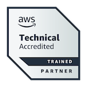</a> 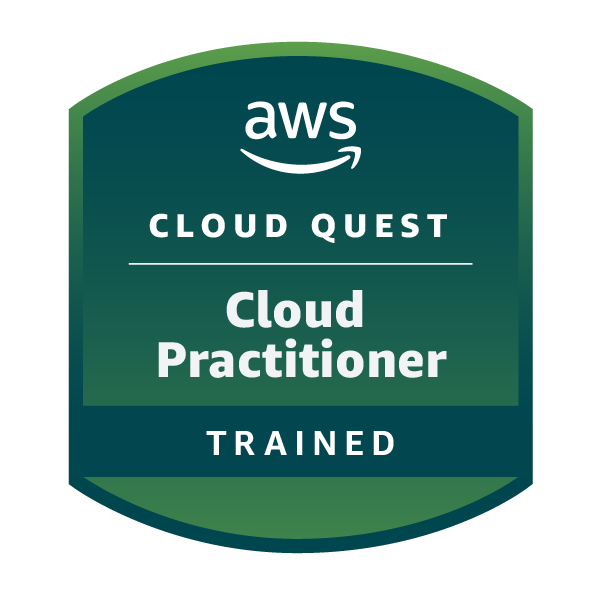

## 🔍 Índice
- [Competências Aplicadas](#-competências-aplicadas)
- [Curso: AWS Partner: Accreditation (Technical)](#%E2%80%8D-curso-docker-para-desenvolvedores-com-docker-swarm-e-kubernetes)
- [Exercícios](#-exercícios)
- [Evidências](#%E2%80%8D-evidências)
- [Desafio da Sprint](#-desafio-da-sprint)
- [Certificados](#-certificados)


## 🧠 Competências aplicadas
- Fundamentos de Computação em Nuvem (AWS)
- Gerenciamento de Identidades e Permissões (IAM)
- Provisionamento de Máquinas Virtuais (EC2)
- Redes na Nuvem (VPC, Subnets, Security Groups)
- Arquitetura Cloud e Alta Disponibilidade
- Contêineres e Orquestração (ECS, EKS, Fargate)
- Computação Serverless (Lambda)
- Conceitos de Infraestrutura como Serviço (IaaS)
- Conceitos de Redes (IPv4, CIDR)
- Modelos de Implantação (On-premises, Cloud, Hybrid)

## 👨‍🔬Curso: AWS Partner: Accreditation (Technical)
### AWS Technical Essentials
**<details><summary>Módulo 1: Introdução ao Amazon Web Services</summary>**

- **O que é AWS?**  
    A Computação em Nuvem é a entrega sob demanda de recursos de TI com preços com pagamentos conforme o uso.
    A computação em nuvem permite que processos como aquisição, manutenção e planejamento de capacidade sejam acelerados e mais eficientes. Com o crescimento dela e popularidade, outras estratégias de implantação surgiram, visando atender necessidades específicas de usuários distintos. Esses métodos contém diferentes níveis de controle, flexibilidade e gerenciamento. Se entendermos as diferenças entre as estratégias de implantação, é possível decidir qual conjunto de serviços é ideal para as necessidades do projeto.

- **Estratégias de Implantação**
    <details><summary>On-premises</summary>
    
    Antes da nuvem, tudo era hospedado internamente. As empresas compravam e mantinham servidores, armazenamento e rede com enormes data center e tinham que dispor de funcionários para cuidar de setores inteiros focados nisso. O controle era total, porém muito mais caro e pouco flexível.  
    Conforme a expansão da internet, começou a se tornar inviável esse tipo de implantação.
    </details>
    <details><summary>Nuvem</summary>

    A Computação em Nuvem, como dito anteriormente, é a entrega de recursos de TI sob demanda pela internet, com pagamento conforme o uso. Com o surgimento da nuvem, empresas não precisavam mais gerenciar e manter hardware e data centers próprios. Em vez disso, com a **Amazon Web Services (AWS)** foi possível ter e manter data centers, fornecer tecnologias e serviços data center virtual para empresas e usuários pela internet, reduzindo assim, custos operacionais.
    </details>
    <details><summary>Híbrida</summary>

    A implantação híbrida é uma maneira de conectar infraestrutura e aplicações entre os recursos baseados em nuvem e recursos atuais que não se encontram lá. O método mais comum consiste em conectar os recursos da nuvem aos sistemas internos para estender e expandir a infraestrutura de uma organização na nuvem.
    </details><br>

- **Seis vantagens da Computação em Nuvem:**
    - Pagamento conforme o uso
    - Beneficiar-se de economias massivas em escala
    - Parar de tentar adivinhar a capacidade
    - Aumentar a velocidade e a agilidade
    - Economizar custos
    - Ter alcance global em questão de minutos

- **Infraestrutura da AWS**  
    Basicamente, a AWS funciona de forma aninhada e redundante, ou seja, seus data centers são conectados entre si, prevenindo perda dos dados em situações imprevistas. Esses data center são conectados por meio del inks redundantes de alta velocidade e baixa latência. Esse cluster de data centers é chamado de `Zona de Disponibilidade (AZ)`.  
    Uma AZ consiste em um ou mais data centers com energia, rede e conectividade redundantes.  
    O agrupamento/cluster de AZs é chamado de `Região`, ao qual tem seus nomes baseados na região em que se localizam, para facilitar saber onde elas estao.  
    Há quatro aspectos que é necessário considerar para escolher a Região AWS:
    - Conformidade, 
    - Latência,
    - Preço,
    - Disponibilidade do serviço.  
    Também há a `Rede Global de Borda`, A rede global de borda é uma estratégia para reduzir a latência ao acessar conteúdo na nuvem. Quando um site está hospedado em uma região específica, como New York, usuários distantes dessa região podem ter atrasos ao carregar os dados. Para resolver isso, serviços como o Amazon CloudFront armazenam em cache o conteúdo mais acessado em locais de borda distribuídos pelo mundo. Assim, quando um usuário solicita essas informações, elas são entregues a partir do local de borda mais próximo, garantindo uma resposta mais rápida e melhor desempenho do site ou aplicativo.

- **Interagir com a AWS**  
    Cada ação feita na AWS é uma chamada de API autenticada e autorizada, podendo fazer chamadas de API para serviços e recursos por meio do Console de Gerenciamento da AWS, da AWS Command Line Interface (AWS CLI) ou dos AWS SDKs.
    <details><summary>Console de Gerenciamento</summary>

    Uma forma de gerenciar os recursos por meio do console baseado na web, onde o login é feito e o serviço é escolhido como desejado. Sendo a maneira mais fácil de criar e gerenciar recursos quando é iniciante na Nuvem.
    </details>
    <details><summary>AWS CLI</summary>

    A AWS CLI é uma ferramenta unificada que permite gerenciar e interagir com os serviços da AWS diretamente pela linha de comando. Com ela, é possível automatizar tarefas, executar comandos e agendar scripts que fazem chamadas às APIs da AWS para criar, configurar, consultar ou extrair dados dos serviços, sem precisar acessar o console web.
    </details>
        <details><summary>AWS SDKs</summary>

    O AWS SDK é um conjunto de bibliotecas que permite interagir com os serviços da AWS diretamente pelo código, usando linguagens de programação como Java, Python, JavaScript, C#, entre outras. Ele facilita a integração de aplicações com a AWS, abstraindo as chamadas às APIs e permitindo criar, configurar e gerenciar recursos da nuvem de forma programática dentro dos próprios sistemas.
    </details><br>

- **Segurança e Responsabilidade Compartilhada**  
    A AWS é responsável pela segurança da nuvem, ou seja, por proteger toda a infraestrutura que faz os serviços funcionarem. Isso inclui a segurança física dos data centers, regiões e zonas de disponibilidade, além do gerenciamento de hardware, rede, virtualização e do sistema operacional que hospeda os serviços da AWS. Quanto mais abstrato for o serviço, maior é a responsabilidade da AWS, chegando a incluir criptografia do lado do servidor e proteção da infraestrutura completa.

    Já o cliente é responsável pela segurança na nuvem. Isso significa configurar corretamente os serviços utilizados, proteger e criptografar os dados, controlar quem pode acessar os recursos, realizar backups e garantir conformidade com leis e regulamentos. Em serviços de infraestrutura, como o `EC2`, o cliente cuida do sistema operacional, das aplicações e dos dados. Em serviços mais abstraídos, como o `S3`, o cliente ainda continua responsável pelos dados e pelo controle de acesso.

    Em resumo, a AWS cuida da base e da infraestrutura, enquanto o cliente mantém total controle e responsabilidade sobre os dados e a forma como os serviços são usados.

- **Proteger o usuário-raiz da AWS**  
    Ao acessar a AWS pela primeira vez, todo usuário começa com uma identidade de login único, conhecida como usuário-raiz, que tem acesso total aos serviços e recursos da AWS na conta. 

    A AWS é responsável pela segurança da nuvem, ou seja, por proteger toda a infraestrutura que faz os serviços funcionarem. Isso inclui a segurança física dos data centers, regiões e zonas de disponibilidade, além do gerenciamento de hardware, rede, virtualização e do sistema operacional que hospeda os serviços da AWS. Quanto mais abstrato for o serviço, maior é a responsabilidade da AWS, chegando a incluir criptografia do lado do servidor e proteção da infraestrutura completa.

    Já o cliente é responsável pela segurança na nuvem. Isso significa configurar corretamente os serviços utilizados, proteger e criptografar os dados, controlar quem pode acessar os recursos, realizar backups e garantir conformidade com leis e regulamentos. Em serviços de infraestrutura, como o EC2, o cliente cuida do sistema operacional, das aplicações e dos dados. Em serviços mais abstraídos, como o S3, o cliente ainda continua responsável pelos dados e pelo controle de acesso.

    Em resumo, a AWS cuida da base e da infraestrutura, enquanto o cliente mantém total controle e responsabilidade sobre os dados e a forma como os serviços são usados.

    <details><summary>Práticas Recomendadas para usuário-raiz da AWS</summary>

    O usuário-raiz tem acesso total a todos os serviços e recursos da AWS em sua conta, incluindo informações pessoais e de cobrança. Portanto, você deve bloquear com segurança as credenciais associadas ao usuário-raiz e não usá-lo para tarefas diárias. Acesse os links no final desta lição para saber mais sobre quando usar o usuário-raiz da AWS.

    Para garantir a segurança do usuário-raiz, siga estas práticas recomendadas:
    - Escolha uma senha forte para o usuário-raiz
    - Ative a autenticação multifator (MFA) para o usuário-raiz
    - Nunca compartilhe suas chaves de acesso ou senha de usuário-raiz com ninguém
    - Desative ou exclua as chaves de acesso associadas ao usuário-raiz
    - Crie um usuário no Identity and Acess Managemente (IAM) para tarefas administrativas ou diárias.
    </details><br>

    **Autenticação Multifator** é a forma mais simples e comum de autenticação. Ele é para prevenir cenários de decodificação por meio da engenharia social, bots ou roteiros, evitando o acesso indesejado à conta. O MFA precisa de dois ou mais métodos de autenticação para verificar uma identidade, sendo elas: `Algo que você sabe, algo que você tem e algo que você é`.

- **AWS Identity and Acess Management**
    - O que é o IAM?  
        Identity and Access Managemente é um serviço da AWS que ajuda a gerenciar o acesso à conta e aos recursos da AWS, fornecendo uma visão centralizada de quem e o que tem autorização em sua conta da AWS e quem e o que tem permissão para usar e trabalhar com os seus recursos da AWS (autorização). Com o IAM, pode-se compartilhar o acesso a uma conta e recursos da AWS sem compartilhar seu conjunto de chaves de acesso ou senha. 
    - Recursos do IAM:
        <details><summary>Global</summary>

        O IAM é global e não é específico de nenhuma Região. Pode-se ver e usar suas configurações do IAM de qualquer Região no Console de Gerenciamento da AWS.
        </details>
        <details><summary>Integrado aos serviços da AWS</summary>
        
        Por padrão, o IAM é integrado a muitos serviços da AWS
        </details>
        <details><summary>Acesso Compartilhado</summary>
        
        Você pode conceder permissão a outras identidades para administrar e usar recursos na conta da AWS sem precisar compartilhar a chave ou senha.
        </details>
        <details><summary>Autenticação Multifator</summary>
        
        É compatível com a MFA, podendo adicionar à conta e a usuários individuais para proporcionar segurança adicional.
        </details>
        <details><summary>Federação de Identidades</summary>
        
        Compatível com a federação de identidades, o que permite que usuários com senhas em outro lugar, como em uma rede corporativa ou em um provedor de identidade da internet, tenham acesso temporário à conta da AWS.
        </details>
        <details><summary>Uso gratuito</summary>
        
        Qualquer cliente da AWS pode usar o IAM e o serviço é oferecido sem custo adicional.
        </details><br>

    - Usuário do IAM:  
        Representa uma pessoa ou serviço que interage com a AWS. O usuário é definido na conta da AWS, onde qualquer atividade feita é cobrada na conta depois. É possível adicionar vários usuários, conforme necessário. O usuário é composto por um conjunto de credenciais e pode-se decidir quais recursos conceder acesso à ele.  
        Assim como há os usuários, há os grupos de usuários, onde todos herdam as permissões atribuídas ao grupo. Sendo uma maneira mais conveniente e dimensionável de gerenciar as permissões para usuários na conta AWS.
    - Políticas do IAM:  
        São criadas políticas do IAM para gerenciar o acesso e fornecer permissões, anexando-as a uma identidade do IAM. Sempre que uma identidade do IAM fazer uma solicitação, a AWS avalia as políticas associadas a ela. A maioria das políticas na AWS são armazenadas como documentos JSON, tendo quatro elementos: `Version, Effect, Action e Resource`.  
        O elemento Version define a versão da linguagem da política.  
        O elemento Effect especifica se a política permitirá ou negará um acesso.  
        O elemento Action descreve o tipo de ação que deve ser permitida/negada. (Utilizar * simboliza cada ação dentro da conta da AWS)  
        O elemento Resource especifica o(s) objeto(s) que a declaração de política abrange.
    - Práticas recomendadas do IAM: 
        - Bloquear o usuário-raiz da AWS,
        - Adotar o principio de menor privilégio,
        - Usar os perfis do IAM quando possível,
        - Considerar usar um provedor de identidade,
        - Revisar e remover regularmente usuários, funções e outras credenciais não utilizadas.
</details>

**<details><summary>Módulo 2: Computação da AWS</summary>**

Em um nível fundamental, três tipos de opções de computação estão disponíveis: Máquinas Virtuais (VMs), serviços de contêiner e sem servidor.
<details><summary>Computação como Serviço</summary>
        
O componente mais básico para hospedar uma aplicação. Os servidores lidam com solicitações HTTP e enviam respostas aos clientes seguindo no modelo cliente-servidor.  
Os servidores HTTP comuns incluem:
- Opções do windows, como Serviços de Informações da Internet (IIS)
- Opções Linux, como servidor Apache HTTP, Nginx e Apache Tomcat

Para executar um servidor HTTP na AWS é necessário encontrar um serviço que dê poder computacional ao Console da AWS.  
Na AWS, o `Amazon Elastic Compute Cloud (EC2)` é um serviço da web que fornece capacidade computacional segura e redimensionável na nuvem, podendo provisionar servidores virtuais, chamados de instâncias. Por trás disso, a AWS opera e gerencia as máquinas host e a camada do hipervisor. A AWS também instala o SO da máquina virtual, chamado de SO convidado.
</details>

<details><summary>Amazon EC2</summary>

Ao arquitetar qualquer aplicação para alta disponibilidade, considere usar pelo menos duas instâncias do EC2 em duas Zonas de Disponibilidade distintas.

- **O que é o Amazon EC2?**  
    Amazon Elastic Compute Cloud (EC2) é um serviço da web que disponibiliza capacidade computacional segura e redimensionável na nuvem, podendo:
    - Provisionar e iniciar uma ou mais instâncias do EC2 em minutos
    - Parar ou encerrar as instâncias do EC2 quando terminar de executar uma carga de trabalho
    - Pagar por hora ou segundo pelos tipos de instância (mínimo de 60s)
    Pode-se criar e gerenciar as instâncias por meio do Console de Gerenciamento da AWS, da AWS CLI, dos AWS SDKs, das ferramentas de automação e dos serviços de orquestração da infraestrutura.

- **Configurações e Fluxo**  
    Para criar uma instância do EC2, deve-se definir:
    - Especificações de hardware: CPU, memória, rede e armazenamento
    - Configurações lógicas: localização das redes, regras de firewall, autenticação e o SO que preferir.

    Iniciada uma instância, a primeira configuração definida é qual SO usar ao selecionar uma `Imagem de Máquina da Amazon (AMI)`.  
    Uma AMI inclui o sistema operacional, o mapeamento de armazenamento, o tipo de arquitetura, permissões de execução e quaisquer aplicações de software adicionais pré-instaladas.  
    As instâncias do EC2 são instanciações ativas (ou versões) do que é definido numa AMI. Nesse caso, AMI é como modelamos e definimos a instância e a instância é a entidade que se interage, na qual pode-se instalar o servidor web e veicular os conteúdos aos usuários.  
    A AWS aloca uma máquina virtual, ao iniciarmos uma nova instância, que é executada em um hipervisor, em seguida a AMI que foi selecionada antes é copiada para o volume dispositivo-raiz, que contém a imagem usada para inicializar o volume.
    Além disso, cada AMI no Console de Gerenciamento da AWS tem um ID de AMI com prefixo `ami-` seguido por um hash. Os IDs são exclusivos para cada Região AWS.  

- **Tipos de AMIs**
    - AMIs Quick Start (feitas pela AWS e de uso mais comum)
    - AMIs do AWS Marketplace (software popular de código aberto e comercial de fornecedores terceiros)
    - Minhas AMIs (criadas com base nas nossas instâncias do EC2)
    - AMIs da Comunidade
    - Imagem Personalizada (imagem personalizada usando EC2 Image Builder)


- **Vantagens das AMIs**  
    A vantagem de usar AMIs é de que são reutilizáveis, ou seja, pode-se escolhar uma AMI baseada em Linux e configurar o servidor HTTP, pacotes de aplicação e software adicional necessário para executar a aplicação e se uma outra instância for criada, é possível configurá-la com as mesmas configurações de modo que corresponda à primeira instância.

- **Tipos de Instâncias do EC2**  
    Instâncias do EC2 são a combinação de processadores virtuais (vCPUs), memória, rede e em alguns casos, armazenamento de instâncias e unidades de processamento gráfico (GPUs). Criar as instâncias se faz necessário escolher o quanto precisar de cada um desses componentes.  
    Os tipos de instância são compostos por um prefixo que identifica o tipo dos `workloads` para os quais eles são otimizados, seguido pelo tamanho.  
    Exemplo (instância c5n.xlarge):
    - Primeira posição, `c`, indica a família da instância. Isso indica que essa pertence à familia otimizada para computação.
    - Segunda posição, `5`, indica a geração da instância. Pertence à quinta geração delas.
    - Letras restantes antes do ponto, `n`, indica atributos adicionais, como armazenamento NVMe local.
    - Após o ponto, `xlarge`, indica o tamanho da instância.

- **Famílias de Instâncias**  
    Cada família é otimizada para atender diferentes casos de uso.
    Abaixo se encontra algumas das mais comuns:
    - Uso geral
    - Otimizada para Computação
    - Computação acelerada
    - Otimizada para armazenamento
    - Otimizada para HPC

- **Locais de Instâncias**  
    Geralmente quando executadas as instâncias, elas são colocadas numa `nuvem privada virtual (VPC) padrão`. A VPC-padrão é bom para começar rapidamente e iniciar instâncias públicas do EC2 sem precisar criar e configurar uma VPC própria. Qualquer recurso colocado dentro da VPC-padrão será público e acessível pela internet, portanto, **não deve-se colocar dados de clientes ou informações privadas nele.**

- **Arquitetura para alta disponibilidade**  
    As instâncias residem em uma Zona de Disponibilidade de nossa escolha. A especificação do tamanho da instância dá vantagem ao projetar sua arquiteutra, pois pode-se usar instâncias menores em vez de algumas maiores.
    Ao arquitetar qualquer aplicação para alta disponibilidade, é recomendado usar pelo menos duas instâncias do EC2 em duas Zonas de Disponibilidade distintas.

- **Ciclo de Vida da Instância**
    A instância faz transição entre estados diferentes desde o momento que é criada até o encerramento.
    Seus estados são:
    - `Pendente`: Ao iniciar a instância, ela estará pendente, onde a cobrança não foi iniciada ainda. Nesse estágio, ela está se preparando para entrar em execução.
    - `Em Execução`: Pronta para uso. Aqui é onde a cobrança começa. Estando em execução, é possível executar outras ações na instância, como reinicializar, terminar, parar e interromper-hibernar.
    - `Reinicializar` uma instância é equivalente a reinicializar um SO, onde ela manterá seu nome DNS público (IPV4) e endereços IPv4 públicos e privados. Um endereço IPv6 (se aplicável) permanece no mesmo computador host e mantém o endereço IP público e privado, além de quaisquer dados em seus volumes de armazenamento de instâncias.  
    - `Interromper` é semelhante a quando um laptop é desligado. É possível parar e iniciar uma instância. Se ela tiver um volume do Amazon Elastic Block Store (Amazon EBS) como dispositivo-raiz. Quando interrompida e iniciada, ela pode ser colocada em um novo servidor físico subjacente. Ela irá reter os endereços IPv4 privados e se tiver um endereço IPv6 também.  
    - `Interromper-hibernar` significa que entrará no estado interrompido, porém salvará as últimas informações ou conteúdo na memória, para que o processo de inicialização seja mais rápido.
    - `Terminar` significa que os armazenamentos da instância serão apagados e perderá o endereço IP público e o privado da máquina, além de que não será possível acessar mais a máquina. Em seguida o estado da instância mudará para `desligando ou encerrada`, não havendo mais cobranças.

- **Preços**
    Uma das maneiras de reduzir custos com o EC2 é escolher a opção de definição de preço certa para a forma como suas aplicações são executadas. Sendo elas:
    - Instâncias sob demanda
    - Instâncias spot
    - Savings Plans
    - Instâncias reservadas
    - Hosts dedicados
</details>

<details><summary>Serviços de Contêiner</summary>

Não existe um serviço de computação único porque depende de suas necessidades. A chave é entender o que cada opção oferece.  
Deste modo, a AWS dá uma ampla variadade de ofertas de computação que trazem flexibilidade de escolher a ferramenta certa para cada tarefa.  
Os contêineres podem hospedar uma variedade de workloads diferentes, incluindo apps web, migrações do tipo mover sem alterações (lift-and-shift), aplicações distribuídas e simplificação de ambientes de desenvolvimento, teste e produção.

- **O que são os Contêineres?**  
    A ideia se iniciou na década de 70, com certos kernels UNIX, tendo a capacidade de separar seus processos por meio do isolamento. Na época, isso era configurado manualmente, tornando as operações complexas.  
    Hoje, eles são usados como solução em problemas de computação tradicional, incluindo fazer com que o software seja executado de forma confiável quando passa de um ambiente de computação para outro.  
    _Contêiner é uma unidade padronizada que empacota seu código e suas dependências._ Este pacote é projetado para ser executado de forma confiável em qualquer plataforma, pois cria o seu próprio ambiente independente. Com eles, os workloads podem ser transportados de um lugar para o outro, de ambientes de desenvolvimento para a produção ou on-premises para a nuvem.

- **Contêiner Vs. VMs**  
    Contêineres compartilham mesmo sistema operacional e kernel do host em que estão, sendo mais leves e ativados de forma mais rápida.
    Máquinas virtuais contêm um SO próprio, onde cada uma deve manter uma cópia de um SO, o que resulta em um certo desperdício de recursos.  
    A diferença no tempo de inicialização se torna fundamental quando há aplicações que devem ser escaladas rapidamente durante picos de E/S.  
    Os contêineres oferecem velocidade e as máquinas virtuais oferecem toda a força de um SO e mais recursos, como instalação de pacotes, kernel dedicado e muito mais.

- **Orquestrar Contêineres**  
    na AWS, os contêineres podem ser executados em instâncias do EC2. Apesar de uma instância ser simples de gerenciar, ela não tem alta disponibilidade e escalabilidade.  
    Deve-se considerar os seguintes fatores se for tentar gerenciar a sua computação em grande escala:
    - Como colocar os contêineres nas instâncias
    - O que acontece se o contêiner falhar
    - O que acontece se a instância falhar
    - Como monitorar as implantações dos contêineres
    Essa coordenação é feita pelos serviços de orquestração de contêineres, sendo eles da AWS: `Amazon Elastic Container Service (Amazon ECS)` e `Amazon Elastic Kubernetes Service (Amazon EKS)`

- **Gerenciar Contêineres com o Amazon ECS**  
    Amazon ECS é um serviço de orquestração completo que ajuda a criar contêineres. Os contêineres são configurados numa definição de tarefa que você usa pra executar uma tarefa individual ou uma tarefa dentro de um serviço. Há a opção de executar tarefas e serviços em uma infraestrutura sem servidor, gerenciada pelo serviço AWS Fargate.  
    Para obter mais controle sobre a infraestrutura, pode-se executar as tarefas e serviços em um cluster de instâncias do EC2. Se optar por isso, será necessário instalar o `agente de contêiner` do Amazon ECS nas instâncias do EC2, sendo consideradas `instâncias de contêiner`.
    Para a execução no ECS, é necessário a definição de tarefa, que é um arquivo de texto no formato JSON, onde descreve um ou mais contêineres.
    <details><summary>Exemplo</summary>

    ```JSON
    {
    "family": "webserver",
    "containerDefinitions": [ {
    "name": "web",
    "image": "nginx",
    "memory": "100",
    "cpu": "99"
    } ],
    "requiresCompatibilities": [ "FARGATE" ],
    "networkMode": "awsvpc",
    "memory": "512",
    "cpu": "256"
    }
    ```
    </details><br>

- **Kubernetes com o Amazon EKS**  
    O Amazon EKS é um serviço gerenciado que pode-se usar para executar o Kubernetes na AWS sem precisar instalar, operar e manter seu próprio plano ou a AWS de controle do Kubernetes. o EKS é semelhante ao ECS, com algumas diferenças:
    - A máquina que executa os contêineres é chamada de `nó de processamento/nó do kubernetes`
    - Um contêiner do ECS é chamado de tarefa, mas no EKS é `pod`
    - EKS é executado no Kubernetes e não na tecnologia nativa da AWS
</details>

<details><summary>Tecnologia sem Servidor</summary>

Dedique tempo ao que diferencia sua aplicação, em vez de gastar tempo para garantir disponibilidade, scaling e gerenciamento de servidores.

- **O que é Tecnologia sem servidor?**  
Cada definição de tecnologia sem servidor menciona esses quatro aspectos:
    - Não é necessário provisionar ou gerenciar servidores
    - Dimensiona conforme o uso
    - Nunca paga por recursos ociosos
    - Disponibilidade e tolerância a falhas estão integradas

- **AWS Fargate**  
    Fargate escala e gerencia a infraestrutura para que os developers possam trabalhar no desenvolvimento de aplicações. Ele abstrai a instância do EC2 para não termos a necessidade de gerenciar a infraestrutura de computação subjacente, possibilitando usar APIs e integrações da AWS do ECS. Ele se integra ao IAM e ao Amazon Virtual Private Cloud (Amazon VPC).  
    Com a integração nativa com o Amazon VPC, pode-se iniciar contêineres do Fargate dentro da rede e controlar a conectividade com as aplicações.  
    Fargate é um mecanismo de computação sem servidor com propósito específico para contêineres. 

- **AWS Lambda**  
    Permite executar código sem provisionar ou gerenciar servidores, praticamente para qualquer tipo de aplicação ou serviço back-end, isso inclui processamento de dados, de stream em tempo real, machine learning, websockets, back-ends de IoT, de móveis e aplicativos web (como Employee Directory)
    O Lambda executa o código em uma infraestrutura de computação de alta disponibilidade e não requer administração do usuário. Não é necessário gerenciar servidores, uma vez que fizer upload do código, o Lambda se encarrega de tudo que for necessário para executar e escalar o código.  
    Tem-se a opção de configurar as funções do Lambda usando o console do Lambda, API do Lambda, AWS CloudFormation ou o AWS Serverless Application Model (AWS SAM), podendo invocar a função diretamente usando a API ou configurar um serviço ou recurso da AWS para invocá-la em resposta de um evento.  
    O Lambda compõe de 7 conceitos:
    - Função
    - Gatilho
    - Evento
    - Ambiente de aplicação
    - Pacote de implantação
    - Runtime
    - Manipulador da função do Lambda
    Com o Lambda, você somente é cobrado pelo número de vezes que o código é invocado (solicitações) e pelo tempo que ele é executado.
    **Camadas(Layers) do Lambda:** De acordo com a documentação, as camadas do Lambda fornecem um modo conveniente de empacotar bibliotecas e outras dependências que você pode usar com suas funções Lambda. O uso de camadas reduz o tamanho dos arquivos de implantação carregados e acelera a implantação do código.  
    Uma camada é um arquivo compactado (zip) que pode conter código ou dados adicionais. Uma camada pode conter bibliotecas, um tempo de execução personalizado, dados ou arquivos de configuração. As camadas promovem o compartilhamento de código e a separação de responsabilidades para que você possa ater-se à escrita da lógica de negócios.  
    Quando você inclui uma camada em uma função lambda, o conteúdo é extraído para o diretório /opt no ambiente de execução
</details>

</details>

**<details><summary>Módulo 3: Redes da AWS</summary>**

A rede é como você conecta computadores em todo o mundo e permite que eles se comuniquem uns com os outros.

- **Endereços IP**  
    Servem para rotear corretamente as mensagens para um local, usando uma combinação de bits de 0 e 1. Normalmente não se vê o endereço IP no seu formato binário, em vez disso é convertido em tipos de endereço.

- **Endereço IPv4**  
    32 bits são agrupados em grupos de 8 bits, chamados de octetos. Cada grupo é convertido em formato decimal separado por ponto (ex: 192.168.1.30).

- **Notação CIDR**  
    Serve para expressar endereços IPs entre o intervalo de 192.168.1.0 e 192.168.1.255, de forma compacta à representar o intervalo. A especificação do intervalo determina quantos endereços IPs estão disponíveis. Ela também Indica a máscara de sub-rede usando a notação `CIDR (Classless Inter-Domain Routing)`, representando quantos bits (de um total de 32 no IPv4) são usados para identificar a rede, definindo o tamanho da rede e quantos dispositivos (hosts) podem existir nela.  
    Exemplo: 192.168.1.0/24  
    O total de 32 bits subtraídos por 24 bits fixos deixa 8 bits flexíveis, o que significa que fornecerá 256 endereços IP nesse intervalo de IP para ser usado.  
    Na AWS o menor intervalo de IP que pode-se ter é /28, que fornece 16 endereços IP. O maior que pode-se ter é /16, que fornece 65.536 endereços IP.

<details><summary>Amazon VPC</summary>

- **O que é Amazon VPC?**  
    Uma nuvem privada virtual (VPC) é uma rede isolada que é criada na nuvem AWS, semelhante a uma rede tradicional em um data center. Pode-se escolher três fatores ao criar:
    - Nome da VPC
    - Região na qual a VPC ficará: uma VPC abrange todas as Zonas de Disponibilidade dentro da Região selecionada.
    - Intervalo de IP para a VPC na notação CIDR. Cada VPC pode ter até cinco CIDRs, um primário e quatro secundários para IPv4. Cada um desses intervalos pode ter entre /28 e /16 em tamanho.

- **Criar uma sub-rede**  
    Depois de criar a VPC, deve-se criar sub-redes dentro da rede. Na AWS, elas são usadas para fornecer opções de alta disponibilidade e conectividade para os recursos. Deve-se usar sub-redes públicas para recursos que são conectados à internet e sub-rede privada para os que não são.  
    Ao criar uma sub-rede, você deve especificar:
    - VPC na qual deseja que a sub-rede resida
    - Zona de Disponibilidade que a sub-rede irá residir
    - Bloco CIDR IPv4 para a sub-rede, que deve ser um subconjunto do bloco CIDR da VPC  

    Recomenda-se criar pelo menos duas sub-redes em duas Zonas de Disponibilidade.

- **IPs reservados**  
    A AWS reserva cinco endereços IP em cada sub-rede para que tudo funcione corretamente. Os IPs reservados são usados para roteamento, sistemas de nomes de domínio (DNS) e gerenciamento de rede.  
    Por exemplo, uma VPC com intervalo IP 10.0.0.0/22 inclui 1024 endereços IP. Isso é dividido em quatro sub-redes de tamanho igual, cada uma com intervalo de IP /24 com 256 endereços IP. De cada um desses intervalos, existem apenas 251 endereços que podem ser usados, porque a AWS reserva os cinco.
    - 10.0.0.0 - Endereço de rede
    - 10.0.0.1 - Roteador local da VPC
    - 10.0.0.2 - Servidor DNS
    - 10.0.0.3 - Uso futuro
    - 10.0.3.255 - Endereço de transmissão da rede

- **Gateways**  
    Serve para habilitar a conectividade com a internet para a VPC, anexando-o a ela. Semelhante a um modem, da mesma forma que o modem conecta o computador à internet, o gateway da internet conecta a VPC à internet. Um gateway da internet é altamente disponível e dimensionável, ao contrário do modem residencial.
    - Gateway Privado Virtual:  
    Conecta a VPC a outra rede privada. Quando o gateway do cliente (seja um dispositivo físico ou software) e você tem um gateway, os dois estabelecem uma conexão entre si chamada de `Conexão de Rede Privada Virtual (VPN)` criptografada entre os dois lados.

- **AWS Direct Connect**  
    Ajuda a estabelecer uma conexão física entre o data center on-premises e a Amazon VPC. Com ele, a rede interna é vinculada a um local do AWS Direct Connect por meio de cabo de fibra óptica Ethernet-padrão. A conexão permite que crie-se interfaces virtuais diretamente para serviços públicos da AWS ou para a VPC.

- **Roteamento da Amazon VPC**  
    - Tabela de Rotas Principal:  
        Ao criar uma VPC, a AWS cria uma Tabela de Rotas Principal, que é um conjunto de regras denominadas rotas, usadas para determinar para onde o tráfego de rede é direcionado. A AWS pressupõe que criar uma nova VPC com sub-redes significa querer que o tráfego flua entre elas. A configuração padrão da tabela de rotas principal é permitir o tráfego entre todas as sub-redes na rede local. Algumas regras se aplicam à ela:
        - Não é possível excluir a tabela de rotas principal.
        - Não pode-se definir uma tabela de rotas de gateway como tabela de rotas principal.
        - Possível substituir ela por uma tabela de rotas de sub-rede personalizada.
        - Possível adicionar, remover e modificar rotas na tabela de rotas principal.
        - Possível associar explicitamente uma sub-rede à tabela, mesmo que ela já esteja implicitamente associada.

    - Tabela de Rotas Personalizadas:  
        Associar uma sub-rede a uma tabela de rotas personalizada, a sub-rede a usará em vez da tabelas de rotas principal. Cada tabela personalizada criada terá a rota local já dentro dela, permitindo que a comunicação flua entre todos os recursos e sub-redes na VPC. Pode-se proteger a VPC associando explicitamente cada nova sub-rede numa tabela personalizada e deixando a tabela principal em seu estado-padrão original.

- **Segurança da Amazon VPC**
    - Sub-redes seguras com listas de controle de acesso à rede:  
    Uma ACL(lista de controle de acesso à rede) permite controlar qual tipo de tráfego pode entrar ou sair da sub-rede. pode-se definir isso configurando regras que definem o que deseja filtrar.  
    A ACL de rede-padrão permite que todo o tráfego entre e saia da sub-rede. Se necessário, é possível restringir os dados no nível da sub-rede.  
    As ACLs de rede são consideradas _stateless_, portanto, precisa incluir as portas de entrada e saída usadas para o protocolo. Se não incluir o intervalo de saída, o servidor responderia, mas o tráfego nunca sairia da sub-rede.  
    Como as ACLs de rede são configuradas por padrão para permitir tráfego de entrada e saída, não é necessásrio alterar as configs iniciais, a menos que precise de camadas de segurança adicionais.
    
    - Instâncias do EC2 seguras com grupos de segurança:  
    Nesta etapa, pode-se criar um firewall chamado de `grupo de segurança`. A configuração-padrão de um grupo de segurança bloqueia todo o tráfego de entrada e permite todo o tráfego de saída. Para permitir o tráfego de entrada, é necessário criar regras de entrada.  
    Os grupos de segurança são _stateful_, o que significa que eles se lembrarão se uma conexão foi originalmente iniciada pela instância do EC2 ou de fora, permitindo temporariamente que o tráfego responda sem modificar as regras de entrada.  
    Os grupos de segurança podem ser usados para separar o tráfego entre computadores da rede, assim como as sub-redes. Um padrão design comum é organizar recursos em diferentes grupos e criar grupos de segurança para cada um controlar a comunicação de rede entre eles.
    Na AWS, os grupos de segurança permitem que obtenha-se um isolamento de grupos de recursos sem vincular os grupos de segurança à rede.
</details>
</details>

**<details><summary>Módulo 4: Armazenamento da AWS</summary>**

Os serviços de armazenamento da AWS são agrupados em três categorias:

<details><summary>Armazenamento de Arquivos</summary>

No armazenamento de arquivos, os dados são armazenados como arquivos em uma hierarquia, semelhante a uma árvore que é composta por pastas e subpastas.  
Cada arquivo tem metadados, como nome do arquivo, tamanho do arquivo e a data em que foi criado. Ele terá também um caminho. Quando precisar recuperar um arquivo, o sistema pode usar o caminho para encontrá-lo na hierarquia de arquivos.  
O armazenamento de arquivos é ideal quando precisa de acesso centralizado a arquivos que precisam ser facilmente compartilhados e gerenciados por vários computadores host. Normalmente, esse armazenamento é montado em diversos hosts e requer bloqueio de arquivos e integração com protocolos existentes de comunicação do sistema de arquivos.  
Casos de Uso de Armazenamento de arquivos:
- Hospedagem de sites
- Analytics
- Mídia e entretenimento
- Diretórios iniciais
</details>

<details><summary>Armazenamento em Bloco</summary>

No armazenamento em bloco, os dados são armazenados em blocos de tamanho fixo, que têm endereços próprios. Cada bloco é uma parte individual do armazenamento de dados. Como cada bloco é endereçável, os blocos podem ser recuperados com eficiência.  
O armazenamento em bloco é de fácil acesso e traz rapidez e usa menos largura de banda.  
Ele é otimizado para operações de baixa latência. Ele é a opção de armazenamento preferencial para workloads corporativos de alto desempenho e aplicações transacionais, de missão crítica e com uso intenso de E/S.
Casos de uso de armazenamento em bloco:
- Workloads transacionais
- Contêineres
- Máquinas Virtuais
</details>

<details><summary>Armazenamento de Objetos</summary>

No armazenamento em objetos, os dados são armazenados como objetos em buckets. Os objetos, assim como os arquivos, são tratados como uma unidade de dados única e distinta quando armazenados. No entanto, esses objetos são armazenados em um bucket, que utiliza uma estrutura plana, o que significa que não há pastas, diretórios ou hierarquias complexas. Cada objeto contém um identificador exclusivo, tal qual é agrupado com os dados e armazenado, com quaisquer metadados adicionais.  
Casos de uso de armazenamento de objetos:
- Arquivamento de dados
- Backup e recuperação
- Mídia avançada

</details><br>

O armazenamento em bloco é análogo ao `Direct-Attached Storage (DAS, armazenamento anexado diretamente)` ou a uma `Storage Area Network (SAN, rede de área de armazenamento)`.  
Geralmente os sistemas de armazenamento de arquivos são compatíveis com um servidor `NAS (Network Attached Storage, Armazenamento anexado à rede).`

<details><summary>Armazenamento de Arquivos (Amazon EFS e FSx)</summary>

- **O que é EFS?**  
    O Amazon Elastic File System (Amazon EFS) é um sistema de arquivos com configuraçãoúnica que aumenta e diminui automaticamente à medida que você adiciona e remove arquivos. O Amazon EFS pode ser usado com serviços de computação da AWS e recursos on-premises. Pode-se conectar até milhares de instâncias de computação a um sistema de arquivos do Amazon EFS ao mesmo tempo e garantir desempenho consistente para cada instância de computação.  
    Você paga apenas pelo armazenamento utilizado e pode escolher uma variedade de classes de armazenamento que são projetadas de forma a se adequar com cada caso: Storage Classes Standard ou Storage Classes One Zone.

- **O que é FSx?**  
    Amazon FSx é um serviço totalmente gerenciado que oferece confiabilidade, segurança, escalabilidade e um amplo conjunto de recursos que o faz ser conveniente e econômico de lançar, executar e escalar sistemas de arquivos de alto desempenho na nuvem. Pode-se escolher entre quatro sistemas: `Lustre, NetApp ONTAP, OpenZFS e Windows File Server`.  
    Há 4 tipos de sistema de arquivos:  
    - Amazon FSx para NetApp ONTAP
    - Amazon FSx para OpenZFS
    - Amazon FSx para WIndows File Server
    - AMazon FSx para Lustre
</details>

<details><summary>Armazenamento em Bloco (EC2 e EBS)</summary>

- **Amazon EC2**    
    Amazon Elastic Compute Cloud (Amazon EC2) fornece armazenamento temporário em nível de bloco para uma instância. O armazenamento está localizado em discos conectados fisicamente ao computador host, o que vincula o ciclo de vida dos dados ao ciclo de vida da instância do EC2.  
    Se a instância foi excluida, o armazenamento de instâncias também será, por isso ele é considerado um armazenamento temporário.  
    Ele é ideal para hospedar aplicações que replicam dados para outras instâncias do EC2, como clusters do Hadoop. Também é ideal para armazenar temporariamente informações que são alteradas com frequência, como buffers, caches, dados transitórios e outros conteúdos temporários.

- **Amazon EBS**  
    Amazon Elastic Block Store (Amazon EBS) é um armazenamento em nível de bloco que permite anexá-lo a uma instância do Amazon EC2. Os volumes do EBS agem de forma semelhante aos drives externos em mais de uma maneira:
    - `Separável`: pode separar um volume do EBS de uma instância EC2 e anexá-lo a outra instância do EC2 na mesma Zona de Disponibilidade para acessar os dados contidos.
    - `Distinto`: unidade externa é separada do computador, o que significa que, se ocorrer um acidente e o computador cair, seus dados estarão na unidade externa, sendo aplicável igualmente aos volumes do EBS.
    - `Limitado por Tamanho`: limitado ao tamanho da unidade externa, por ter um limite fixo de quão dimensionável ela pode ser. Isso também se relaciona ao Amazon EBS, já que um volume também tem uma limitação máxima de quanto conteúdo pode-se armazenar nele.
    - `Conexão 1 para 1`: maioria das unidades externas só pode ser conectada a um computador por vez. A maioria dos volumes do EBS tem relacionamento individual com as instâncias do EC2, não podendo ser compartilhados ou anexados a várias instâncias ao mesmo tempo.

    Pode-se escalar os volumes de duas maneiras: `Aumentando o tamanho do volume ou anexar vários volumes`.  
    Casos de Uso do Amazon EBS:
    - Sistemas Operacionais
    - Bancos de dados
    - Aplicações empresariais
    - Mecanismos de big data analytics

    **Tipos de Volumes do EBS:**  
    Os volumes do EBS são organizados em duas categorias principais: `unidades de estado sólido (SSDs) e unidades de disco rígido (HDDs)`. SSDs são usadas para workloads transacionais com operações frequentes de leitura/gravação com pequeno tamanho de E/S. As HDDs são usadas para grandes workloads de streaming que precisam de alto desempenho de throughput. A AWS dá dois tipos de cada um:
    - Volumes de SSD
    - Volumes de HDD

    **Snapshots do Amazon EBS:**  
    Os snapshots são backups incrementais que salvam somente os blocos no volume que foram alterados após o snapshot mais recente. Tirar um snapshot de qualquer um dos volumes do EBS fará com que o s backups sejam armazenados de forma redundante em várias Zonas de Disponibilidade usando o Amazon S3.
</details>

<details><summary>Armazenamento de Objetos com o Amazon S3</summary>

- **O que é Amazon S3?**  
    O armazenamento de objetos é criado para a nuvem e oferece escalabilidade praticamente ilimitada, alta durabilidade e economia.  
    O `Amazon Simple Storage Service(Amazon S3)` é uma solução de armazenamento independente que não está vinculada à computação. Ele permite que recupere dados de qualquer lugar da web. O armazenamento de objetos armazena dados em uma estrutura plana. Pode-se armazenar quantos desses objetos quiser. Todas as caracterísitcas de objetos também são características do Amazon S3.

- **Conceitos do Amazon S3**  
    Os objetos são armazenados em contêineres chamados `buckets`. Nada pode ser upado sem antes criar um bucket, ao qual especificará no mínimo dois detalhes: Nome do Bucket e Região da AWS.  
    Quando armazena-se um objeto em um bucket, a combinação de um nome de bucket, chave e ID da versão identifica exclusivamente o objeto.

- **Nomes dos buckets do Amazon S3**  
    Cada nome de bucket deve ser exclusivo em todas as contas da AWS em todas as Regiões AWS dentro de uma partição. Ao nomear um bucket, o nome deve ser relevante.  
    Abaixo segue algumas regras:
    - Os nomes devem ter entre 3 e 63 caracteres
    - Devem consistir apenas em letras minúsculas, números, pontos e hífens
    - Devem começar e terminar com uma letra ou número
    - Não devem ser formatados como um endereço IP
    - Não pode ser usado por outra conta da AWS na mesma partição até que ele seja excluído.

- **Nomes de chaves de objetos**  
    A chave de objeto (nome da chave) identifica de forma exclusiva o objeto em um bucket do Amazon S3. Ao usar prefixo e delimitadores de nomes de chave, pode-se sugerir uma hierarquia lógica.

- **Casos de uso do Amazon S3:**
    - Backup e Armazenamento
    - Hospedagem de mídia
    - Entrega de software
    - Data lakes
    - Sites estáticos
    - Conteúdo estático  

- **Segurança no Amazon S3**  
    Tudo é privado por padrão e protegidos.  
    Isso significa que os buckets e objetos só são visualizados pelo usuário ou pela conta da AWS que criou esse recurso.  
    Pode-se tornar públicos os buckets e objetos, através de vários recursos de gerenciamento de segurança: políticas de IAM, políticas de bucket e criptografia.

- **Estados de versionamento**  
    Os buckets podem ter 3 estados:
    - Sem versionamento (padrão)
    - Versionamento ativado
    - Versionamento suspenso

- **Gerenciar ciclo de vida de armazenamento**  
    Ao definir uma configuração de ciclo de vida para um objeto ou grupo de objetos, pode-se automatizar esse processo com dois tipos de ações: `ações de transição e expiração`.  
    Casos de uso bons para o uso das regras de configuração do ciclo de vida:
    - Logs periódicos
    - Dados com diferentes frequências de acesso
</details>
</details>

**<details><summary>Módulo 5: Bancos de Dados na AWS</summary>**

- **Bancos de Dados Relacionais**  
    Organiza dados em tabelas vinculando a dados em outras tabelas para criar relacionamentos.  
    Os dados são armazenados em linhas e colunas, onde uma linha geralmente é chamada de rgistro e contém todas as informações sobre uma entrada específica. As colunas descrevem atributos de uma entrada.  
    Casos de Uso:
    - Aplicações que têm um esquema fixo e não passam por alterações frequentes
    - Aplicações que precisam de armazenamento persistente

- **SGDBs**  
    Sistemas criados para criar, atualizar e administrar bancos de dados.  
    Exemplos dos relacionais:
    - MySQL
    - PostgreSQL
    - Oracle
    - Microsoft SQL Server
    - Amazon Aurora

    Todos eles seguem o princípio ACID:  
    - Atomicidade
    - Consistência
    - Isolamento
    - Durabilidade

- **Bancos de dados não gerenciados**  
    Nessa opção, a AWS é responsável e tem controle sobre o hardware e a infraestrutura subjacente. Você fica responsável e tem controle sobre o gerencimaento do host e do banco de dados.

- **Banco de dados gerenciados**  
    Para transferir mais partes do trabalho para a AWS pode-se usar um serviço de banco de dados gerenciado, onde fornecerá a configuração da instância do EC2 e do banco dedados, além de sistemas de alta disponibilidade, escalabilidade, aplicações de patches e backups. Você ainda fica responsável pelo ajuste do banco de dados, otimização de consultas e garantir que os dados do cliente estejam seguros.

<details><summary>Amazon RDS</summary>

- **O que é RDS?**  
    É um serviço de banco de dados gerenciado que os clientes usam para criar e gerenciar os bancos relacionais na nuvem sem a carga operacional tradicional do gerenciamento de bancos.  
    O Amazon RDS é compatível com a maioria dos RDBMs (bancos de dados relacionais) conceituados, variando de opções comerciaisi, código aberto e até mesmo uma opção específica da AWS.
    - Comercial: Oracle, SQL Server
    - Código aberto: MySQL, PostgreSQL, MariaDB
    - Nativo da Nuvem: Aurora  

    Ele é baseado em computação e armazenamento, onde a parte da computação é chamada de `instância de banco de ados (DB)`, que executa o mecanismo de banco de dados. Uma instância pode conter vários DBs com o mesmo mecanismo e cada DB pode conter várias tabelas.  
    Ao criar a instância de banco de dados, pode-se escolher o tipo e o tamanho da instância. A classe de instância de banco de dados que escolher afeta a capacidade de processamento e a quantidade de memória que ela tem.

- **Armazenamento no Amazon RDS**  
    Usa volumes do Amazon Elastic Block Store (EBS) para armazenamento de bancos e logs. Isso inclui MySQL, MariaDB, PostgreSQL, Oracle e SQL Server.  
    Ao usar o Aurora, os dados são armazenados em volumes de cluster (que são volumes virtuais únicos que usam unidades de estados sólido (SSDs)). Um volume de cluster contém cópias dos dados em três Zonas de Disponibilidade em uma única Região da AWS. Para arquivos temporários e não persistentes, o Aurora usa o armazenamento local.  
    O RDS fornece três tipos: `SSD de uso geral` (também chamado de gp2 e gp3), `SSD de IOPS supervisionadas` (também chamado de io1) e `magnético`(chamado de padrão).

- **RDS em uma Amazon Virtual Private Cloud**  
    Ao criar uma instância de banco de dados, você seleciona uma Amazon VPC, onde ficarão seus bancos de dados. Depois seleciona as sub-redes. Isso é chamado de grupo de sub-redes de banco de dados e tem pelo menos 2 Zonas de Disponibilidade na Região.  
    As sub-redes nesse grupo devem ser privadas para que não tenham uma rota para o gateway da internet, garantindo que os dados e a instância somente sejam acessados pelo back-end da aplicação.  
    Possível usar listas de controle de acesso à rede (ACLs de rede) e grupos de segurança para restringir ainda mais.

- **Redundância com o Amazon RDS Multi-az**  
    O Multi-AZ garante que tenha duas cópias do banco de dados em execução e que uma delas esteja na função primária, para caso haja algum problema, como a perda de conectividade, o RDS iniciará um failover automático.
</details>

<details><summary>Bancos de dados com propósito específico</summary>

A abordagem generalista de usar banco de dados relacional para tudo não funciona mais, por isso surgiu bancos de dados com propósito específico, onde considera-se as necessidades das aplicações e um banco que as atenda.
</details>

<details><summary>Amazon DynamoDB</summary>

É um banco de dados NoSQL gerenciado que fornece desempenho rápido e consistente em qualquer escala. Tem modelo de cobrança flexível, forte integração com a infraestrutura como código (IaC) e um modelo operacional sem intervenção manual.  
O DynamoDB é ideal para aplicações de alta escala e aquelas sem servidor, ainda sim pode funcionar para quase todos os workloads de aplicações com processamento de transações on-line (OLTP).
É possível usá-lo para livrar-se do fardo administrativo ao scaling e à operação de um banco de dados distribuído. Não é necessário se preocupar com provisionamento, instalação e configuração de hardware, replicação, aplicação de patches de software ou scaling de clusters.  
Ele distribui automaticamente os dados e o tráfego das tabelas em um número suficiente de servidores para lidar com seus requisitos de throughput e armazenamento. Ele faz isso enquanto mantém um desempenho consistente e rápido. Todos os dados são armazenados em SSDs e replicados automaticamente em várias Zonas de Disponibilidade em uma Região, o que oferece alta disponibilidade e durabilidade integradas de dados.  
Componentes principais:
- Tabela (coleção de itens)
- Item (coleção de atributos)
- Atributo
</details>

<details><summary>Amazon Elasticache</summary>
    Uma solução de armazenamento em cache na memória totalmente gerenciada, sendo compatível com dois mecanismos de cache em memória de código aberto: `Redis e Memcached`. Você não fica responsável por failovers, backups e restaurações da instância ou atualizações de software.
</details>

<details><summary>Amazon MemoryDB para Redis</summary>

Serviço de banco de dados em memória durável compatível com Redis que oferece desempenho ultrarrápido. Pode-se obter latência de leitura de microssegundos, de gravação em menos de dez milissegundos, alto throughput e durabilidade Multi-AZ para aplicações modernas, como as criadas com arquiteturas de microsserviços. Pode-se usar como um DB primário gerenciado para criar aplicações de alto desempenho e não é necessário gerenciar separadamente um cache, um banco durável ou a infraestrutura subjacente exigida.
</details>

<details><summary>Amazon DocumentDB (compatível com MongoDB)</summary>

Banco de dados de documentos gerenciado, da AWS. É do tipo NoSQL e pode ser usado para armazenar e consultar documentos formatados na aplicação. Esse tipo funciona bem em: `sistemas de gerenciamento de conteúdo, perfis, aplicativos web e aplicativos móveis`. Pode-se usar bibliotecas populares open source para interagir com ele ou migrar bancos de dados existentes.
</details>

<details><summary>Amazon Keyspaces (para Apache Cassandra)</summary> 

Serviço de banco de dados compatível com Apache Cassandra, dimensionável, altamente disponível e gerenciado. Uma opção popular para aplicações de alta escala que precisam de desempenho de nível superior.  
Ele é adequado para aplicações de alto volume com padrões de acesso simples.  
Com ele, pode-se executar os workloads do Cassanda na AWS usando o mesmo código da Cassandra Query Language (CQL), drivers que são licenciados do Apache 2.0.
</details>

<details><summary>Amazon Neptune</summary>

DB totalmente gerenciado, considerado um banco de dados de grafos, adequado para dados altamente conectados com grande variedade de relacionamentos. Costuma-se usar para mecanismos de recomendação, detecção de fraudes e grafos de conhecimento
</details>

<details><summary>Amazon Timestream</summary>

Serviço de banco de dados de série temporal rápido, dimensionável e sem servidor para aplicações operacionais e da IoT. Facilita o armazenamento e a análise de muitos eventos por dia, até 1000x mais rápido e por 1/10 dos custos dos bancos de dados relacionais.  
Ele é uma sequência de pontos de dados registrados em um intervalo de tempo, usado para medir eventos que mudam com o tempo, como: preços de ações ou medições de temperatura ao longo do tempo.
</details>

<details><summary>Amazon Quantum Ledger Database (QLDB)</summary>

Banco de dados ledger criado com propósito de fornecer um histórico completo e criptograficamente verificável de todas as alterações nos dados da aplicação.
</details>

</details>
</details>

**<details><summary>Módulo 6: Monitoramento, balanceamento de carga e scaling</summary>**

O monitoramento fornece informações sobre as aplicações que ajudam a detectar, investigar e corrigir problemas com mais rapidez.

- **Objetivo**  
    Fornecer um pulso quase em tempo real do sistema, coletando e analisando dados sobre a integridade operacional e o uso dos recursos.

- **Usar métricas para resolver problemas**  
    Se uma instância do EC2 tiver uma alta utilização da CPU, pode significar um alto número de solicitações.  
    Há outros exemplos de métricas que as instâncias do EC2 também tem, como desempenho do disco, utilização da memória, logs criados e etc.

- **Tipos de métricas**  
    - Métricas do Amazon Simple Storage Service (S3)
    - Métricas do Amazon Relational Database Service(RDS)
    - Métricas do Amazon EC2

<details><summary>Amazon Cloudwatch</summary>

- **O que é o CloudWatch?**  
    Um serviço de monitoramento e observabilidade que coleta dados dos recursos e fornece informações práticas sobre as aplicações.

- **O que ele faz?**  
    Ele centraliza os dados de monitoramento, mostra métricas e logs das aplicações, cria alarmes quando algo sai do normal. Além de poder executar ações automáticas (auto scaling, reiniciar instancia, chamar Lambda) e ajuda a detectar erros e gargalos.

- **Métricas**  
    São os números monitorados ao longo do tempo, eles vêm com timestamp e dimensões (tipo InstanceID). Muitos serviços já enviam métricas de graça a cada 5min e dá para ativar monitoramento detalhado. Também pode-se criar métricas personalizadas para a aplicação (tempo de carregamento, erros HTTP e etc)

- **Logs**  
    CloudWatch Logs guarda e centraliza logs do EC2, Lambda e etc. Permite pesquisar, filtrar e transformar logs em métricas. No entanto, em EC2 é necessário instalar o agente do CloudWatch para funcionar.

- **Dashboards**  
    Ele tem painéis visuais com gráficos e dados em tempo real, permitindo montar do jeito que quiser e juntando até mesmo várias regiões.
</details>

<details><summary>Otimização da solução</summary>

- **Objetivo**  
    Projetar o sistema sem ponto único de falha (SPOF), usando monitoramento automatizado, detecção de falhas e failover automático.

- **Disponibilidade**  
    A disponibilidade costuma ser expressa em porcentagem do tempo de atividade. Quanto maior a disponibilidade, maior será a redundância e consequentemente o custo.  
    A redundância é a base da alta disponibilidade, no entanto é necessário haver um equilíbrio entre disponibilidade e viabilidade financeira.

- **Tipos de arquitetura de disponibilidade**  
    - Ativo-passivo: apenas um recurso atende requisições enquanto outro fica em espera para assumir se o principal falhar. A vantagem desse método é que para aplicações stateful não haverá problemas.
    - Ativo-ativo: vários recursos atendem ao mesmo tempo, melhorando escabilidade e distribuição de carga, mas exige que o sistema consiga funcionar com múltiplas instâncias simultâneas.
</details>

<details><summary>Roteamento de tráfego com Elastic Load Balancing</summary>

O serviço Elastic Load Balancing (ELB) pode distribuir o tráfego de entrada das aplicações em instâncias do EC2, contêineres, endereços IP e funções do Lambda.

- **O que é?**  
    É o processo de distribuir requisições entre vários recursos (normalmente várias instâncias/servidores). O balanceador fica no meio do tráfego:  
    cliente -> balanceador -> servidores -> resposta volta pro balanceador
    Ele é ideal para evitar sobrecarga em um único servidor, aumentar disponibilidade e permitir escala horizontal. Ele decide para qual servidor enviar cada requisição usando um algoritmo (ex: round robin).

- **Papel do ELB na arquitetura**  
    o ELB é um serviço gerenciado da AWS que recebe todo o tráfego de entrada, distribui para instâncias/contêineres/lambda, monitora saúde dos servidores, para de enviar tráfego para servidor com problema e é integrado com Auto Scaling. A AWS que o gerencia, não você.
    Quando existe só um servidor, ele vira um ponto único de falha, por isso a existência do balanceador na frente de vários servidores, para manter o sistema funcionando mesmo que um deles pare.  
    O balanceador analisa se os servidores estão saudáveis por meio de verificações de integridade antes de enviar o tráfego. Em arquiteturas Auto Scaling esse servidor defeituoso pode ser removido e substituído automaticamente.

- **Tipos de ELB**  
    Existem diferentes tipos de balanceador, mas a diferença principal é o nível em que eles operam. Um Application Load Balancer trabalha no nível de HTTP/HTTPS e entende como coisas como a URL e rota. Já um `Network Load Balancer` trabalha no nível de rede (TCP/UDP) e é mais bruto e rápido. Na prática o mais comum é o Application Load Balancer

- **Componentes Principais**  
    Essas três peças trabalham juntas para rotear o tráfego:
    - `Listener (receptor)`: é o ponto de entrada, ele define em qual porta e protocolo o load balancer recebe as requisições, tipo HTTP ou HTTPS. Toda requisição chega primeiro nele.
    - `Regras`: elas determinam o que fazer com a requisição quando ela chega. Com base em condições (URL, domínio, etc) a regra decide para onde o tráfego deve ser enviado.
    - `Target Group (grupo de destino)`: contém as instâncias ou serviços que realmente vão atender ao usuário. O load balancer manda as requisições para esse grupo e monitora a saúde das instâncias dentro dele.
</details>

<details><summary>Amazon EC2 Auto Scaling</summary>

O Amazon EC2 Auto Scaling ajuda você a manter a disponibilidade das aplicações. Você pode adicionar ou remover automaticamente instâncias do EC2 usando as políticas de scaling definidas por você.

- **O que é?**  
    É o mecanismo que mantém a quantidade de servidores (instâncias) adequada à demanda. A ideia central é que a infraestrutura não fica fixa, ela aumenta quando o tráfego sobe e diminui quando o tráfego cai. Isso existe para manter a aplicação disponível e evitar pagar por servidor parado.  
    Sem Auto Scaling seria necessário prever o pico máximo de acesso e deixar servidores sobrando o tempo todo, o que não é viável financeiramente e pode falhar se o tráfego subir além do previsto. Com Auto Scaling se ajusta automaticamente com base em regras e métricas.

- **Scaling Horizontal**  
    Em vez de deixar um servidor cada vez mais potente, adiciona-se mais servidores iguais. Esse modelo é o padrão em cloud, pois permite crescer quase sem limite e também aumenta a resiliência.

- **Auto Scaling**  
    O Auto Scaling trabalha semprej unto de um grupo de instâncias. Esse grupo define quantas instâncias mínimas, desejadas e máximas podem existir. A quantidade "desejada" é o alvo que o sistema tenta manter. Se uma instância falha, outra é criada automaticamente para manter o número. Isso garante disponibilidade.  
    A decisão de aumentar ou diminuir instâncias vem das `políticas de Scaling`, que usam métricas como CPU, número de requisições e entre outras, para decidir quando agir.

- **Integração com o Balanceador de Carga**  
    Quando uma nova instância é criada, ela não recebe tráfego imediatamente, primeiro ela passa por verificações de integridade. Quando está saudável, o balanceador começa a enviar requisições para ela. Se falhar, ela é retirada e substituída, formando um ciclo automático de manutenção da aplicação.
</details>
</details>


### Introdução ao AWS CAF
AWS Cloud Adoption Framework (AWS CAF) foi projetado para ajudar a criar e implementar um plano abrangente para transformação digital, que aproveita as práticas recomendadas da AWS e as lições aprendidas com milhares de interações com clientes.

Ele ajuda à:
- Identificar e priorizar oportunidades de transformação
- Avaliar e melhorar sua prontidão para a nuvem
- Evoluir iterativamente o roteiro que seguir para orientar na jornada de transformação digital de negócios

Fases do CAF:
- Envision(Visualizar):
    - por que ir para nuvem
    - objetivos de negócio
    - métricas de sucesso
    - prioridades
    - quem serão os stakeholders
- Align(Alinhar)
    - Vê o gap entre a visão e a realidade
    - Perspectiva de Negócios
    - Perspectiva de Pessoas
    - Perspectiva de Governança
    - Perspectiva de Plataforma
    - Perspectiva de Segurança
    - Perspectiva de Operações
- Launch(Iniciar)
    - primeiros projetos na nuvem
    - workloads migrados
    - pilotos em produção
    - criação de processos e suporte
- Scale(Escalar)
    - fase de amadurecimento e inovação contínua
    - aumenta migração
    - otimiza ambiente
    - melhora governança
    - garante que o valor de negócio está vindo

### Introdução às Estratégias de Migração
Uma estratégia de migração é a abordagem utilizada para migrar uma workload para a nuvem AWS. Existem sete estratégias de migração para mover aplicações para nuvem, conhecidas como...

**Os 7 Rs:**
1. Retire(Retire)  
    Se a aplicação não é mais usada, então é desligada e não migra, cortando custos.

2. Reter(Retain)  
    Ainda não dá para migrar (dependência, compliance, etc), ficando no on-premise por enquanto.

3. Rehost(redefinir hospedagem /lif and shift)  
    Migra do jeito que está. (Ex: VM do Data Center -> EC2). Rápido e simples.
    
4. Relocate(Realocar)  
    Move infraestrutura inteira sem mudar app. Ex: VMware on-premise -> VMware Cloud na AWS. Quase zero mudança.

5. Repurchase(Recomprar)  
    Troca o sistema por SaaS. Ex: Sistema interno -> Salesforce.

6. Replatform(Redefinir plataforma)  
    Pequenas melhorias sem reescrever tudo. Ex: sair de VM -> usar RDS ou containers. Meio termo entre rápido e otimizado.

7. Refactor / Re-architect(refatorar)  
    Reescreve pra cloud native. Ex: microsservices, serverless. Mais caro e demorado, mas melhor no longo prazo.

Em migrações grandes o padrão é usar `rehost, replatform, relocate ou retire`, deixando o `refactor` para depois, pela complexidade de fazer em massa durante a migração.

**Perguntas-chaves antes de escolher a estratégias**  
- Quem mantém o sistema?
- Qual área usa?
- Quão crítico é pro negócio?

### Introdução ao AWS Well-Architected Framework
O AWS Well-Architected Framework ajuda a entender os prós e contras das decisões escolhidas ao criar sistemas na AWS. Ele ensina as práticas recomendadas de arquitetura para projetar e operar workloads seguras, confiáveis, eficientes, econômicas e sustentáveis na nuvem. Além disso, fornece uma maneira de medir consistentemente as arquiteturas em relação às práticas recomendadas e identificar áreas para melhoria. O processo de revisão de uma arquitetura é uma conversa construtiva sobre decisões arquitetônicas, não um mecanismo de auditoria.

Ele é dividido em seis áreas de foco, chamadas de `pilares`.
- Excelência operacional
- Segurança
- Confiabilidade
- Eficiência de desempenho
- Otimização de custos
- Sustentabilidade

# ✍ Exercícios
### LAB AWS S3
1. <details><summary><a href="./Exercicios/data-e-analytics/s3/">AWS S3</a></summary>

    Criação de bucket, arquivo [index](Exercicios/data-e-analytics/s3/index.html), importação do arquivo de dados [nomes.csv](Exercicios/data-e-analytics/s3/dados/nomes.csv) e criação do arquivo 
    ```html
    <html xmlns="http://www.w3.org/1999/xhtml" >
    <head>
        <title>Home Page do meu WebSite - Tutorial de S3</title>
    </head>
    <body>
    <h1>Bem-vindo ao meu website</h1>
    <p>Agora hospedado em Amazon S3!</p>
    <a href="./dados/nomes.csv">Download CSV File</a> 
    </body>
    </html>
    ```
</details>

2. <details><summary><a href="./Exercicios/data-e-analytics/athena/">AWS Athena</a></summary>

    ```sql
    -- Passo 1: criar o database
    CREATE DATABASE IF NOT EXISTS meubanco;

    -- Passo 2: criar a tabela
    CREATE EXTERNAL TABLE IF NOT EXISTS meubanco.dados_pessoas (
    Nome STRING,
    Sexo CHAR(1),
    Total INTEGER,
    Ano INTEGER
    ) 
    ROW FORMAT SERDE 'org.apache.hadoop.hive.serde2.lazy.LazySimpleSerDe'
    WITH SERDEPROPERTIES (
        'serialization.format' = ',',
        'field.delim' = ','
        )
    LOCATION 's3://exercicio-s3-jocimar.com/dados/'
    TBLPROPERTIES ('skip.header.line.count'='1');
    
    -- Passo 3: testar a tabela
    SELECT nome 
    FROM meubanco.dados_pessoas 
    WHERE ano = 1999 
    ORDER BY total 
    LIMIT 15;

    -- Passo 4: resgatar top 3 nomes por década
    WITH ranking AS (
    SELECT
        FLOOR(ano/10)*10 AS decada,
        nome,
        SUM(total) AS total,
        DENSE_RANK() OVER(
            PARTITION BY FLOOR(ano/10)*10
            ORDER BY SUM(total) DESC
        ) AS posicao
        FROM meubanco.dados_pessoas
        WHERE ano >= 1950
        GROUP BY FLOOR(ano/10)*10, nome
    )
    SELECT decada, nome, total
    FROM ranking
    WHERE posicao <= 3
    ORDER BY decada, total DESC;
    ```
</details>

3. <details><summary><a href="./Exercicios/data-e-analytics/lambda/">AWS Lambda</a></summary>

    Criação da função Lambda, camada PandasLayer, [dockerfile](./Exercicios/data-e-analytics/lambda/Dockerfile) para executar e usar container com imagem `amazonlinux:2023` e upload de cópia do arquivo "minha-camada-pandas.zip" no bucket do S3.
    ```dockerfile
    # Arquivo Dockerfile
    FROM amazonlinux:2023

    RUN dnf update -y
    RUN dnf install -y python3.11 python3.11-pip zip
    RUN dnf clean all

    RUN mkdir -p /root/layer_dir/python
    RUN python3.11 -m pip install numpy==1.26.4 pandas -t /root/layer_dir/python

    WORKDIR /root/layer_dir
    RUN zip -r minha-camada-pandas.zip .
    ```

    [Buildar a imagem e Iniciar o container](./Exercicios/data-e-analytics/imagens-execucao/lambda-building-container.png)
    ```bash
    docker run -it amazonlinuxpython39 .
    ```

    [Copiar arquivo para o repositório local](./Exercicios/data-e-analytics/imagens-execucao/lambda-copy-container.png): 
    ```bash 
    docker cp <id do container>:/root/layer_dir/minha-camada-pandas.zip ./
    ```

    [Execução na AWS](./Exercicios/data-e-analytics/imagens-execucao/lambda-success-execution.png)
    ```py
    # Código utilizado no AWS Lambda para ler um arquivo CSV do S3 e contar o número de linhas, 
    # retornando essa informação como resposta e completando o exercício.
    import json
    import pandas
    import boto3
    
    
    def lambda_handler(event, context):
        s3_client = boto3.client('s3')
    
        bucket_name = 'exercicio-s3-jocimar.com'
        s3_file_name = 'dados/nomes.csv'
        objeto = s3_client.get_object(Bucket=bucket_name, Key=s3_file_name)
        df=pandas.read_csv(objeto['Body'], sep=',')
        rows = len(df.axes[0])
    
        return {
            'statusCode': 200,
            'body': f"Este arquivo tem {rows} linhas"
        }
    ```
</details>

4. <details><summary><a href="./Exercicios/data-e-analytics/">Limpeza de Recursos</a></summary>

    Neste exercício somente era necessário fazer a [Exclusão dos arquivos usados/gerados no S3](./Exercicios/data-e-analytics/imagens-execucao/lambda-clear-bucket.png), além da [Exclusão do Bucket]() utilizado
</details>

# 👁‍🗨 Evidências
<details><summary>AWS Cloud Quest: Cloud Practitioner</summary>

<details><summary>Fundamentos da Computação em Nuvem</summary>

Nesta etapa, foi solicitado para habilitar a hospedagem estática de sites em um bucket do Amazon S3 e revisar a política do bucket para protegê-lo de hospedagem.
</details>

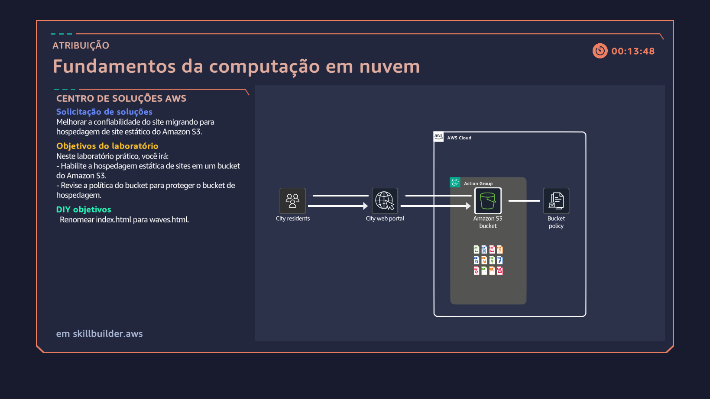

<details><summary>Primeiros passos na nuvem</summary>

Nesta etapa foi solicitado que lançasse uma instância do EC2 e configurasse um script de dados do usuário para exibir os detalhes da instância em um navegador.
</details>

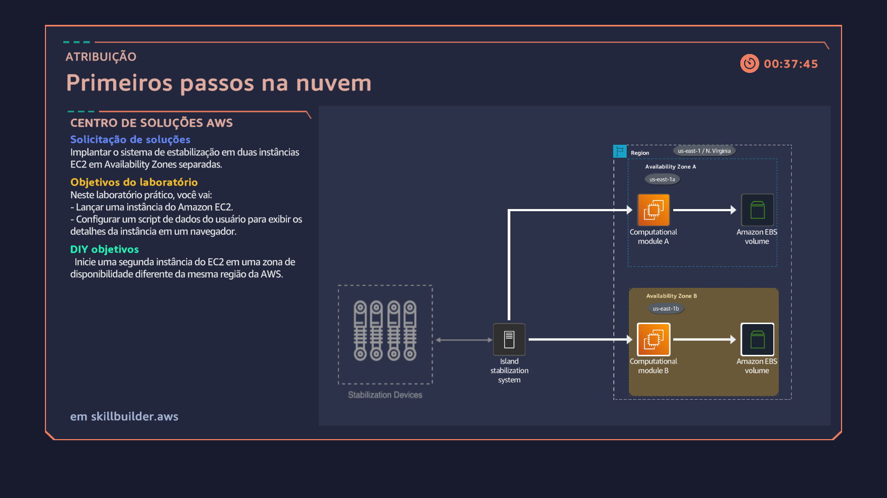

<details><summary>Soluções de Computação</summary>

Nesta etapa foi solicitado para explorar os tipos de instâncias do EC2, filtrá-las com base em seus atributos, me conectar à uma instância EC2 usando EC2 Instance Connect, visualizar metadados da instância e pará-la usando o console.
</details>

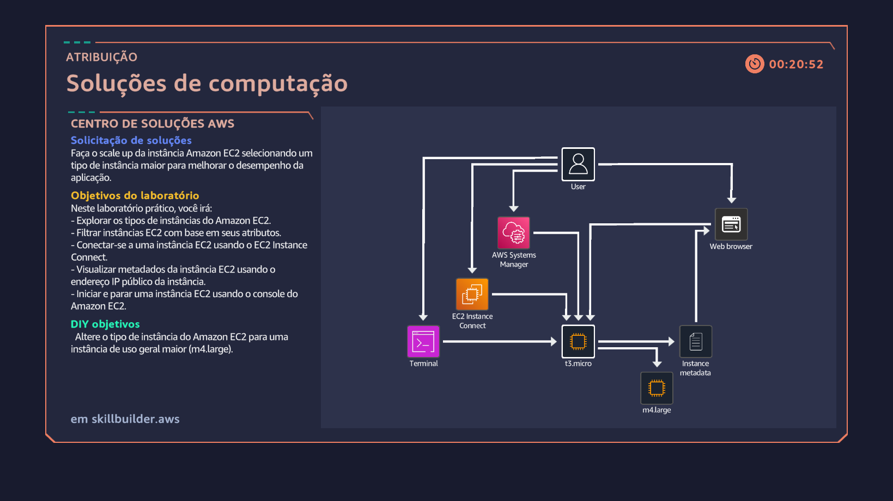

<details><summary>Conceitos de Rede</summary>

Nesta etapa foi solicitado para explorar os componentes de uma VPC, configurar tabela de rotas anexada a uma subnet dentro da VPC e configurar outra para direcionar o tráfego para o internet gateway e configurar regras de entrada no security group.
</details>

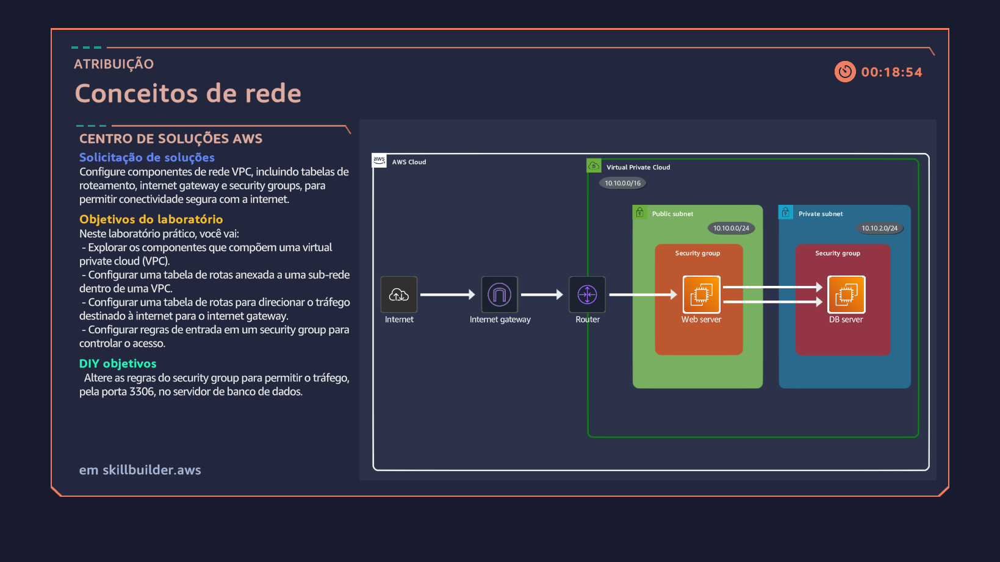

<details><summary>Economias na Nuvem</summary>

Nesta etapa foi solicitado para explorar os componentes de uma VPC, configurar tabela de rotas anexada a uma subnet dentro da VPC e configurar outra para direcionar o tráfego para o internet gateway e configurar regras de entrada no security group.
</details>

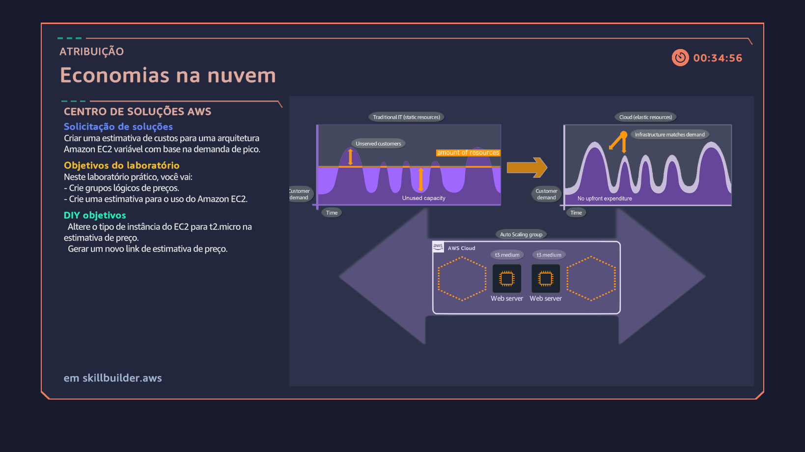

<details><summary>Banco de Dados  na Prática</summary>

Nesta etapa foi solicitado para iniciar uma instância no RDS, configurar uma implantação multi-AZ e backups no RDS.
</details>

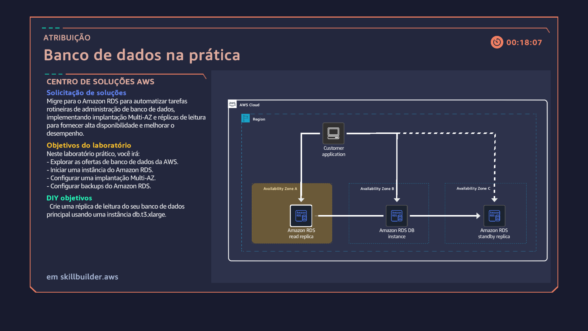


<details><summary>Conectando VPCs</summary>

Nesta etapa foi solicitado para configurar uma conexão de peering de VPC e certificar que o tráfego está roteado corretamente entre as VPCs emparelhadas.
</details>

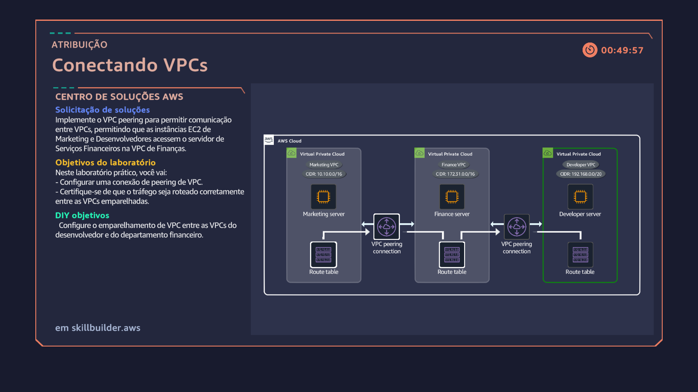

<details><summary>Primeiro Banco de Dados NoSQL</summary>

Nesta etapa foi solicitado para criar banco de dados NoSQL como uma tabela do DynamoDB, adicionar registros e consultá-la.
</details>

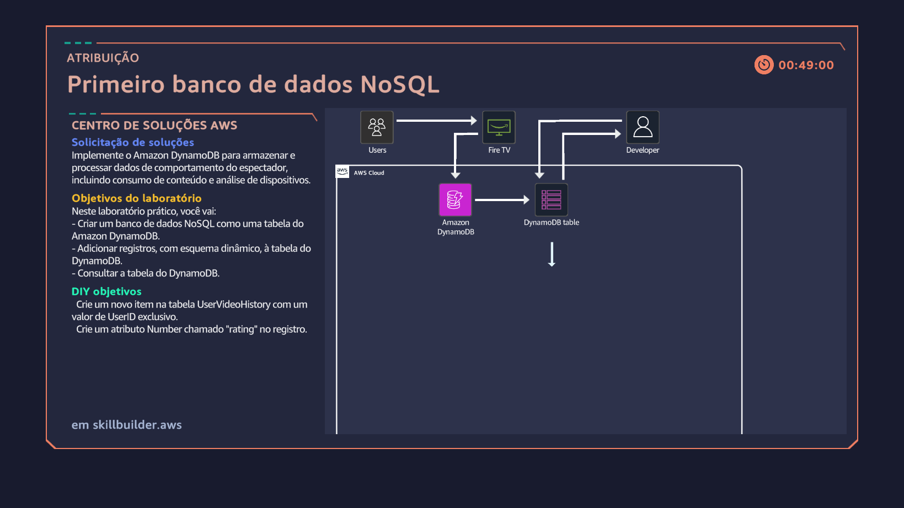

<details><summary>Sistemas de Arquivos na Nuvem</summary>

Nesta etapa foi solicitado para configurar um EFS, montar o sistema em uma instância EC2, conectar outra instância ao mesmo sistema e compartilhar arquivos entre as duas instâncias.
</details>

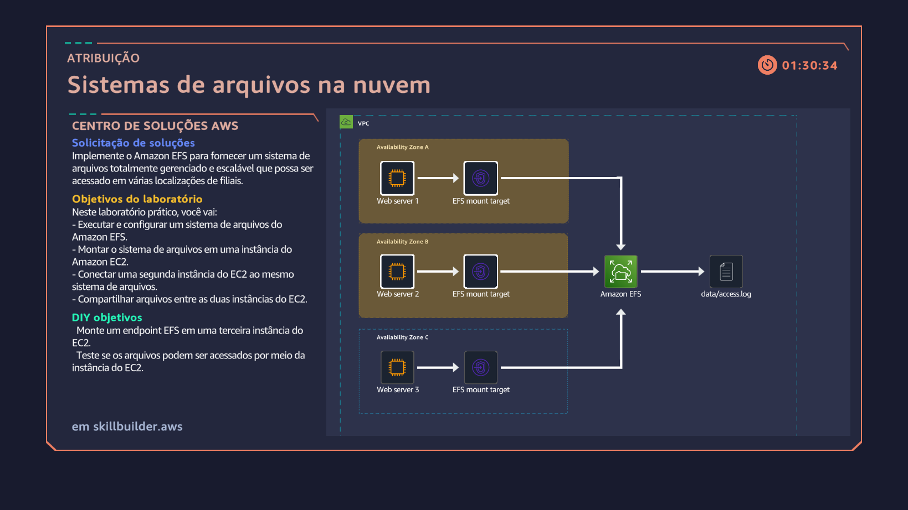

<details><summary>Conceitos Básicos de Segurança</summary>

Nesta etapa foi solicitado para criar um grupo e usuários do IAM e anexar uma política gerenciada pela aws ao grupo de usuários.
</details>

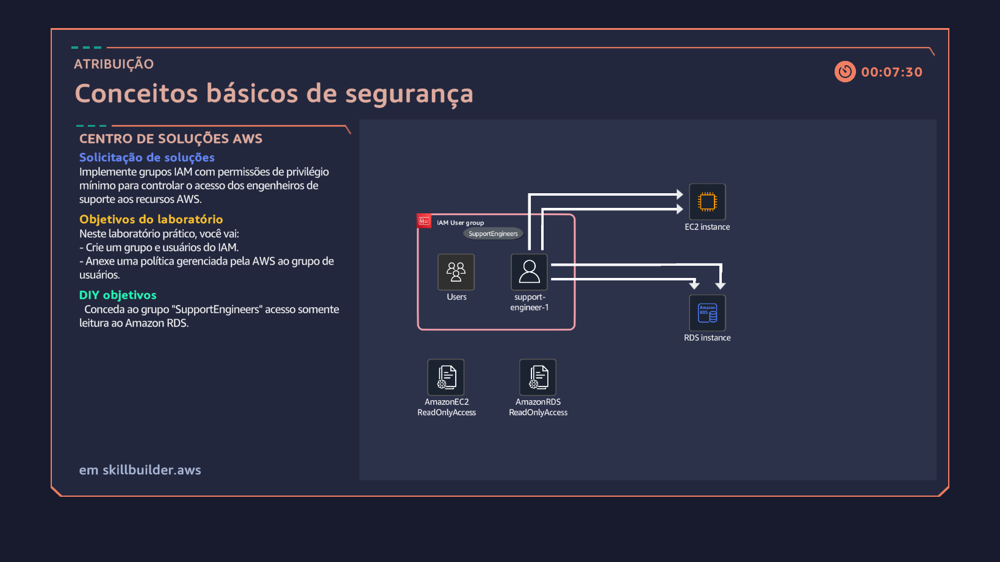

<details><summary>Aplicações de recuperação automática e com escalabilidade (Auto Scaling)</summary>

Nesta etapa foi solicitado para criar um grupo do EC2 Auto Scaling e atribuir instâncias do EC2 ao grupo do Auto Scaling.
</details>

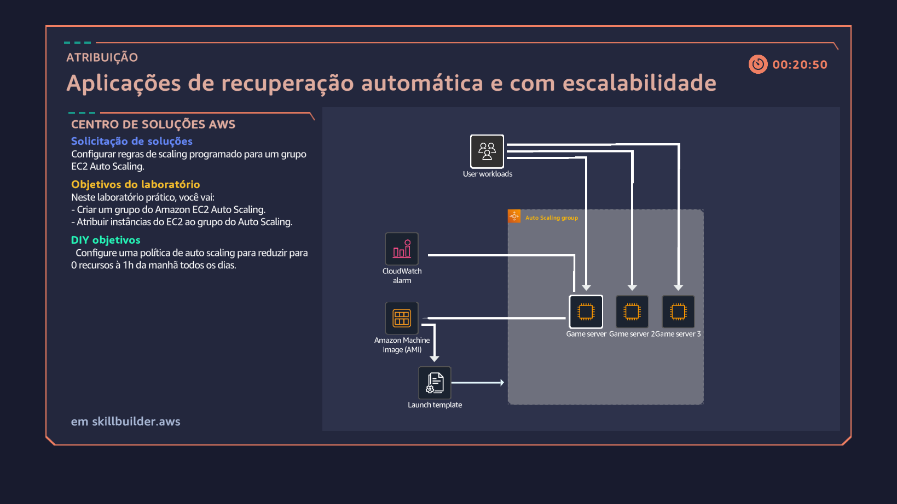


<details><summary>Aplicativos Web de Alta disponibilidade</summary>

Nesta etapa foi solicitado para configurar um grupo de Auto Scaling pra usar um Application Load Balancer, configurar health checks do load balance para o grupo Auto Scaling e adicionar outras 2 zonas de disponibilidade ao grupo de Auto Scaling.
</details>

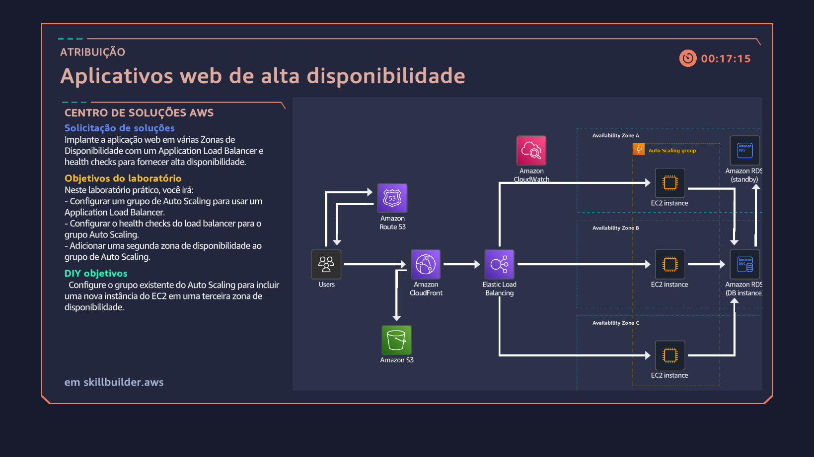

</details><br>

<details><summary>Laboratório AWS</summary>

<details><summary>S3 - Criação de Bucket e Site estático</summary>

Nesta etapa, foi realizado a criação do bucket na AWS S3, além de ter colocado os arquivos bases necessários para a realização dos exercícios posteriores.
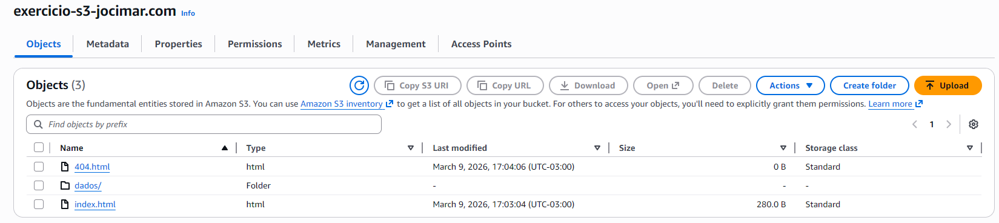

</details>

<details><summary>Athena - SQL e Consulta</summary>

Nesta etapa, foi realizado a [criação do banco de dados](./Exercicios/data-e-analytics/athena/createDatabase-query1.sql) e da [tabela](./Exercicios/data-e-analytics/athena/createTable-query2.sql)
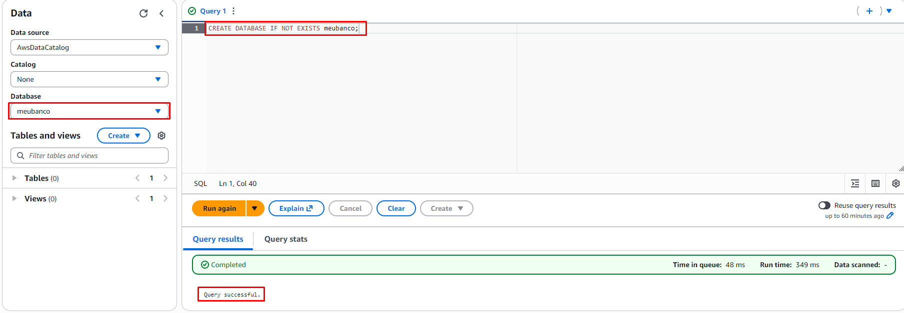
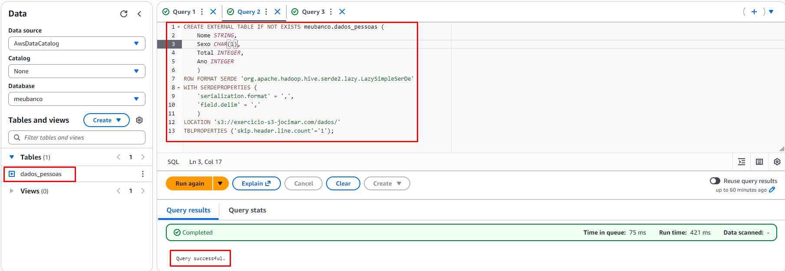
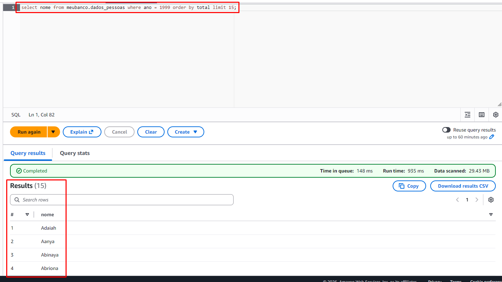

Aqui estão alguns motivos do por que usei essas funções para realizar a consulta dos [Top 3 Nomes por década](./Exercicios/data-e-analytics/athena/top3namesBydecade-query4.sql):
- `ROW_NUMBER()`: É útil para identificar linhas únicas, paginação ou remover duplicatas.
- `DENSE_RANK()`: Ideal quando o ranking precisa de continuidade (ranking denso) e num momento de empate, ele não escolhe apenas um, mas sim todos os elementos que obtiveram o mesmo resultado, colocando-os no mesmo patamar. Diferente do row_number() que escolhe apenas um por linha ou do rank() que não deixará de refletir empates, porém segue à risca a quantidade de itens limite definido.

</details>

<details><summary>Lambda - Criação e uso de Função e Camada(layer) </summary>

Nesta etapa foi usada a imagem Docker `amazonlinux:2023` para em seguida o container ser criado, ao qual continha as bibliotecas numpy(por obrigação) e pandas. Além disso, dentro da AWS, foi criado uma função lambda e uma layer(camada) chamada PandasLayer, ao qual empcatou bibliotecas e outras dependências do arquivo chamado "minha-camada-pandas.zip".
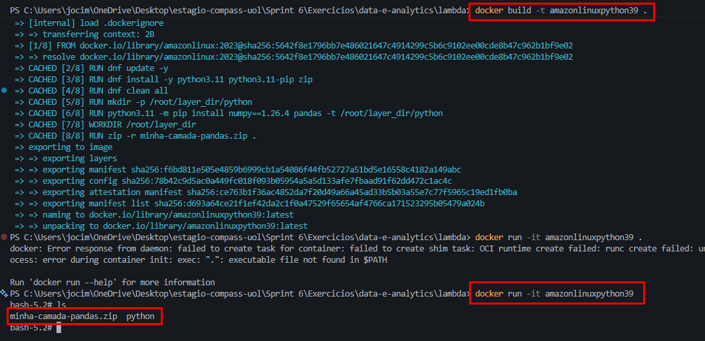
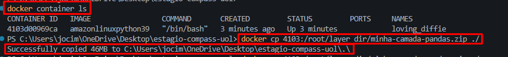
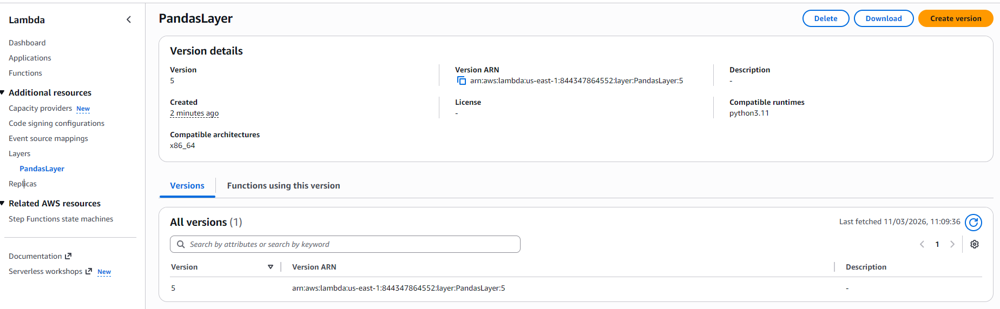
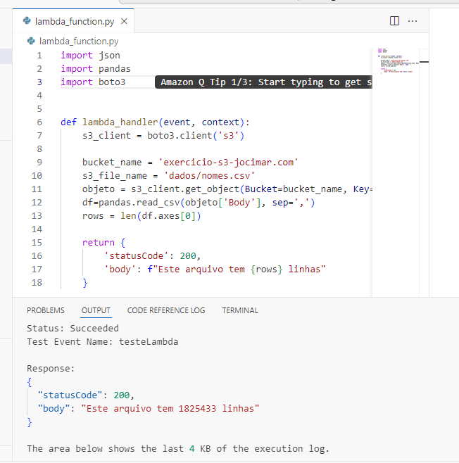
</details>

<details><summary>Limpeza de Recursos</summary>

Nesta etapa foi realizada a exclusão dos arquivos contidos no bucket e o bucket em si, como o recomendado.
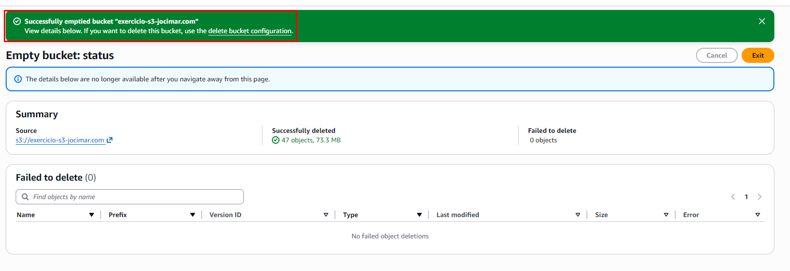
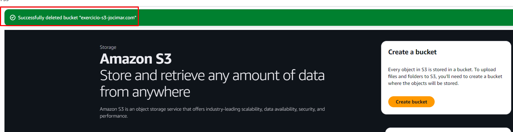
</details>

</details><br>

# 🎯 Desafio da Sprint
O desenvolvimento do desafio da sprint e seus respectivos arquivos relacionados encontram-se em sua pasta, assim como seu README que fora usado para dissertar sobre os passos executados e resultados.
O Readme do Desafio foi dividido em etapas, seguindo a lógica proposta pela Compass e tais quais apresentam e explicam as resoluções utilizadas e os resultados obtidos:
- 📁[Pasta do Desafio](../Sprint%206/Desafio/)
- 📝[README do Desafio](../Sprint%206/Desafio/README.md)
    
# ✅ Certificados

### AWS Partner Accreditation (Português)
[Certificado: AWS Technical Essentials](./Certificados/AWS%20Technical%20Essentials.pdf)

[Certificado: AWS Partner Accreditation](./Certificados/AWS%20Partner%20Accreditation.pdf)

### AWS Cloud Quest: Cloud Practitioner

[Certificado: AWS Cloud Quest Practitioner](./Certificados/AWS%20Cloud%20Quest%20Cloud%20Practitioner.pdf)