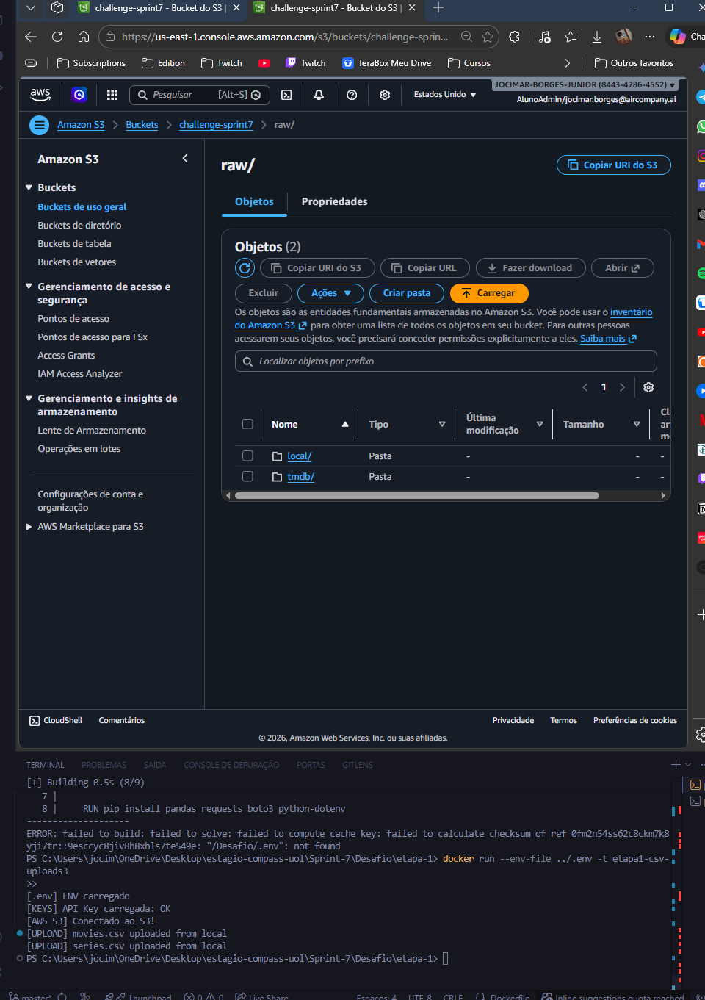
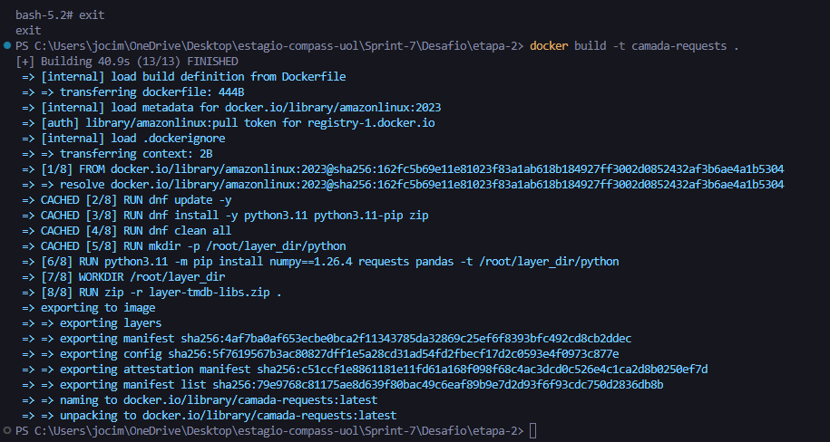
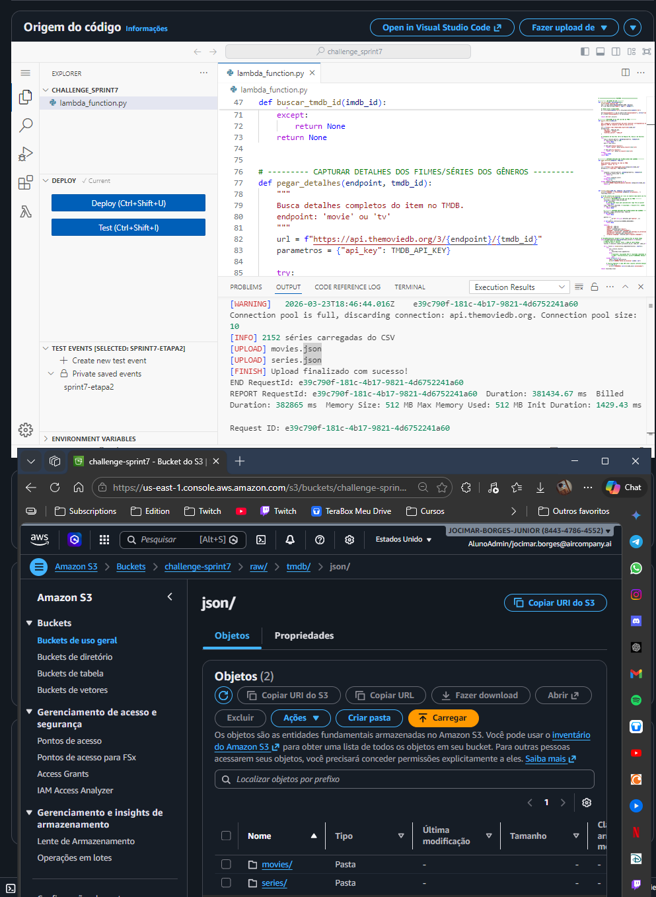

# 📊 Desafio da Sprint – AWS + Desafio Final

## 🎯 Objetivo do Desafio
A finalidade dessa análise é para comparar consistência, engajamento e popularidade. Utilizando conhecimentos aprendidos e praticados anteriormente em ambiente AWS Lambda, S3 e Docker.

## 📌 Visão Geral

## Análises de filmes/séries do gênero Comédia e Animação
- Consistência das avaliações entre gêneros
- Influência do formato (filme/série) na consistência
- Influência do engajamento na estabilidade das avaliações
- Impacto da popularidade na dispersão das notas
- Influência de franquias na consistência

## ⏬ Etapas
### [Etapa 1](../Desafio/etapa-1/) - Definir as análises e script de upload
Nesta etapa, fiz o upload para o Bucket do S3 dos arquivos `movies.csv` e `series.csv`, que são dados do IMDB disponibilizados pelo desafio.
- Utilizei a biblioteca `os` e `dotenv` para carregar e acessar as variáveis de ambiente configuradas no arquivo [.env](../Desafio/.env.example).
- A biblioteca `boto3` foi usada para conectar-se à AWS.
<details><summary>Script Python</summary>

```python
import boto3
import os
from dotenv import load_dotenv

load_dotenv()
print("[.env] ENV carregado")

api_key = os.getenv("API_KEY_TMDB")
print("[KEYS] API Key carregada:", "OK" if api_key else "ERRO")

access_key = os.getenv("AWS_ACCESS_KEY_ID")
secret_key = os.getenv("AWS_SECRET_ACCESS_KEY")
session_token = os.getenv("AWS_SESSION_TOKEN")
region = os.getenv("AWS_DEFAULT_REGION")
bucket=os.getenv("BUCKET_NAME")

s3 = boto3.client("s3",
                  aws_access_key_id=access_key,
                  aws_secret_access_key=secret_key,
                  aws_session_token=session_token,
                  region_name=region
                  )
print("[AWS S3] Conectado ao S3!")

s3.upload_file("movies.csv", bucket, f"raw/local/csv/movies/2026/03/20/movies.csv")
print("[UPLOAD] movies.csv uploaded from local")

s3.upload_file("series.csv", bucket, f"raw/local/csv/series/2026/03/20/series.csv")
print("[UPLOAD] series.csv uploaded from local")
```
</details>

<details><summary>Execução</summary>

**Modo Normal:**
```bash
docker build -t etapa1-csv-uploads3 .
docker run --env-file ../.env -t etapa1-csv-uploads3
```

**Via Docker Compose:**
```bash
# Acesse a pasta raiz do Compose
cd './Sprint-7/Desafio/'

# utilize a versão v2.20+ do Docker para este comando funcionar
docker-compose run --build --rm etapa1
# senão:
docker-compose up --build etapa1
docker-compose run --rm etapa1
```
</details>

<details><summary>Resultado obtido</summary>

Pasta `/local` no Bucket do S3, onde se encontra os arquivos csv no caminho.

</details>

### [Etapa 2](../Desafio/etapa-2/) - Dados da API do TMDB e Upload via Lambda
Nesta etapa para reduzir o tempo de execução, utilizei de processamento paralelo com threads para realizar cerca de 20 requisições por segundo à API do TMDB. Esta etapa consistia em capturar dados da API do TMDB que fossem diferentes daqueles contidos nos CSVs, ou seja, complementares.  
Esse script pega os IDs do IMDB que sejam 35(comedia) ou 16(animacao) e buscam os dados complementares no TMDB.
- Utilizei biblioteca `boto3` para me conectar à AWS
- Utilizei blbioteca `pandas` para fazer a leitura e pequena formatação(redução) dos datasets originais (movies.csv e series.csv) para reduzir a quantidade de dados processados.
- Utilizei a biblioteca `requests` para fazer requisições à API
- Utilizei a blbioteca `json` para converter dados entre Python e JSON, permitindo tanto ler respostas da API quanto salvar resultados no S3 em formato padronizado.
- Utilizei a biblioteca `os` para capturar os dados das variáveis de ambientes criadas no Lambda
- Utilizei a biblioteca `concurrent.futures` para realizar o processamento paralelo e utilizar threads para fazer várias requisições ao mesmo tempo.

Neste script, filtrei os dados do TMDB, pegando apenas os correspondentes aos IDs contidos no CSV, que fossem do gênero Comédia e Animação e sua data de lançamento fosse superior ao ano de 2022.

<details><summary>Script Python</summary>

```py
import boto3
import json
import os
import pandas as pd
import requests
from concurrent.futures import ThreadPoolExecutor, as_completed

TMDB_API_KEY = os.environ["API_KEY_TMDB"]
BUCKET_NAME = os.environ["BUCKET_NAME"]
MOVIES_CSV_KEY = os.environ["MOVIES_CSV_KEY"]
SERIES_CSV_KEY = os.environ["SERIES_CSV_KEY"]
GENRES_DESEJADOS = [35, 16]  # Comedy, Animation

s3 = boto3.client("s3")
try:
    response = s3.list_buckets()
    bucket_names = [b["Name"] for b in response["Buckets"]]
    print("[AWS S3] Conexão feita!")
    print(f"Buckets disponíveis: {bucket_names}")
except Exception as e:
    print(f"[AWS S3] Erro ao conectar: {e}")

session = requests.Session()

def ler_csv_s3(key, ano_minimo=2021):
    print("Lendo arquivos CSV...")
    obj = s3.get_object(Bucket=BUCKET_NAME, Key=key)
    df = pd.read_csv(obj["Body"], sep="|", dtype=str)
    df = df.dropna(subset=["id"]).drop_duplicates(subset=["id"])
    df["anoLancamento"] = pd.to_numeric(df["anoLancamento"], errors="coerce")
    df = df[df["anoLancamento"] >= ano_minimo]
    return df["id"].tolist()

def buscar_tmdb_id(imdb_id):
    url = f"https://api.themoviedb.org/3/find/{imdb_id}"
    parametros={
        "api_key": TMDB_API_KEY,
        "language": "en-US",
        "external_source": "imdb_id"
    }

    try:
        resp = session.get(url, params=parametros, timeout=10)
        if resp.status_code != 200:
            return None
        data = resp.json()

        if data.get("movie_results"):
            return "movie", data["movie_results"][0]["id"]

        if data.get("tv_results"):
            return "tv", data["tv_results"][0]["id"]
    except:
        return None
    return None


def pegar_detalhes(endpoint, tmdb_id):

    url = f"https://api.themoviedb.org/3/{endpoint}/{tmdb_id}"
    parametros = {"api_key": TMDB_API_KEY}

    try:
        resposta = session.get(url, params=parametros, timeout=10)
        if resposta.status_code != 200:
            return {}
        try:
            return resposta.json()
        except ValueError:
            return {}
    except requests.RequestException as e:
        print(f"[ERROR] RequestException detalhes {endpoint}/{tmdb_id}: {e}")
        return {}

def filtrar_dados(imbd_ids, endpoint, max_workers=15):
    print(f"[LOADING...] Processando {endpoint} em paralelo...")
    resultado_final = []

    def _processar_um_id(imdb_id):
        resultado = buscar_tmdb_id(imdb_id)
        if not resultado:
            return None
        tipo, tmdb_id = resultado  # resultado = ("movie"|"tv", 12345)
        if tipo != endpoint:
            return None

        detalhes = pegar_detalhes(tipo, tmdb_id)
        if not detalhes:
            return None

        generos = {
                    g["id"] for g in detalhes.get("genres", [])
                  }
        if not generos.intersection(GENRES_DESEJADOS):
            return None

        return {
            "imdb_id": imdb_id,
            "tmdb_id": tmdb_id,
            "adult": detalhes.get("adult"),
            "homepage": detalhes.get("homepage"),
            "belongs_to_collection": detalhes.get("belongs_to_collection") if tipo == "movie" else None,
            "popularity": detalhes.get("popularity"),
            "original_language": detalhes.get("original_language"),
        }

    with ThreadPoolExecutor(max_workers=max_workers) as executor:

        futures = {executor.submit(_processar_um_id, imdb_id): imdb_id for imdb_id in imbd_ids}

        for i, future in enumerate(as_completed(futures), start=1):
            try:
                res = future.result()
                if res:
                    resultado_final.append(res)
                else:
                    pass
            except Exception as e:
                imdb = futures.get(future)
                print(f"[ERROR] Falha ao processar {imdb}: {e}")

            if i % 100 == 0:
                print(f"[PROGRESS] {i}/{len(imbd_ids)} processados")

    return resultado_final

def salvar_no_s3(dados, caminho):
    if not dados:                                               
        print("[WARNING] Nenhum dado para upload")
        return

    s3.put_object(Bucket=BUCKET_NAME,
                  Key=caminho, 
                  Body=json.dumps(dados, ensure_ascii=False),
                  ContentType="application/json"
                  )
    print(f"[UPLOAD] {os.path.basename(caminho)}")

def lambda_handler(event, context):
    movies_ids = ler_csv_s3(MOVIES_CSV_KEY, ano_minimo=2022)
    series_ids = ler_csv_s3(SERIES_CSV_KEY, ano_minimo=2022)

    filmes = filtrar_dados(movies_ids, "movie")
    path_filmes = "raw/tmdb/json/movies/2026/03/20/movies.json"
    print(f"[INFO] {len(movies_ids)} filmes carregados do CSV")
    
    series = filtrar_dados(series_ids, "tv")
    path_series = "raw/tmdb/json/series/2026/03/20/series.json"
    print(f"[INFO] {len(series_ids)} séries carregadas do CSV")

    salvar_no_s3(filmes, path_filmes)
    salvar_no_s3(series, path_series)
    print("[FINISH] Upload finalizado com sucesso!")

    return {
        "statusCode": 200,
        "body": json.dumps({
            "movies_qtd": len(filmes),
            "series_qtd": len(series),
            "movies_path": path_filmes,
            "series_path": path_series
        })
    }
```
</details>

<details><summary>Execução</summary>

[Buildar a imagem:]()
```bash
docker build -t camada-requests .
```

[Rodar container e copiar arquivo .zip para repositório local:](./etapa-2/layer-tmdb-libs.zip)
```bash
docker run --rm -v ${PWD}:/output camada-requests cp /root/layer_dir/layer-tmdb-libs.zip /output/

# OU

docker run -it camada-requests
# abra outro terminal e:
docker cp <id_container>:/root/layer_dir/layer-tmdb-libs.zip .
```

### Pontos a serem observados
O `-v` serve para mapear (conectar) uma pasta do seu computador a uma pasta dentro do container. Sem isso, tudo o que acontece no Docker morre no Docker. Com o volume, o que você colocar na pasta do container aparece no seu PC na mesma hora.

`${PWD}`: significa *Print Working Directory* (Diretório de Trabalho Atual).
É um atalho que diz ao Docker "Use a pasta onde eu estou agora no Windows".

`/output`
É o nome de uma pasta "fantasia" que o Docker vai criar dentro do container apenas para essa operação. Como se fosse uma "caixa de correio" compartilhada.

**Informações de configuração da layer/function no AWS Lambda**:  
Arquitetura: x86_64  
Interpretador: Python 3.11

</details>

<details><summary>Resultado obtido</summary>

Criação do arquivo [layer-tmdb-libs.zip](etapa-2/layer-tmdb-libs.zip) ao qual foi exportado para uma camada(layer) do Lambda, contendo as bibliotecas não nativas.


Execução do script no AWS Lambda, citado anteriormente, e as pastas `series/` e `movies/`.

</details>
