# 📊 Desafio da Sprint – AWS + Desafio Final

## 🎯 Objetivo do Desafio
A finalidade dessa análise é para comparar consistência, engajamento e popularidade. Utilizando conhecimentos aprendidos e praticados anteriormente em ambiente AWS Lambda, S3 e Docker.

## 📌 Visão Geral

## Análises de filmes/séries do gênero Comédia e Animação
- Consistência das avaliações entre gêneros
- Influência do formato (filme/série) na consistência
- Influência do engajamento na estabilidade das avaliações
- Impacto da popularidade na dispersão das notas
- Influência de franquias na consistência

## ⏬ Desenvolvimento
O desenvolvimento deste desafio dividi em etapas, para facilitar a compreensão e objetivar os processos.

### Etapa 1 - Configurações do Glue
- Primeiramente foi configurado os Jobs do AWS Glue, na qual foi necessário criar uma Role no AWS IAM que daria permissões para acessar o S3, CloudWatch, Data Lake Formation e etc., usando as políticas AmazonS3FullAccess, AWSLakeFormationDataAdmin, AWSGlueConsoleFullAccess e CloudWatchFullAccess.
- Após isso, no AWS Lake Formation um database foi criado que serviria para o crawler, que futuramente foi criado, adicionar automaticamente uma tabela a partir dos dados armazenados no S3.
- E então, no AWS Glue, criei um Job e configurei-o, além de adicionar os parâmetros (variaveis de ambiente)

### Etapa 2 - Implementação do Código-Fonte
- Primeiramente foi criado o código [gluecsv.py](./gluecsv.py) que faria o processamento dos arquivos CSV e testado localmente e posteriormente adaptado para o contexto do Glue. Nesse momento, os dados foram puxados e lidos do Bucket do S3, houve a transformação de tipos (casting) nas colunas, renomeação das nomenclaturas para o estilo snake_case e padronização das strings, além da conversão de `\N` (que estava como string) para tipo nulo (Null).
- <details><summary><a href="./gluecsv.py">Código Python - gluecsv.py</a></summary>

    ```py
    import sys
    from awsglue.transforms import *
    from awsglue.utils import getResolvedOptions
    from pyspark.context import SparkContext
    from awsglue.context import GlueContext
    from awsglue.job import Job
    from pyspark.sql import functions as F
    from awsglue.dynamicframe import DynamicFrame
    from pyspark.sql.functions import col, trim, lower
    from pyspark.sql import types as ty
    import re

    # @params: [JOB_NAME], [S3_INPUT_PATH], [S3_TARGET_PATH]
    args = getResolvedOptions(sys.argv, ['JOB_NAME','S3_INPUT_PATH_MOVIE','S3_INPUT_PATH_SERIES','S3_TARGET_PATH'])

    sc = SparkContext()
    glueContext = GlueContext(sc)
    spark = glueContext.spark_session
    job = Job(glueContext)
    job.init(args['JOB_NAME'], args)

    source_file_movies = args['S3_INPUT_PATH_MOVIE']
    source_file_series = args['S3_INPUT_PATH_SERIES']
    target_path = args['S3_TARGET_PATH']

    dynamic_frame_movies = glueContext.create_dynamic_frame.from_options(
        connection_type="s3",
        connection_options={"paths": [source_file_movies]},
        format="csv",
        format_options={"withHeader": True, "separator":"|"},
    )
    dynamic_frame_series = glueContext.create_dynamic_frame.from_options(
        connection_type="s3",
        connection_options={"paths": [source_file_series]},
        format="csv",
        format_options={"withHeader": True, "separator":"|"},
    )

    df_movies = dynamic_frame_movies.toDF().replace("\\N", None)
    df_series = dynamic_frame_series.toDF().replace("\\N", None)

    def strings_snake_case(nome):

        expressao = re.sub('(.)([A-Z][a-z]+)', r'\1_\2', nome)

        expressao = re.sub('([a-z0-9])([A-Z])', r'\1_\2', expressao).lower()

        expressao = re.sub(r'[\s\.]+', '_', expressao).lower()

        return expressao.lower()

    mapeamento_colunas_movies = [(c, strings_snake_case(c)) for c in df_movies.columns]
    mapeamento_colunas_series = [(c, strings_snake_case(c)) for c in df_series.columns]

    df_movies_trusted = df_movies.select([col(velho).alias(novo) for velho, novo in mapeamento_colunas_movies])
    df_series_trusted = df_series.select([col(velho).alias(novo) for velho, novo in mapeamento_colunas_series])


    df_movies_trusted = df_movies_trusted \
        .withColumn("ano_lancamento", col("ano_lancamento").cast(ty.IntegerType())) \
        .withColumn("tempo_minutos", col("tempo_minutos").cast(ty.IntegerType())) \
        .withColumn("nota_media", col("nota_media").cast(ty.DoubleType())) \
        .withColumn("numero_votos", col("numero_votos").cast(ty.IntegerType())) \
        .withColumn("ano_nascimento", col("ano_nascimento").cast(ty.IntegerType())) \
        .withColumn("ano_falecimento", col("ano_falecimento").cast(ty.IntegerType()))

    df_series_trusted = df_series_trusted \
        .withColumn("ano_lancamento", col("ano_lancamento").cast(ty.IntegerType())) \
        .withColumn("ano_termino", col("ano_termino").cast(ty.IntegerType())) \
        .withColumn("tempo_minutos", col("tempo_minutos").cast(ty.IntegerType())) \
        .withColumn("nota_media", col("nota_media").cast(ty.DoubleType())) \
        .withColumn("numero_votos", col("numero_votos").cast(ty.IntegerType())) \
        .withColumn("ano_nascimento", col("ano_nascimento").cast(ty.IntegerType())) \
        .withColumn("ano_falecimento", col("ano_falecimento").cast(ty.IntegerType()))

    def padronizar_strings(dataset):
        padronizar = [
            lower(trim(col(c))).alias(c) if t == "string" else col(c)
            for c, t in dataset.dtypes
        ]
        return padronizar

    df_movies_trusted = df_movies_trusted.select(*padronizar_strings(df_movies_trusted)).dropDuplicates()
    df_series_trusted = df_series_trusted.select(*padronizar_strings(df_series_trusted)).dropDuplicates()

    dynamic_frame_movies_salvar = DynamicFrame.fromDF(df_movies_trusted, glueContext, "dynamic_frame_movies_salvar")

    dynamic_frame_series_salvar = DynamicFrame.fromDF(df_series_trusted, glueContext, "dynamic_frame_series_salvar")

    glueContext.write_dynamic_frame.from_options(
        frame = dynamic_frame_movies_salvar,
        connection_type = "s3",
        connection_options = {"path": f"{target_path}/movies/"},
        format = "parquet"
    )

    glueContext.write_dynamic_frame.from_options(
        frame = dynamic_frame_series_salvar,
        connection_type = "s3",
        connection_options = {"path": f"{target_path}/series/"},
        format = "parquet"
    )

    job.commit()
    ```
</details><br>

- Da mesma maneira, os dados do TMDB capturados e armazenados no bucket foram processados e houve a formatação dos dados das colunas, na qual strings foram padronizadas e a ordenação das colunas visando uma visualização melhor.
- <details><summary><a href="./gluejson.py">Código Python - gluejson.py</a></summary>

    ```py
    import sys
    from awsglue.transforms import *
    from awsglue.utils import getResolvedOptions
    from pyspark.context import SparkContext
    from awsglue.context import GlueContext
    from awsglue.job import Job
    from pyspark.sql import functions as F
    from awsglue.dynamicframe import DynamicFrame
    from pyspark.sql.functions import col, trim, lower
    from pyspark.sql import types as ty
    import re

    # @params: [JOB_NAME], [S3_INPUT_PATH], [S3_TARGET_PATH]
    args = getResolvedOptions(sys.argv, ['JOB_NAME','S3_INPUT_PATH_MOVIE','S3_INPUT_PATH_SERIES','S3_TARGET_PATH'])

    sc = SparkContext()
    glueContext = GlueContext(sc)
    spark = glueContext.spark_session
    job = Job(glueContext)
    job.init(args['JOB_NAME'], args)

    source_file_movies = args['S3_INPUT_PATH_MOVIE']
    source_file_series = args['S3_INPUT_PATH_SERIES']
    target_path = args['S3_TARGET_PATH']

    dynamic_frame_movies = glueContext.create_dynamic_frame.from_options(
        connection_type="s3",
        connection_options={"paths": [source_file_movies], "recurse": True},
        format="json",
        format_options={"jsonPath": "$[*]", "multiline": True},
    )
    dynamic_frame_series = glueContext.create_dynamic_frame.from_options(
        connection_type="s3",
        connection_options={"paths": [source_file_series], "recurse": True},
        format="json",
        format_options={"jsonPath": "$[*]", "multiline": True},
    )

    df_movies = dynamic_frame_movies.toDF()
    df_series = dynamic_frame_series.toDF()

    df_movies_trusted = df_movies.select("imdb_id", "tmdb_id", "popularity", "original_language", "adult", "belongs_to_collection", "homepage")
    df_series_trusted = df_series.select("imdb_id", "tmdb_id", "popularity", "original_language", "adult", "homepage")

    df_movies_trusted = df_movies_trusted.withColumn("tmdb_id", col("tmdb_id").cast(ty.IntegerType()))
    df_series_trusted = df_series_trusted.withColumn("tmdb_id", col("tmdb_id").cast(ty.IntegerType()))

    def padronizar_strings(dataset):
        padronizar = [
            lower(trim(col(c))).alias(c) if t == "string" else col(c)
            for c, t in dataset.dtypes
        ]
        return padronizar
    df_movies_trusted = df_movies_trusted.select(*padronizar_strings(df_movies_trusted))
    df_series_trusted = df_series_trusted.select(*padronizar_strings(df_series_trusted))


    dynamic_frame_movies_salvar = DynamicFrame.fromDF(df_movies_trusted, glueContext, "dynamic_frame_movies_salvar")
    dynamic_frame_series_salvar = DynamicFrame.fromDF(df_series_trusted, glueContext, "dynamic_frame_series_salvar")

    glueContext.write_dynamic_frame.from_options(
        frame = dynamic_frame_movies_salvar,
        connection_type = "s3",
        connection_options = {"path": f"{target_path}/movies/"},
        format = "parquet"
    )

    glueContext.write_dynamic_frame.from_options(
        frame = dynamic_frame_series_salvar,
        connection_type = "s3",
        connection_options = {"path": f"{target_path}/series/"},
        format = "parquet"
    )

    job.commit()
    ```
</details>

- Os dataframes agora processados e formatados foram exportados em formato `.parquet` para o S3.

### Etapa 3 - AWS Glue e Data Catalog
- Após feita a implementação, os scripts foram executados no Job do AWS Glue, armazenando os dados como `.parquet` no Bucket do S3.
    - Job com o script do processamento dos CSV 
    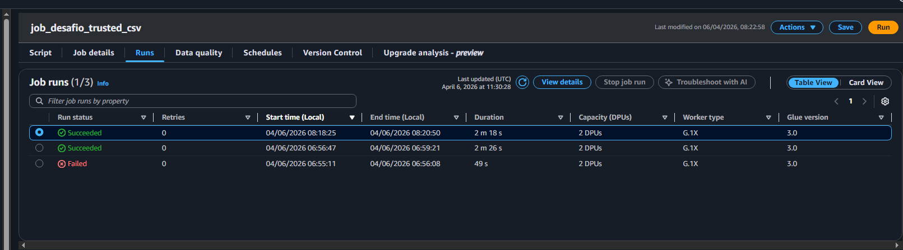

    - Job com o script do processamento dos dados do TMDB .json
    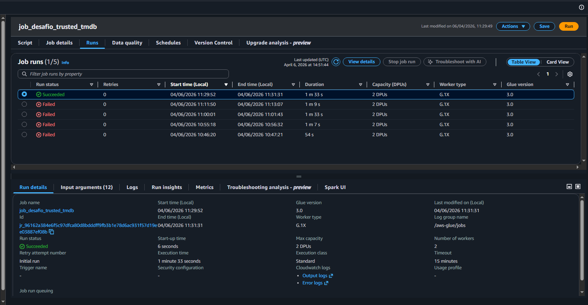

- Os dados armazenados no Bucket do S3 após a execução dos Jobs foram lidos pelo crawler e uma tabela automaticamente foi criada
    #### LOCAL
    - Criação do Crawler para os arquivos local (originalmente CSV)
    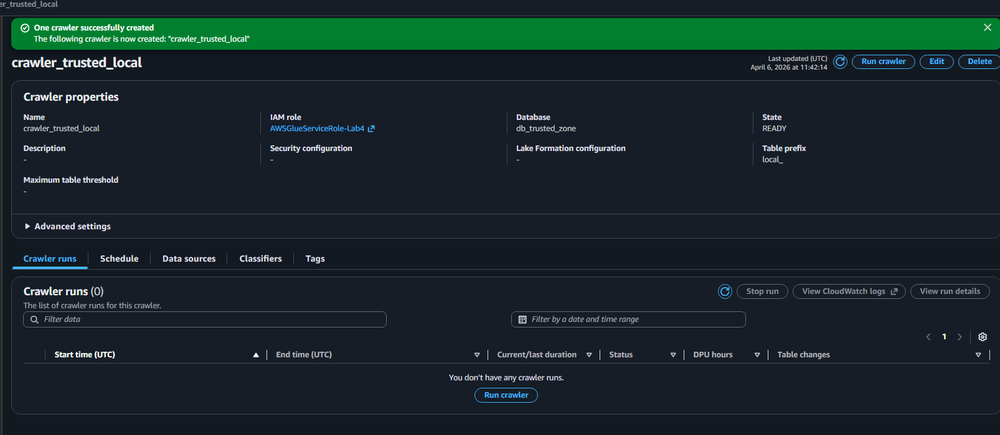
    - Execução bem sucedida do crawler
    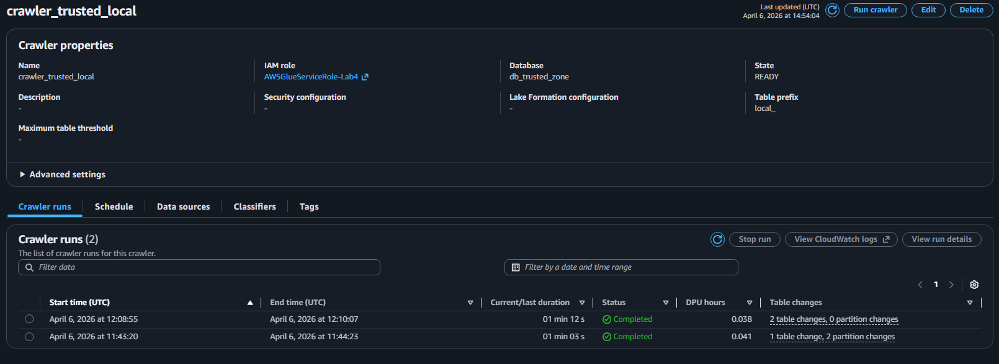
    - Consequentemente a criação das tabelas `local_*`
    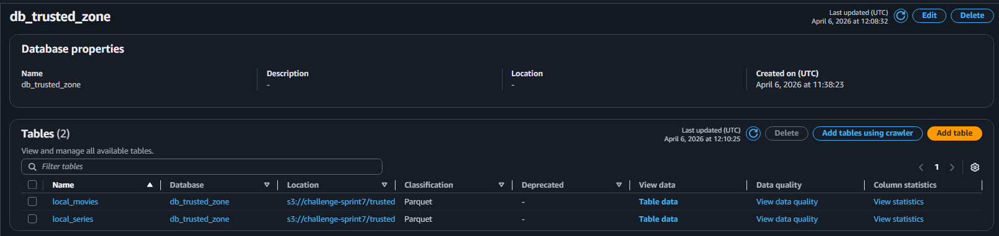
    
    #### TMDB
    - Criação do Crawler para os arquivos do TMDB (originalmente .json)
    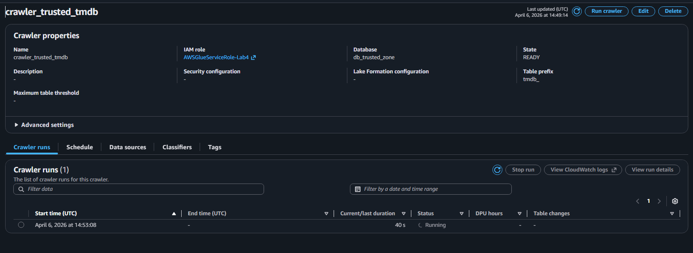
    - Execução bem sucedida do crawler
    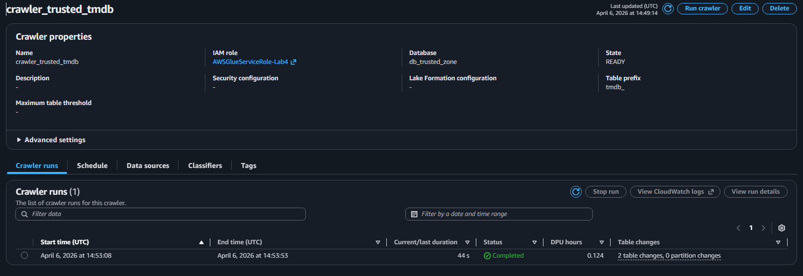
    - Consequentemente a criação das tabelas `tmdb_*`
    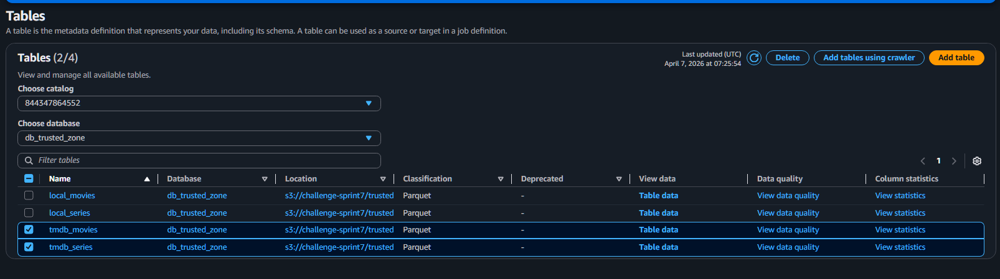

### Etapa 4 - Consulta e Verificação dos dados no AWS Athena

- Após a criação das tabelas `tmdb_*` e `local_*` para series e movies, uma consulta foi realizada no Athena para verificar se os dados foram corretamente inseridos e organizados.
    #### LOCAL
    - Consulta na tabela Movies
    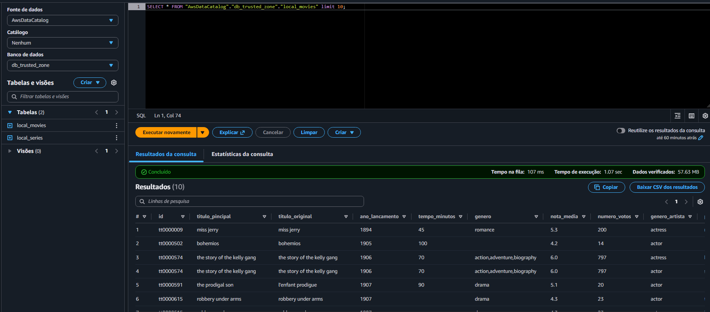
    - Consulta na tabela Series
    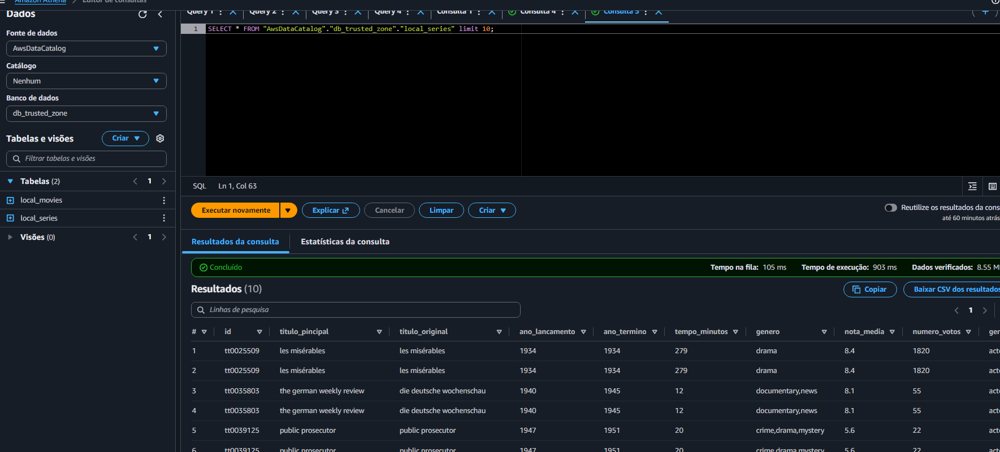

    #### TMDB
    - Consulta na tabela Movies
    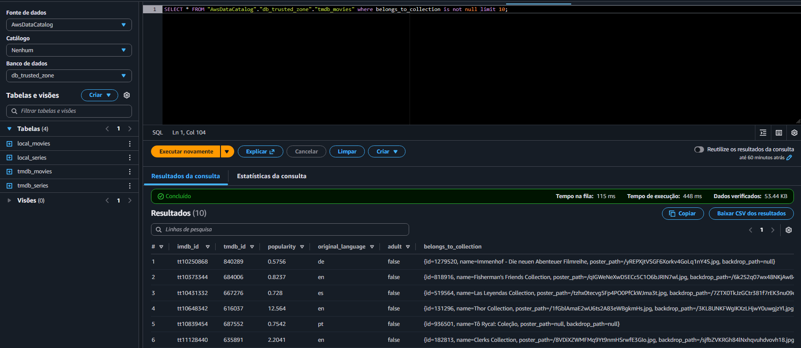
    - Consulta na tabela Series
    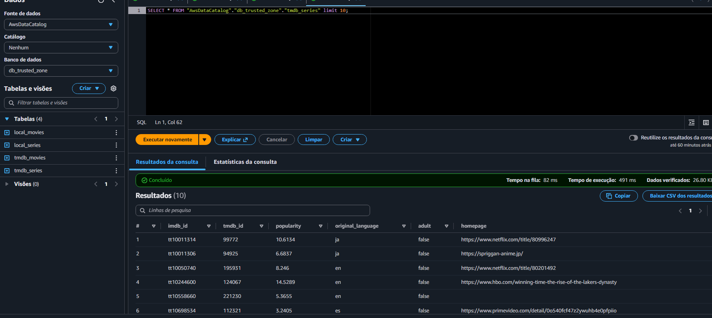