# 📝 Resumo

## 🔍 Índice
- [Competências Aplicadas](#-competências-aplicadas)
- [Exercícios](#-exercícios)
- [Evidências](#%E2%80%8D-evidências)
- [Desafio da Sprint](#-desafio-da-sprint)
- [Certificados](#-certificados)


## 🧠 Competências aplicadas
- e
- e

## 🔶 Curso: Pyspark | Fundamentos Análise AWS | Glue
### AWS Skill Builder - Fundamentals of Analytics on AWS – Part 2
**<details><summary>Seção 1: Arquiteturas</summary>**

<details><summary>Data Lake</summary>

- **O que é um DataLake?**  
    Um repositório centralizado que uma organização pode usar para armazenar dados em escala, estruturados e não estruturados, em seu formato original. Os data lakes ingerem dados brutos de várias fontes, como bancos de dados, sensores, mídia social, documentos e aplicações. Antes da análise, os dados brutos podem passar por transformações, como limpeza, normalização, agregação e muito mais. Os recursos de grande escala e schema-on-read de um data lake oferecem oportunidades para as organizações obterem informações por meio de analytics de big data, machine learning e inteligência artificial (IA).
    
- **Benefícios do Data Lake**  
    - Ajudam a eliminar os silos de dados para maximizar o valor dos seus dados de ponta a ponta
    - Escalabilidade
    - Eficiência de Custos
    - Flexibilidade
    - Análise mais rápida
    - Visualização centralizada

- **Funções de um Data Lake**  
    <details><summary>Ingestão e Armazenamento</summary>
    
    Dados coletados de várias fontes e ingeridos na zona bruta (raw zone) do datalake em seu formato original. Com esse processo pode-se escalar dados de qualquer tamanho e economizar tempo definindo antecipadamente estruturas de dados, esquemas e transformações. Os dados brutos podem então ser movidos para uma zona processada onde passam por transformações para prepará-los para análise.
    </details>

    <details><summary>Catalogação e Pesquisa</summary>

    Data lakes podem armazenar diferentes tipos de dados, incluindo dados não estruturados, semiestruturados e estruturados. A principal vantagem dos data lakes é que eles permitem que você entenda quais dados residem no lake. Atributos como crawling, catalogação e indexação ajudam a classificar o conteúdo do data lake e facilitam a localização de ativos de dados específicos para análise. Ao oferecer suporte a vários tipos de dados e catalogar dados, os data lakes fornecem um repositório centralizado para os diversos dados gerados nas organizações modernas.
    </details>

    <details><summary>Proteção e Segurança</summary>
    
    Um data lake da AWS protege e mantém a segurança dos dados por meio de controles de acesso, criptografia e auditoria. Os controles de acesso restringem usuários e sistemas apenas aos dados necessários. Os dados são criptografados em repouso e em trânsito. A atividade é registrada para auditoria de acesso.
    </details>

    <details><summary>Analytics e Informações </summary>

    Com data lakes na AWS, diferentes funções em sua organização podem acessar dados para análise. Data scientist, desenvolvedores e analistas podem usar os serviços de analytics da AWS, como o Amazon Athena, o Amazon EMR e o Amazon Redshift. Com essas ferramentas, você pode executar SQL, machine learning e outros analytics em dados no Amazon S3 sem movê-los. Os serviços de analytics da AWS se integram às ferramentas de business intelligence. Os usuários podem criar painéis e visualizações usando suas ferramentas preferidas. 
    </details><br>

- **Noções básicas da arquitetura de Data Lake**  
    Um DataLake da AWS geralmente consiste no `Amazon S3` como armazenamento de dados principal, onde dados de várias fontes são coletados e armazenados no formato original. Pode-se usar o `AWS Glue` para fazer `crawling, catalogar e extrair` esquemas dos diversos dados. Use serviços adicionais como `Lambda, Kinesis e EMR` para processar, transformar e analisar os dados no data lake.  

- **Serviços da AWS usados no pipeline de analytics**  
    Para os dados armazenados no data lake sejam mais úteis, os datalakes precisam de governança, catalogação e controles de acesso. A seguir se encontra quais os tipos de serviços que estão em cada estágio do pipeline.  
    Em cada estágio deve ser feito a proteção e monitoramento dos dados.
    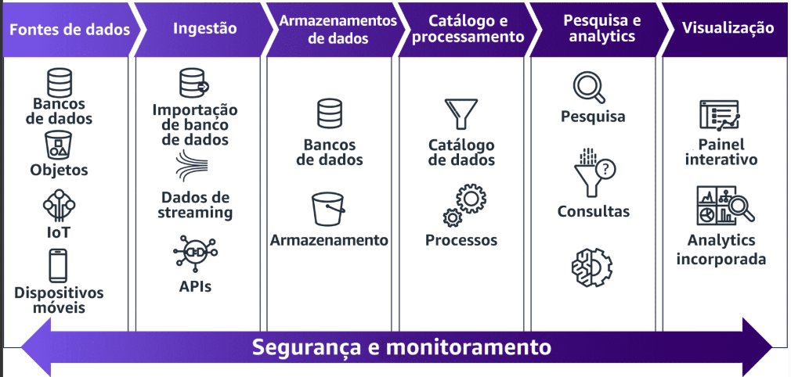

- **Desafios na Construção**
    Um grande desafio na criação de um data lake é implementar práticas eficazes de governança de dados. À medida que dados de fontes diferentes fluem para o lake, os metadados, como esquemas e definições de dados, podem se perder ou ficar incorretos. Com diversos usuários em uma organização consultando os dados, pode ser difícil manter a qualidade, segurança e conformidade dos dados sem uma governança forte. Com um framework robusto de governança, você pode estabelecer políticas, funções, processos e ferramentas para realizar adequadamente a ingestão, catalogação, proteção e o gerenciamento do uso dos diversos dados. Os recursos essenciais de governança incluem rastreamento de linhagem, controles de acesso, criptografia, monitoramento, auditoria e gerenciamento de metadados. A falta de governança pode levar a baixa qualidade dos dados, consultas e acessos descontrolados, riscos de segurança, além de incapacidade  de usar adequadamente o data lake para as necessidades de analytics da empresa.
    - Governança de dados
    - Qualidade dos dados
    - Segurança

    Os desafios de criar um data lake podem ser enfrentados usando o `AWS Lake Formation`. O Lake Formation é um serviço gerenciado que simplifica a criação, a proteção e o gerenciamento de data lakes. Ele automatiza a ingestão, catalogação, limpeza e transformação de dados de diversas fontes em um data lake no Amazon S3. O Lake Formation usa machine learning e políticas para proteger, organizar e catalogar dados automaticamente. Ele fornece um data lake governado por meio da integração com serviços da AWS, como AWS Glue, Athena, AWS Identity and Access Management (AWS IAM) e AWS CloudTrail. O Lake Formation simplifica a criação de um data lake seguro, o que reduz o tempo para obter informações.

    Componentes do Lake Formation:
    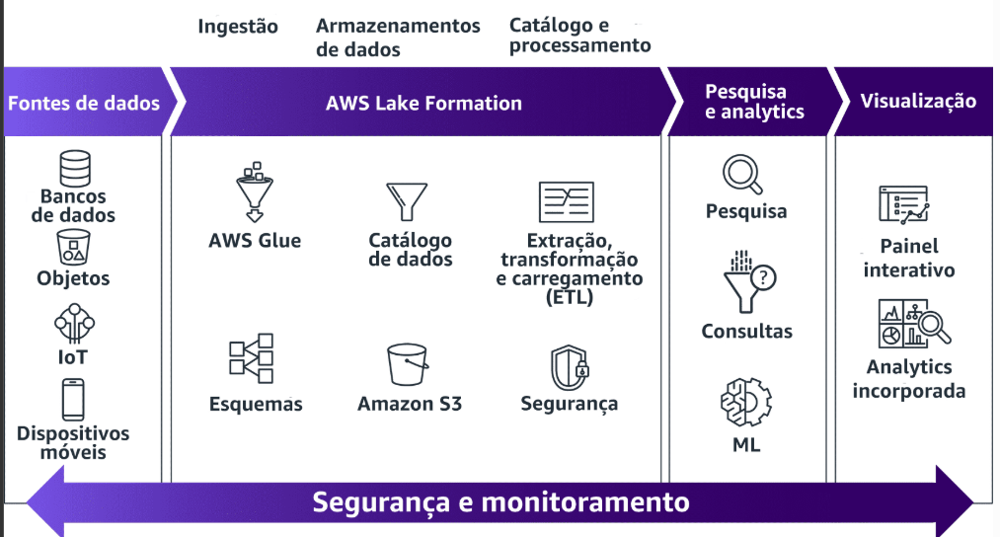

- **Principais Benefícios e Recursos do Lake Formation**  
    Benefícios:
    - Serviços com tecnologia sem servidor totalmente gerenciados
    - Datalake desenvolvido em dias, em vez de semanas ou meses
    - Baixo custo
    - Gerenciamento simplificado de permissões
    - Acesso monitorado e auditado para verificar a conformidade
    - Compartilhamento de dados
    - Integração com muitas ferramentas de analytics e machine learning

    Recursos:
    - Ambiente de criação automatizado
    - Armazene sistematicamente metadados de conjunto de dados
    - Orquestre scripts e crawlers
    - Controles de acesso centralizados

    Funções (modelo de permissões):
    - Administrador do lake formation
    - Criador de banco de dados
    - Criador de tabelas
    </details>

<details><summary>Data Warehouse</summary>

- **O que é Data Warehouse?**  
    Repositório central de informações especialmente projetado para analytics, onde os dados fluem para um datawarehouse a partir de aplicações de negócios, bancos de dados e outras fontes. Os usuários dele acessam dados por meio de ferramentas de business intelligence (BI), clientes SQL e outras aplicações analytics.  
    Um data warehouse alimenta relatórios, painéis e ferramentas de analytics, armazenando dados de forma eficiente, minimizando a E/S de dados, fornecendo resultados rápidos de consultas a milhares de usuários simultaneamente.

- **Desafios**  
    - Altos custos iniciais
    - Problemas de escalabilidade
    - Sobrecarga de manutenção
    - Flexibilidade limitada
    - Requisitos do conjunto de habilidades
    - Falta de disponibilidade

- **Modernização usando o Amazon Redshift**  
    O Redshift ajuda organizações a configurar e implantar um novo warehouse em minutos.  
    Foi criado para armazenar e consultar conjuntos de dados com tamanhos de até pentabytes. Ele fornece um ambiente seguro, escalável e baseado na nuvem para seu data warehouse. Muitas organizações implantam no Redshift para melhorar desempenho das consultas, reduzir sobrecarga e diminuir o custo de analytics.
    O Amazon Redshift pode consultar facilmente os dados em todos os seus armazenamentos. O Amazon Redshift pode consultar um data lake do Amazon S3 e gravar dados no data lake em formatos abertos, além de ajudar você a fazer consultas de dados em tempo real em bancos de dados operacionais sem precisar de nenhum carregamento de dados e ETL zero. Redshift usa declarações SQL conhecidas para combinar e processar dados em todos os seus armazenamentos. 

- **Vantagens do Redshift**  
    - Escalabilidade
    - Agilidade
    - Eficiência de custos
    - Desempenho
    - Durabilidade
    - Segurança
    - Tecnologia sem servidor
    - Machine learning
    - Automação
    - Compartilhamento de dados

- **ETL Zero**  
    Redshift tem suporte integrado para ETL zero. ETL zero é um conjunto de integrações que elimina ou minimiza a necessidade de criar pipelines de dados para ETL, que geralmente são demorados e complexos de desenvolver, manter e escalar. Tradicionalmente, a transferência de dados de um banco de dados transacional para um data warehouse central exigia uma solução de ETL complexa. O ETL zero, por sua vez, facilita a movimentação de dados ponto a ponto sem a necessidade de criar pipelines de dados para ETL.  
    As integrações ETL zero facilitam a movimentação de dados ponto a ponto sem a necessidade de criar pipelines de dados para ETL. ETL zero também pode permitir a consulta em silos de dados sem a necessidade de movimentá-los.
</details>

<details><summary>Introdução à Arquitetura de Dados Moderna</summary>

- **O que é uma Arquitetura de Dados Moderna?**  
    Uma arquitetura de dados moderna remove os limites entre sistemas diferentes e integra perfeitamente o data lake, o data warehouse e os armazenamentos de banco de dados com propósito específico. Em vez de uma abordagem única, que compromete a plataforma de analytics, uma arquitetura moderna reconhece que diferentes sistemas são indicados para diferentes necessidades de dados. Ela também engloba governança unificada de dados, segurança, gerenciamento de metadados e fácil movimentação de dados entre armazenamento e processamento.  
    A arquitetura de dados moderna visa fornecer informações de dados, analytics, relatórios, machine learning e IA, processando com eficiência grandes volumes de dados diversos de várias fontes. Ela usa infraestrutura de nuvem e ferramentas modernas de big data, como data lakes, processamento de stream e armazéns na nuvem para ingerir, armazenar, processar e analisar dados em escala. Ela também otimiza a velocidade, a flexibilidade e a eficiência de custos.

- **Pilares**  
    - Data lakes escaláveis
    - Serviços de analytics com propósito específico (Bancos de dados com isso incluem o Amazon Redshift, EMR, SageMaker, Athena, DynamoDB, Aurora, OpenSearch Service e outros)
    - Acesso unificado a dados
    - Governança unificada
    - Desempenho e relação custo-benefício

- **Conceitos de movimentação de dados**  
    Abordagens inovadoras para mover dados somente quando necessário. Os principais conceitos incluem:
    - Minimização do trânsito
    - Uso da gravidade dos dados
    - Uso de fluxos de trabalho mínimo de extração-carregamento-transformação (ELT) ou ETL Zero
    - Orquestração de pipelines
    - Streaming para processamento contínuo de dados

- **Tipos de movimentação de dados**  
    <details><summary>De dentro para fora</summary>

    A movimentação de dados de dentro para fora mantém os dados em um repositório central, como um data lake, e move a computação para ele em vez de transferir dados entre sistemas. Essa abordagem minimiza a movimentação desnecessária de dados. Os principais facilitadores são tecnologias como funções de tecnologia sem servidor, mecanismos de consulta e ferramentas de orquestração que coletam workloads de processamento com os dados de origem. Um catálogo de dados compartilhados fornece metadados para ativar a consulta no local. Ao analisar, transformar e mover dados somente quando necessário, esse padrão reduz os custos de duplicação e movimentação e, ao mesmo tempo, otimiza o desempenho do processamento.
    </details>

    <details><summary>De fora para dentro</summary>

    A movimentação de dados de fora para dentro se refere ao processo de trazer dados de sistemas criados especificamente para o data lake de uma organização. Um exemplo é quando um cliente copia do data warehouse para o data lake os resultados da consulta de vendas regionais de produtos para executar algoritmos de recomendação de produtos em um conjunto de dados maior usando ML. 
    </details>

    <details><summary>Ao redor do perímetro</summary>

    Na movimentação ao redor do perímetro, os dados são movidos de um armazenamento de dados criado para fins específicos para outro. Um exemplo é quando um cliente copia os dados do catálogo de produtos armazenados em seu banco de dados para o serviço de pesquisa. Isso facilita a consulta ao catálogo de produtos e reduz a carga das consultas de pesquisa do banco de dados.
    </details>

    <details><summary>compartilhamento</summary>

    A movimentação de dados por compartilhamento envolve a transferência contínua de dados entre diferentes aplicações. Um exemplo da movimentação de dados através do compartilhamento é o uso de uma arquitetura de malha de dados. Dados como um produto é uma meta de design central da malha de dados. Um domínio alinhado aos negócios se registra como um nó em uma malha, publica seus produtos de dados em um catálogo de governança central e descobre produtos de dados para consumir por meio de serviços de governança central. A empresa gerencia um conjunto central de serviços de governança para oferecer suporte à descoberta de dados, relatórios e auditoria em toda a organização.

    `Malha de dados`: Uma arquitetura de malha de dados é composta por equipes de dados que criam e executam a plataforma. Elas criam controles de segurança, executam a integração e oferecem treinamento.

    `Produtores de dados`:  Os produtores de dados consistem em equipes do domínio de negócios que desejam compartilhar seus dados. Eles são especialistas da área e gerenciam a propriedade e a governança dos dados. Eles garantem a qualidade dos dados e gerenciam os metadados para facilitar a localização de seus dados.

    `Consumidores de dados`:  Os consumidores de dados usam a malha de dados de acordo com suas funções comerciais. Eles querem ser capazes de encontrar dados com facilidade. Os consumidores de dados usam dados para executar prioridades de negócios e desenvolver analytics de negócios para encontrar novas informações.
    </details><br>

- **Arquitetura de malha de dados para compartilhamento de dados**  
    A **malha de dados (Data Mesh)** é uma arquitetura descentralizada que trata os dados como produtos e distribui responsabilidades entre domínios de negócio e infraestrutura central. A `malha de dados` conecta data lakes e domínios de aplicação em uma rede interligada, equilibrando `autonomia` e `governança` para acelerar o uso estratégico dos dados.

    Principais pontos:
    - `Problema`: equipes centralizadas ficam sobrecarregadas e não atendem bem às necessidades dos domínios.
    - `Solução`: descentralização orientada a domínios, com dados gerenciados como produtos.
    - `Componentes`:
        - Plataformas de dados de autoatendimento (por domínio).
        - Infraestrutura central para serviços compartilhados (catálogos, observabilidade, governança).
        - Data lakes específicos para cada produto de dados.
    - `Separação`:
        - Produtores, consumidores e governança central são independentes.
        - Cada data lake é catalogado e esquematizado.
        - Consumidores acessam dados diretamente via serviços de nuvem.
    - `Benefícios`:
        - Mais agilidade e velocidade analítica.
        - Autonomia dos domínios sem perder consistência e segurança.
        - Colaboração facilitada entre equipes.
    - `Objetivos`:
        - Produtos de dados
        - Governança central de dados
        - Acesso comum

- **Amazon DataZOne**  
    A AWS implementa o padrão de malha de dados por meio do Amazon DataZone.  
    O Amazon DataZone se integra a vários serviços da AWS. Ele pode publicar ativos de dados de fontes como AWS Glue Data Catalog, Amazon Redshift e Amazon S3 no seu catálogo. DataZone oferece suporte à consulta de dados por meio do Athena e do Amazon Redshift. Ele também usa o Lake Formation e o Amazon EventBridge para controlar o acesso a ativos de dados e se integrar a outros serviços.
</details>

<details><summary>Serviços da AWS para arquitetura de dados moderna</summary>

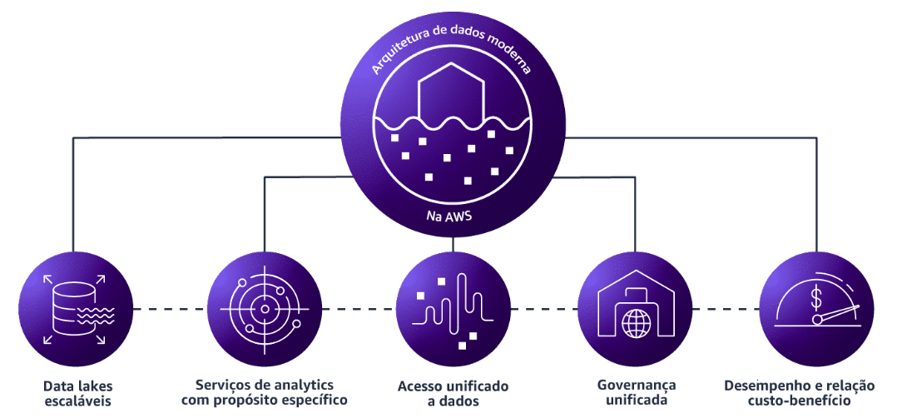

**Para Data Lakes Escaláveis:**  
Uma arquitetura de dados moderna utiliza data lakes escaláveis que podem lidar com quantidades crescentes de dados e workloads. Os data lakes podem se expandir sem esforço para armazenar petabytes de dados.
- Amazon S30
- AWS Lake Formation
- AWS Glue Data Catalog

**Para analytics com propósito específico:**  
Fornecem recursos para procesar, explorar, visualizar e criar previsões a partir de dados como parte de uma arquitetura de analytics moderna e baseada na nuvem. Todos esses serviços foram projetados para ajudar a atingir metas complexas de analytics.
- Amazon Managed Service for Apache Flink
- Amazon QuickSight
- Amazon OpenSearch Service
- Amazon Redshift
- Amazon EMR
- Amazon SageMaker
- Serviços da AWS para IA
- Serviços da AWS para IA generativa
- Amazon Athena
- Amazon RDS
- Amazon Aurora
- Amazon DynamoDB

**Para acesso unificado a dados:**  
Combinar, mover e replicar dados em vários armazenamentos de dados e em seu datalake.
- AWS Glue
- Amazon Kinesis Data Firehose

**Para governança unificada:**  
Importante em data analytics, para ajudar os clientes a autorizar, gerenciar e auditar o acesso aos dados.
- Amazon Datazone
- AWS Lake Formation

**Para desempenho e economia:**  
Fornece o mais abrangente conjunto de serviços de dados, analytics e machine learning, projetados para oferecer a melhor relação preço-desempenho.  
Traz o melhor desempenho para serviços de dados em armazenamentos, bancos de dados, catalogação de dados e governança de dados. Os bancos de dados relacionais e os bancos de dados com propósito específico são projetados para oferecer o maior desempenho pelo menor preço possível para os respectivos casos de uso.
- Amazon S3
- Amazon Redshift
- Amazon EMR
- AWS Glue

Os serviços da AWS que oferecem suporte a data lakes escaláveis são:
- Amazon S3 para armazenamento escalável
- Amazon Glue para acesso unificado a dados
- AWS Lake Formation para gerenciamento e governança unificados
- Amazon Athena para analytics interativo diretamente no S3 usando SQL

Serviços da AWS para analytics com propósito específico são:
- Amazon Redshift para data warehouse na nuvem
- Amazon EMR para aplicações de big data e data analytics em escala de petabytes
- Amazon Aurora para bancos de dados OLTP compatíveis com MySQL e PostgreSQL
- Amazon DynamoDB para banco de dados NoSQL de chave-valor
- Amazon OpenSearch Service para pesquisa e analytics de código aberto
- Amazon Sagemaker para criar, treinar e implantar modelos de ML

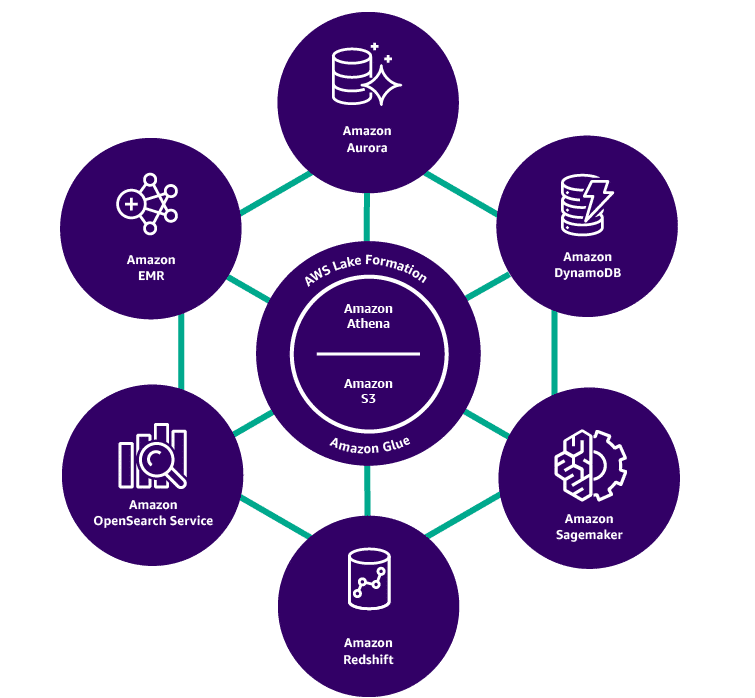


</details>

</details>

**<details><summary>Seção 2: Casos de Uso Comuns e Arquiteturas de Referência</summary>**

**Arquitetura moderna de referência de dados e analytics na AWS:**
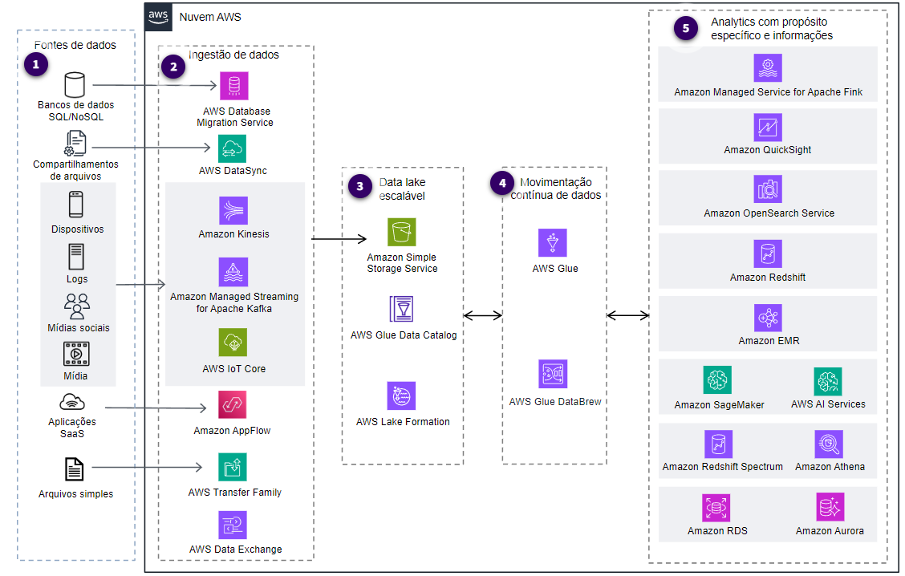

**Arquitetura de dados de streaming (opcional):**  
é um framework que lida com dados de streaming à medida que são gerados ou ingeridos. Embora a arquitetura moderna de referência de dados englobe vários frameworks de processamento de dados, a arquitetura de dados de streaming se concentra especificamente no processamento de dados em tempo real ou quase em tempo real. A arquitetura de dados de streaming é baseada em cinco componentes principais: 

- Fontes de dados
- Ingestão de fluxo
- Armazenamento de fluxo
- Processamento de fluxo
- Destinos

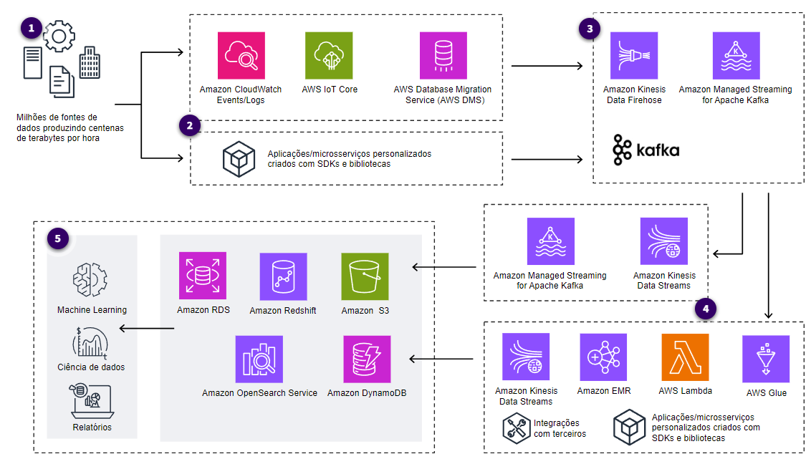

**Arquitetura de visualização de dados (opcional):**  
Diz respeito ao design e à estrutura dos sistemas e componentes usados para criar, exibir e interagir com representações visuais de dados. As organizações podem criar uma arquitetura de visualização de dados para interpretar as informações em um ambiente visual e interativo e acelerar informações baseadas em dados que sejam fáceis de entender e navegar. 
As arquiteturas de visualização de dados consistem nas seguintes características principais:
- Escalabilidade
- Conectividade
- Segurança e conformidade centralizadas
- Compartilhamento e colaboração
- Registro em log, monitoramento e auditoria
- Analytics avançado
- Interações de autoatendimento

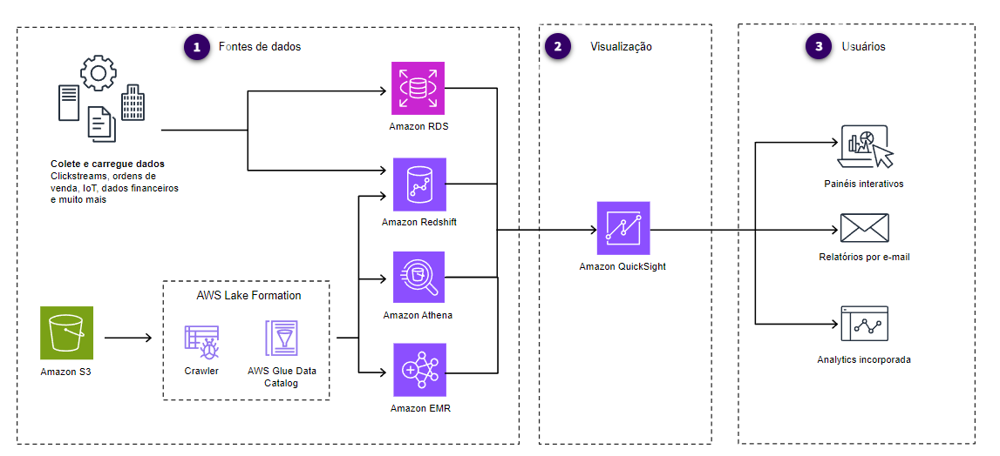

</details>

### AWS Skill Builder - AWS Glue Getting Started

**<details><summary>Seção 1: Introdução</summary>** 

- **O que o GLUE faz?**  
    É um serviço de integração de dados sem servidor, o que significa que você paga apenas pelo uso, e não pelo tempo ocioso. Com o AWS Glue, data scientists, analistas e desenvolvedores podem descobrir, preparar e combinar dados para várias finalidades. Os exemplos incluem análise, machine learning (ML) e desenvolvimento de aplicações. O AWS Glue fornece interfaces visuais e baseadas em código para atividades de integração de dados e transforma dados usando transformações integradas. 
    Também é possível localizar e acessar dados rapidamente por meio do AWS Glue Data Catalog. Engenheiros de dados e desenvolvedores de extração, transformação e carregamento (ETL) podem criar, executar e monitorar fluxos de trabalho de ETL usando o AWS Glue Studio. Os analistas de dados podem usar os recursos sem código do AWS Glue DataBrew para enriquecer, limpar e normalizar dados sem escrever nenhum código. Os data scientists podem usar os cadernos interativos do AWS Glue para começar rapidamente a consultar seus dados para 
    
- **Quais problemas o GLUE resolve?**  
    - Provisiona e gerencia o ciclo de vida dos recursos
    - Fornece ferramentas interativas
    - Gera código automaticamente
    - Conecta-se a centenas de armazenamentos de daods
    - Cria um catálogo de dados para várias fontes de dados
    - Identifica dados sigilosos usando padrões de reconhecimento de ML para PII
    - Gerencie e aplique esquemas em aplicações de streaming de dados
    - Oferece qualidade de dados e auto scaling de dados

- **Benefícios do Glue**  
    - Integração de dados mais rápida
    - Automatize a integração de dados em grande escala
    - Nenhuma infraestrutura para gerenciar
    - Crie, execute e monitore tarefas de ETL sem codificação
    - Pague somente pelo o que usar

- **Mecnaismo de integração de dados compatível com Glue**  
    - AWS Glue for Apache Spark
    - AWS Glue para Python
    - AWS Glue for Ray

- **Quanto custa o AWS Glue?**  
    <details><summary>Tarefas de ETL e sessões interativas</summary>

    Com o AWS Glue, não há taxas nem custos iniciais para manter a infraestrutura e não há cobranças pela inicialização ou desativação. Os usuários pagam apenas pelo que usam, o que significa que as cobranças são aplicadas somente às execuções de trabalho. O custo é baseado em uma taxa por hora arredondada para o segundo mais próximo, calculada com base no `número de DPUs usadas` para executar seu trabalho de ETL.  
    Glue oferece diferentes tipos de trabalhadores com capacidades variadas, incluindo Standard, G.1X, G.2X e G.025X. Uma DPU equivale a 4 vCPUs e 16 GB de memória.
    Os usuários podem usar as sessões interativas do AWS Glue para o desenvolvimento de código de ETL interativo, mas só serão cobrados se decidirem executar algumas transformações como um trabalho. A duração da sessão determina o custo das sessões interativas e a quantidade de DPUs usadas. As sessões interativas podem ser definidas com tempos limite de inatividade ajustáveis, e um mínimo de 1 minuto é cobrado. As sessões interativas exigem no mínimo duas DPUs, com um padrão de cinco DPUs.  
    O AWS Glue Studio permite visualizações de dados para testar suas transformações durante o processo de criação do trabalho. Cada sessão de visualização de dados do AWS Glue Studio usa 2 DPUs, é executada por 30 minutos e é interrompida automaticamente.
    </details>

    <details><summary>Data catalog e solicitações de armazenamento</summary>

    Nível gratuito para armazenar um determinado número de objetos de metadados, como tabelas, versões de tabelas, partições e bancos de dados. Se você exceder esse limite, haverá cobranças com base no número de objetos adicionais armazenados no nível gratuito. O preço é aplicado por objeto e é baseado no número de objetos que excedem o limite do nível gratuito. É importante observar que as cobranças se aplicam apenas ao Data Catalog e não a nenhum outro serviço da AWS que você possa usar com ele.
    </details>

    <details><summary>Crawlers do Glue</summary>

    Cobram uma taxa horária para descobrir dados e atualizar o Data Catalog com base no número de DPUs usadas. O crawler é cobrado em incrementos de 1 segundo, com um mínimo de 10 minutos para cada crawl, e arredondado para o segundo mais próximo. O uso de crawlers do AWS Glue é opcional, e os usuários podem preencher o Data Catalog diretamente por meio da API.
    </details>

    <details><summary>Sessões interativas do DataBrew</summary>

    Cobra os usuários pela criação por sessão. Uma sessão é iniciada quando um projeto DataBrew é aberto e os usuários são cobrados pelo número total de sessões usadas. Cada sessão pode durar 30 minutos e é cobrada em incrementos de 30 minutos. Os usuários iniciantes do DataBrew recebem as primeiras 40 sessões interativas gratuitamente.
    </details>

    <details><summary>Tarefas do DataBrew</summary>

    Usuários pagam uma taxa por hora com base no número de funcionários do DataBrew usados para executar o trabalho. Por padrão, o DataBrew aloca cinco trabalhadores para cada trabalho. Há uma duração de cobrança de 1 minuto para cada trabalho.
    </details>

    <details><summary>Execução do AWS Glue Flex</summary>

    Uma nova opção que pode ajudar os clientes a reduzir os custos de seus workloads de pré-produção, testes e integração de dados não críticos em até 34%. Essa opção é conhecida como execução do AWS Glue Flex, que utiliza capacidade extra na AWS para executar tarefas do AWS Glue.
    </details>

    <details><summary>Qualidade de dados do AWS Glue</summary>

    Com o AWS Glue Data Quality, os usuários podem padronizar seus dados comparando-os com o sistema de origem e preservando os dados aprovados para uso posterior. O AWS Glue gera automaticamente recomendações de regras com base nas estatísticas computadas dos dados e usa essas estatísticas para verificar sua acurácia. Além disso, é possível criar regras personalizadas escrevendo a lógica usando a linguagem simples de definição de qualidade de dados.
    </details>

    <details><summary>AWS Glue Schema Registry</summary>

    Um esquema define a estrutura e o formato de um registro de dados. Com o AWS Glue Schema Registry, você pode gerenciar e aplicar esquemas em suas aplicações de streaming de dados usando integrações convenientes. Essas integrações incluem Apache Kafka, Amazon Managed Streaming for Apache Kafka, Amazon Kinesis Data Streams, Amazon Kinesis Data Analytics for Apache Flink e AWS Lambda.
    </details>

- **Como o AWS Glue é usado para arquitetar uma solução de nuvem?**  
    Pode identificar e criar um catálogo de dados técnicos para vários locais de armazenamento de dados. Você pode usar esse catálogo de dados como entrada e, em seguida, executar o ETL ou processos de ETL ou de extração, carregamento e transformação com base em seus requisitos. A arquitetura a seguir exibe o padrão mais comum de conexão com fontes de dados usando conectores. Posteriormente, faça crawling dos dados para identificar o esquema, limpar e padronizar e criar o processo de ETL para gerar dados brutos. Em seguida, use os mesmos utilitários de ETL fornecidos pelo AWS Glue para criar dados refinados. Por fim, esses dados podem ser consumidos por meio de mecanismos de consulta analítica, como o Amazon Athena, o Amazon Redshift e o Amazon QuickSight.
    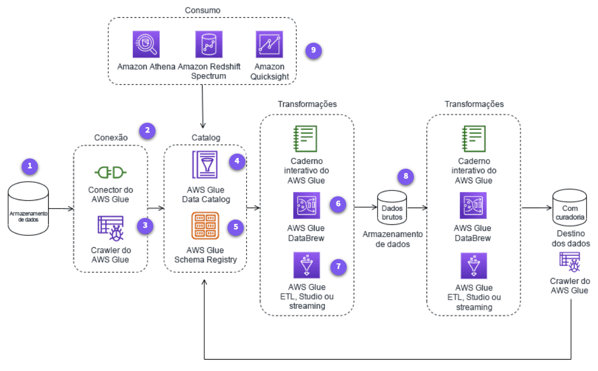

- **Conceitos técnicos básicos do AWS Glue Studio**  
    - Conexão
    - Crawler
    - Armazenamento de dados, fonte de dados, destino de dados
    - Sessões interativas do AWS Glue
    - DynamicFrame
    - Trabalho
    - Formatos de arquivo
    - Tabela
    - Transformar
    - Gatilhos do AWS Glue

- **Conceitos técnicos básicos do AWS Glue DataBrew**  
    - Conjunto de dados
    - Criação de perfil
    - Linhagem de dados
    - Qualidade dos dados
    - Fórmulas
    - Projeto
    - Tarefas
    - Tipo de arquivo
    - Transformar

- **Uso mais comuns do AWS Glue**  
    - Desenvolvimento simplificado de ETL
    - Catálogo de dados técnicos para encontrar dados em vários armazenamentos de dados
    - Qualidade de dados, preparação de dados e criação de perfil de dados sem codificação
    - Orquestração e visualização rápidas de trabalho com arrastar e soltar
    - Processamento de dados em tempo real

- **O que mais considerar sobre o AWS Glue**  
    O AWS Glue é um serviço de integração de dados dimensionável que simplifica o processo de ETL usando conectores integrados. Você pode criar fluxos de tarefa complexos usando crawlers, tarefas e iniciações e optar por criar as tarefas usando código ou transformações visuais. As tarefas podem ser implantadas usando o AWS CloudFormation, que atua como infraestrutura como código em JSON ou YAML, e podem ser controladas por versão no Bitbucket ou no GitHub. O AWS Glue também oferece monitoramento centralizado por meio de um único visor. Isso ajuda você a verificar o status do seu pipeline de ETL e iniciar, interromper e executar novamente as tarefas que eles criaram. 
    - Particionamento
    - Execute localmente primeiro
    - Uso do Auto Scaling para o AWS Glue
    - Compressão e formato do arquivo
    - Use marcadores de trabalho: processamento incremental
    - Segurança e criptografia de dados
    - Monitoramento de trabalho
    - Amazon Q Developer
    - Data lake transacional
</details>

### AWS - Tutoriais Técnicos - Analytics
**Casos de USO do ETL com Glue:**
- Pipelines ETL controlados por eventos
- Catálogo unificado para localizar dados em vários armazenamentos de dados
- Trabalhos ETL, sem necessidade de codificar

**SQL padrão em S3 com Amazon Athena:**
- Consultas instantaneas (são feitas em paralelo)
- Baseado em Presto, executa SQL padrão
- Pagamento por consulta
- Desempenho interativo, rápido e serverless

**Visualização dos dados com QuickSight:**  
O QuickSight é alimentado pelo SPICE, semelhante à uma camada de cache, um mecanismo de cálculo super-rápido na memória que oferece desempenho e escala, independentemente de quantos usuários ativos.
- Serverless (nenhum servidor para gerenciar)
- Dimensionar para dezenas de milhares de usuários
- Insights mais profundos com ML
- Detecção e previsão de anomalias integradas
- Incorpora painéis BI nas aplicações
- Obtém respostas em segundos

# ✍ Exercícios

1. <details><summary><a href="./Exercicios/exercicio1-geracao-e-massas/">Gerador e massa de dados</a></summary>

    **Etapa 1:**
    Nesta etapa, foi solicitado que fizéssemos um script em python utilizando a biblioteca `random`, na qual imprimiria uma lista de números inteiros em ordem reversa.
    ```py
    import random
    inteiros = [random.randint(1,1000) for _ in range(250)]
    inteiros.reverse()
    print(inteiros)
    ```

    **Etapa 2:**
    Nesta etapa, foi solicitado que utilizássemos uma lista contendo nome de 20 animais e ordenasse-os em ordem alfabética, utilizando list comprehension e armazenando o conteudo em um arquivo [lista_animais.txt](./Exercicios/exercicio1-geracao-e-massas/etapa-2/lista_animais.txt)
    ```py
    animais = [
        "Zebra", "Cachorro", "Gato", "Elefante", "Arara", 
        "Baleia", "Capivara", "Dromedário", "Foca", "Girafa", 
        "Hipopótamo", "Iguana", "Jacaré", "Leão", "Macaco", 
        "Onça", "Panda", "Quati", "Rato", "Sapo"
        ]
    animais.sort()
    [print(animal) for animal in animais]
    with open("./Sprint-8/Exercicios/exercicio1-geracao-e-massas/etapa-2/lista_animais.txt", "w", encoding="utf-8") as file:
        for animal in animais:
            file.write(animal + "\n")
    print("Arquivo 'lista_animais.txt' gerado com sucesso!")
    ```

    **Etapa 3:**
    Nesta etapa, foi solicitado para gerarmos um dataset com nomes de pessoas, usando principalmente a biblioteca `random`, para gerar nomes aleatórios únicos e [aleatórios](./Exercicios/exercicio1-geracao-e-massas/etapa-3/nomes_aleatorios.txt).
    ```py
    import names, time, os, random
    from tqdm import tqdm as progress_bar
    # semente de aleatoriedade
    random.seed(40)

    qtd_nomes_unicos = 50000        # 50 mil
    qtd_nomes_aleatorios = 1000000  # 1 milhão
    dados = []

    aux = [names.get_full_name() for _ in progress_bar(range(qtd_nomes_unicos), desc="Gerando nomes únicos")]

    print(f'[LOADING] Gerando {qtd_nomes_aleatorios} nomes aleatórios')
    with open('Sprint-8/Exercicios/exercicio1-geracao-e-massas/etapa-3/nomes_aleatorios.txt', 'w', encoding='utf-8') as file:
        for i in progress_bar(range(qtd_nomes_aleatorios), desc="Gerando nomes aleatórios:"):
            nome = random.choice(aux)
            file.write(nome + "\n")
            if i % 100000 == 0:
                print(int((i / qtd_nomes_aleatorios) * 100), "%")
    print("\n [UPLOAD] Arquivo 'nomes_aleatorios.txt' gerado com sucesso!")
    ```

</details>

2. <details><summary><a href="./Exercicios/exercicio2-apache-spark/">Apache Spark</a></summary>

    Neste exercício, foi dividido em várias etapas, nas quais tinha que utilizar pyspark para fazer um dataframe e testar comandos SQL. Foi pedido que renomeássemos e adicionássemos colunas, além de executar comandos SQL.
    ```py
    # =================== ETAPA 1 ====================
    print("=========== ETAPA 1 ===========")
    from pyspark.sql import SparkSession
    from pyspark import SparkContext, SQLContext

    spark = SparkSession \
            .builder \
            .master ("local[*]") \
            .appName("Exercicio2 Etapa1") \
            .getOrCreate()

    df_nomes = spark.read.csv("Sprint-8/Exercicios/exercicio1-geracao-e-massas/etapa-3/nomes_aleatorios.txt")
    df_nomes.show(5)

    # =================== ETAPA 2 ====================
    print("=========== ETAPA 2 ===========")
    print("Renomear coluna para 'Nomes'")
    df_nomes = df_nomes.withColumnRenamed("_c0", "Nomes")
    df_nomes.printSchema()
    df_nomes.show(10)

    # =================== ETAPA 3 ====================
    print("=========== ETAPA 3 ===========")
    print("Coluna Escolaridade adicionada")
    from pyspark.sql.functions import rand, when
    df_nomes = df_nomes.withColumn("Escolaridade",
                                when( (rand() < 0.33), "Fundamental")
                                .when( (rand() < 0.66), "Medio")
                                .otherwise("Superior")           
                                )

    # =================== ETAPA 4 ====================
    print("=========== ETAPA 4 ===========")
    print("Coluna País adicionada")
    from pyspark.sql.functions import floor
    paises = [
        "Argentina", "Bolivia", "Brasil", "Chile", "Colombia", "Equador",
        "Guiana", "Paraguai", "Peru", "Suriname", "Uruguai", "Venezuela", "Guiana Francesa"
    ]

    df_nomes = df_nomes.withColumn(
        "Pais",
        when( floor(rand()*13) == 0, paises[0]    )
        .when( floor(rand()*13) == 1, paises[1]   )
        .when( floor(rand()*13) == 2, paises[2]   )
        .when( floor(rand()*13) == 3, paises[3]   )
        .when( floor(rand()*13) == 4, paises[4]   )
        .when( floor(rand()*13) == 5, paises[5]   )
        .when( floor(rand()*13) == 6, paises[6]   )
        .when( floor(rand()*13) == 7, paises[7]   )
        .when( floor(rand()*13) == 8, paises[8]   )
        .when( floor(rand()*13) == 9, paises[9]   )
        .when( floor(rand()*13) == 10, paises[10] )
        .when( floor(rand()*13) == 11, paises[11] )
        .otherwise(paises[12])
    )

    # =================== ETAPA 5 ====================
    print("=========== ETAPA 5 ===========")
    print("Filtrar pessoas de 1945 à 2010")
    df_nomes = df_nomes.withColumn(
        "AnoNascimento",
        (floor(rand() * (2010 - 1945 + 1)) + 1945) 
    )

    df_nomes.show(10)

    # =================== ETAPA 6 ====================
    print("=========== ETAPA 6 ===========")
    print("Filtrar pessoas do século 21")
    from pyspark.sql.functions import col

    df_select = df_nomes.select("*").filter(col("AnoNascimento") >= 2001)

    df_select.show(10)

    # =================== ETAPA 7 ====================
    print("=========== ETAPA 7 ===========")
    print("Filtrar pessoas do século 21 (versão SQL)")
    from pyspark.sql.functions import col

    df_nomes.createOrReplaceTempView("pessoas")
    spark.sql("""
            SELECT * 
            FROM pessoas 
            WHERE pessoas.AnoNascimento >= 2001
            """
            ).show(10)

    # =================== ETAPA 8 ====================
    print("=========== ETAPA 8 ===========")
    print("Filtrar Millennials")
    df_millennials = df_nomes.filter( col("AnoNascimento").between(1980, 1994) )
    df_millenials = df_millennials.count()
    print(f"Numero de pessoas millenials: {df_millenials}")

    # =================== ETAPA 9 ====================
    print("=========== ETAPA 9 ===========")
    print("Filtrar Millennial (versão SQL)")
    spark.sql(
            """
            SELECT COUNT(*) AS qtd_millennials
            FROM pessoas
            WHERE AnoNascimento BETWEEN 1980 AND 1994
            """
            ).show()

    # =================== ETAPA 10 ====================
    print("=========== ETAPA 10 ===========")
    print("Classificar por geração")
    spark.sql(
            """
            SELECT Pais,
            CASE
                    WHEN AnoNascimento BETWEEN 1944 AND 1964 THEN 'Baby Boomers'
                    WHEN AnoNascimento BETWEEN 1965 AND 1979 THEN 'Geração X'
                    WHEN AnoNascimento BETWEEN 1980 AND 1994 THEN 'Millennials'
                    WHEN AnoNascimento BETWEEN 1995 AND 2015 THEN 'Geração Z'
            END AS Geracao,
            COUNT(*) AS Quantidade
            FROM pessoas
            GROUP BY Pais, Geracao
            ORDER BY Pais ASC, Geracao ASC, Quantidade ASC
            """
            ).show(truncate=False)
    ```
</details>

3. <details><summary><a href="./Exercicios/exercicio2-apache-spark/">Laboratório AWS Glue</a></summary>

    Neste exercício, foi solicitado para que nós realizássemos um processo de ETL utilizando o AWS Glue. Inicialmente, fizemos o upload do arquivo nomes.csv para um bucket no S3 e configuramos as permissões necessárias por meio de uma IAM Role. Em seguida, preparamos o ambiente no AWS Glue e criamos um banco de dados chamado glue-lab. Depois, desenvolvemos um job em PySpark para ler, transformar e analisar os dados, aplicando operações como formatação, contagem e agrupamentos. Por fim, salvamos os resultados no S3 em formato JSON particionado e utilizamos um crawler para criar automaticamente uma tabela no catálogo do Glue.
    ```py
    import sys
    from awsglue.transforms import *
    from awsglue.utils import getResolvedOptions
    from pyspark.context import SparkContext
    from awsglue.context import GlueContext
    from awsglue.job import Job
    from pyspark.sql import functions as F
    from awsglue.dynamicframe import DynamicFrame

    # @params: [JOB_NAME], [S3_INPUT_PATH], [S3_TARGET_PATH]
    args = getResolvedOptions(sys.argv, ['JOB_NAME','S3_INPUT_PATH','S3_TARGET_PATH'])

    sc = SparkContext()
    glueContext = GlueContext(sc)
    spark = glueContext.spark_session
    job = Job(glueContext)
    job.init(args['JOB_NAME'], args)

    source_file = args['S3_INPUT_PATH']
    target_path = args['S3_TARGET_PATH']

    dynamic_frame = glueContext.create_dynamic_frame.from_options(
        connection_type="s3",
        connection_options={"paths": [source_file]},
        format="csv",
        format_options={"withHeader": True, "separator":","},
    )

    df = dynamic_frame.toDF()

    df.printSchema()

    # Padronizando tipos para evitar ponto flutuante
    df = df.withColumn("total", F.col("total").cast("int"))
    df = df.withColumn("ano", F.col("ano").cast("int"))

    # Deixando nome da Coluna "nome" e seus dados em maiúsculo, conforme solicitado
    df = df.withColumn("nome", F.upper(F.col("nome")))
    df = df.withColumnRenamed("nome", "NOME")

    # Total de linhas do dataframe
    print(f"Total de linhas do dataframe: {df.count()}")

    # Quantidade de nome
    qtd_NOME = df.groupBy("ano", "sexo").count().orderBy(F.col("ano").desc())
    qtd_NOME.show()

    nome_fem_top = df.filter(df.sexo=="F")\
                        .groupBy("NOME", "ano")\
                        .agg(F.sum("total").cast("int").alias("total_registros"))\
                        .orderBy(F.col("total_registros").desc())\
                        .limit(1)
    nome_fem_top.show()

    nome_masc_top = df.filter(df.sexo=="M")\
                        .groupBy("NOME", "ano")\
                        .agg(F.sum("total").cast("int").alias("total_registros"))\
                        .orderBy(F.col("total_registros").desc())\
                        .limit(1)
    nome_masc_top.show()

    qtd_nome_por_genero = df.groupBy("sexo", "ano")\
                        .agg(F.sum("total").cast("int").alias("total_registros_por_genero"))\
                        .orderBy(F.col("ano").asc())\
                        .limit(10)
    qtd_nome_por_genero.show()

    dynamic_frame_para_salvar = DynamicFrame.fromDF(df, glueContext, "dynamic_frame_para_salvar")

    glueContext.write_dynamic_frame.from_options(
        frame = dynamic_frame_para_salvar,
        connection_type = "s3",
        connection_options = {"path": target_path, "partitionKeys": ["sexo", "ano"]},
        format = "json"
    )

    job.commit()
    ```
</details>

# 👁‍🗨 Evidências
<details><summary>Parte 1 - Geração e massa de dados</summary>

Nesta etapa, fiz ai mportação da biblioteca random e utilizei a função `.randint()` dentro de um List Comprehension para gerar os números inteiros e aleatórios numa variável, com limite de 250 números. Depois disso usei a função `.reverse()` nativamente do python para reverter todos os números da lista, modificando a lista. 
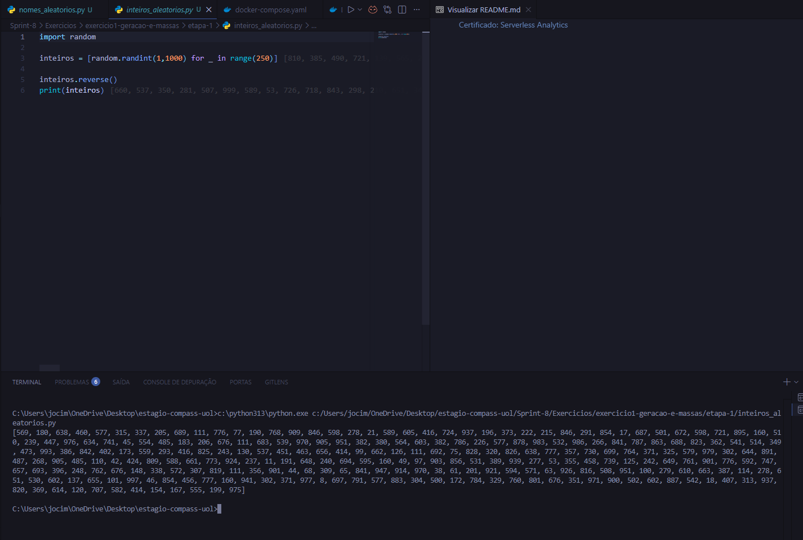

Nesta etapa, inicializei uma lista com 20 nomes de animais diferentes e utilizei a função `.sort()` para ordená-los em ordem crescente. Depois disso, utilizei a função de contexto `With open()` para criar o arquivo .txt e escrever nele cada animal, onde percorre a lista com um `for` e escreve cada um usando a função `write()`.
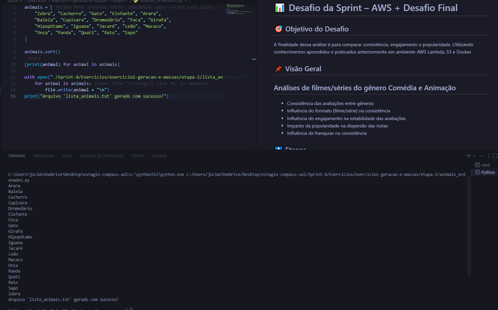

Nesta etapa, importei as bibliotecas `names, time, os e random` como o exercício solicitava, além da biblioteca `tqdm` que usaria para visualização do progresso durante o processamento.  
Usei a função `.seed()` para definir uma semente fixa de aleatoriedade. Defini o limite de nomes únicos em 50 mil e nomes aleatórios em 1 milhão.  
Utilizando o conceito de List Comprehension, peguei 50 mil nomes únicos e completos usando a função `.get_full_name()` acompanhada de um `for` que iria gerar até que atingisse o valor definido na variável `qtd_nomes_unicos`.  
Depois disso, para gravar os nomes em um .txt e gerar nomes aleatórios (no intervalo de 50 mil nomes definidos e capturados anteriormente), usei a função `With open()` acompanhada de um `for` e `.choice()` e `.write()`.  
A função `.choice()` é a chave principal, na qual faz uma decisão com base na sequência de valores armazenados na variável `aux`, ou seja, escolhe um daqueles nomes.
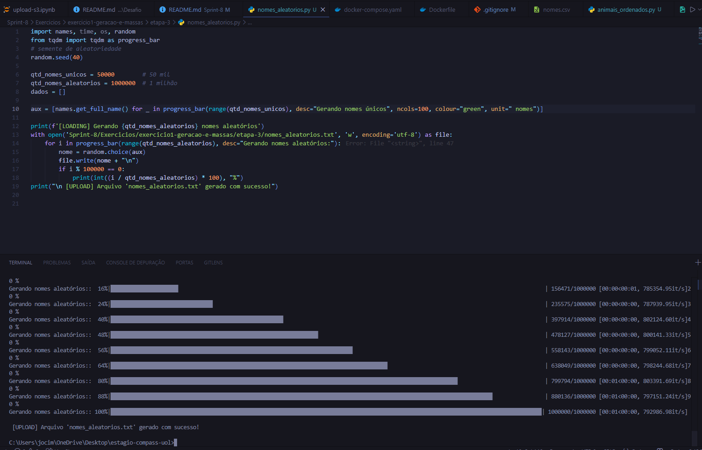
</details><br>

<details><summary>Parte 2 - Apache Spark</summary>

Neste exercicio, fiz a importação da biblioteca `Spark` e utilizei `.read.csv()` para a leitura do arquivo csv. Formatei a coluna '_c0' para 'Nomes', mostrei o tipo de cada coluna com `.printSchema()` e adicionei colunas novas como `Escolaridade` e `Pais`. Além de adicionar filtros, pelo Ano de Nascimento, onde filtrava pelo século e categorizava por gerações. 
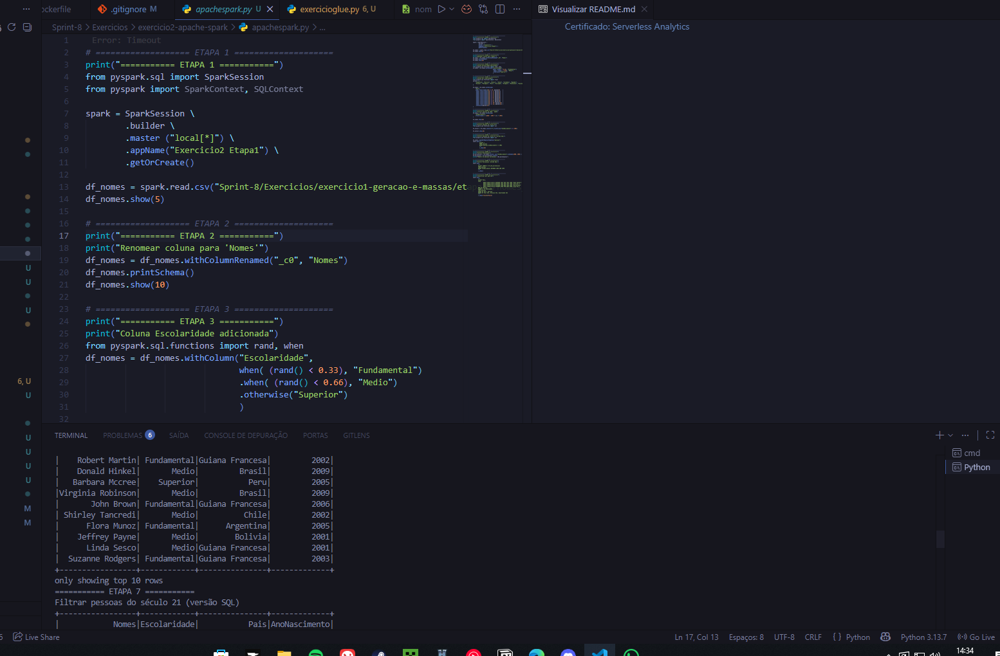
</details><br>

<details><summary>Laboratório AWS</summary>

Neste exercicio, fiz a transformação do dataset nomes.csv, como conversão de String para Int nas colunas, tornar a coluna `nome` e seus dados em formato maiúsculo. Além disso, utilizei o contexto do Glue para executar jobs spark distribuidos em cima de um cluster Apache Spark. O Spark já é naturalmente paralelo e distribuído, e quando executamos o código no Glue, o Spark cuida de como dividir as tarefas (transformações e queries) entre os workers.  

- Pasta do exemplo criada dentro do bucket, após a execução de [glueteste.py](./Exercicios/exercicio3-laboratorioAWS/glueteste.py).
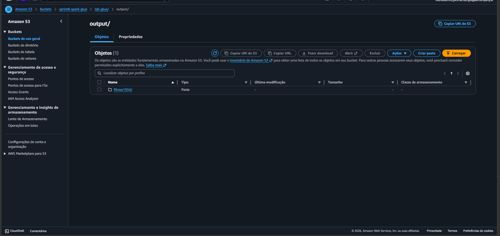

- Caminho para o arquivo `nomes.csv` exportado para o glue para iniciar o exercício.
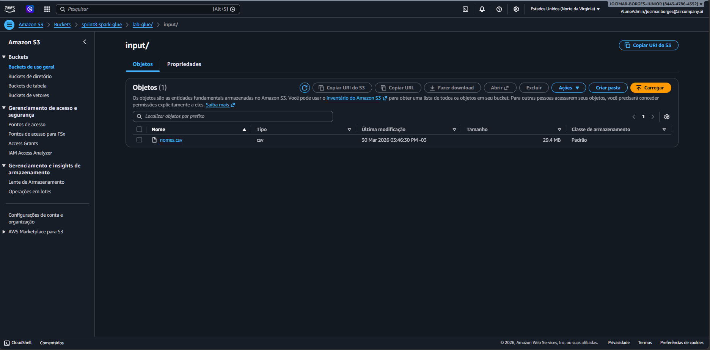

- Caminho para a partição (Sexo e Ano) gerada no bucket após a execucação de [exercicioglue.py](./Exercicios/exercicio3-laboratorioAWS/exercicioglue.py)
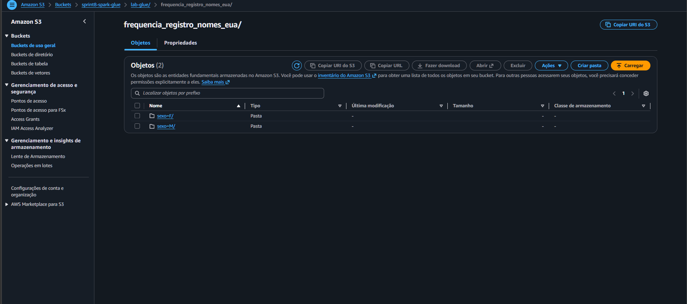

- Execução bem sucedida do Job no glue.
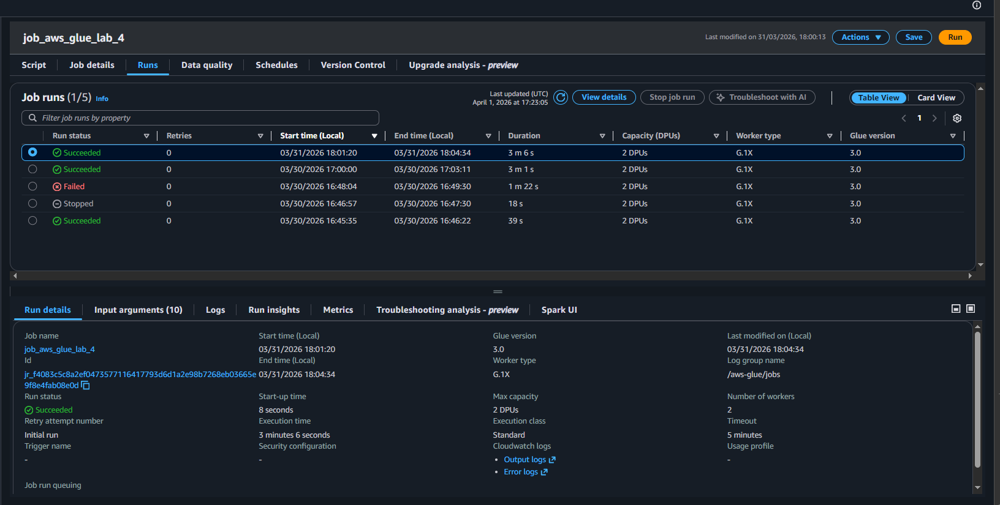

- Execução do Crawler bem sucedida, criando a tabela no Glue Data Catalog
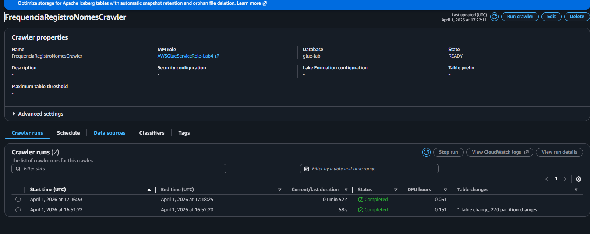

- Database `frequencia_registro_nomes_eua` criado no Glue Data Catalog após a execução do Job.
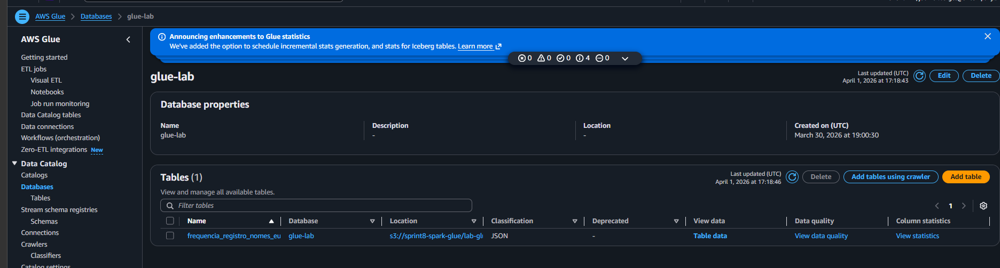

- Consultando e verificando dados na tabela `frequencia_registro_nomes_eua` criada pelo Crawler com o Athena
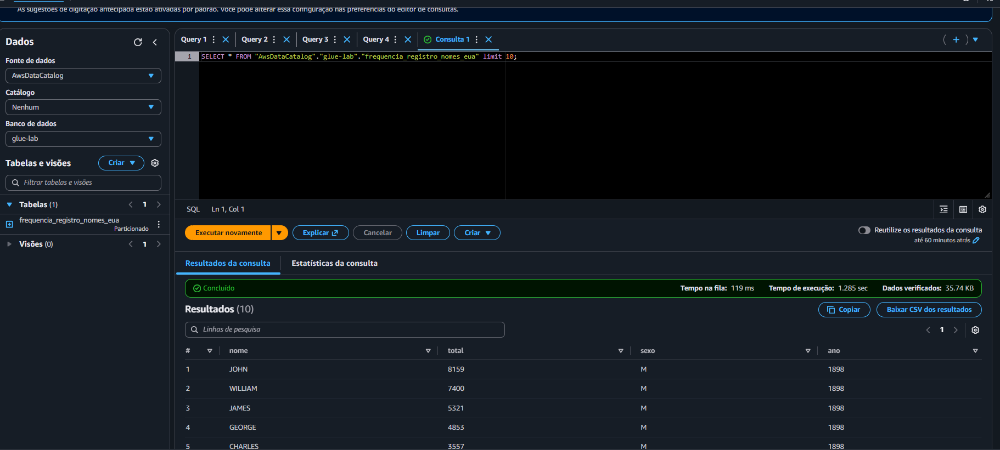
</details><br>

# 🎯 Desafio da Sprint
O desenvolvimento do desafio da sprint e seus respectivos arquivos relacionados encontram-se em sua pasta, assim como seu README que fora usado para dissertar sobre os passos executados e resultados.
O Readme do Desafio foi dividido em etapas, seguindo a lógica proposta pela Compass e tais quais apresentam e explicam as resoluções utilizadas e os resultados obtidos:
- 📁[Pasta do Desafio](../Sprint-8/Desafio/)
- 📝[README do Desafio](../Sprint-8/Desafio/README.md)
    
# ✅ Certificados

### AWS
[Certificado: Fundamentals of Analytics Part 2](./Certificados/AWS%20-%20fundamentals%20of%20analytics%20on%20AWS%20part%202.pdf)

[Certificado: Glue Getting Started](./Certificados/AWS%20-%20glue%20getting%20started.pdf)