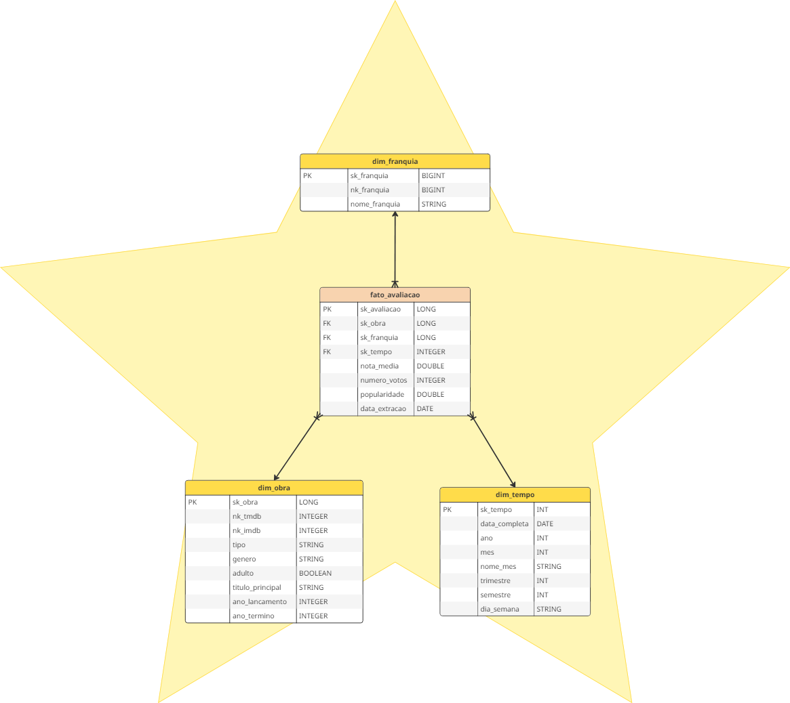
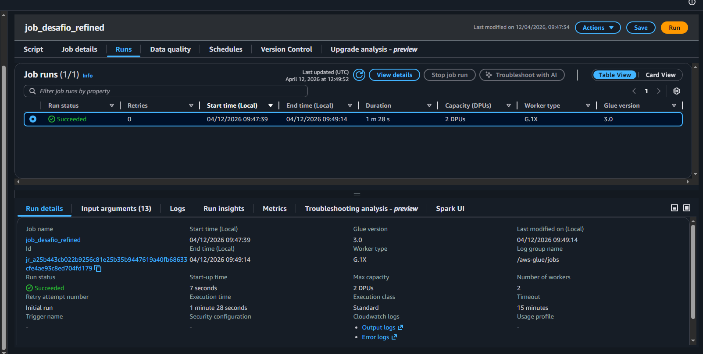
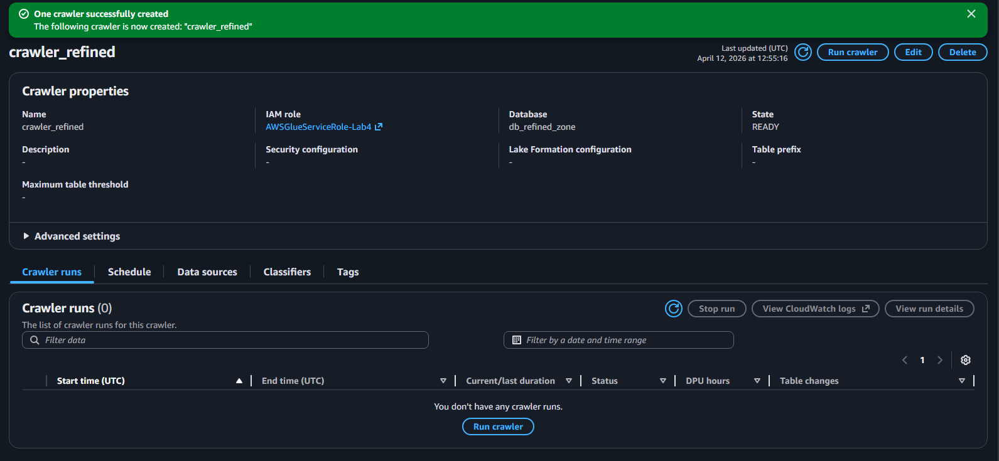
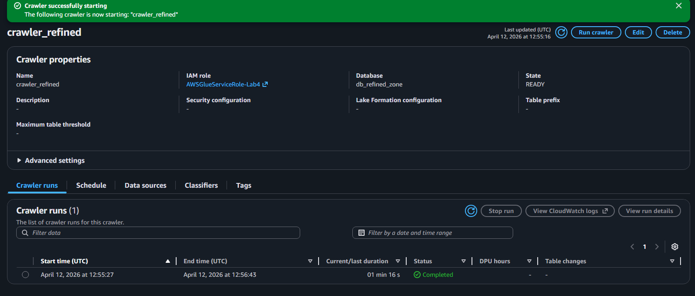
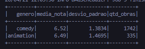
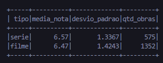
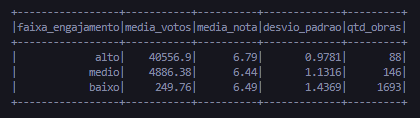
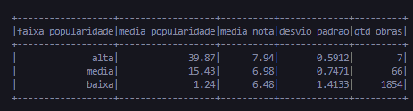
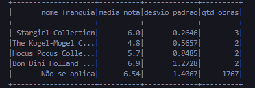
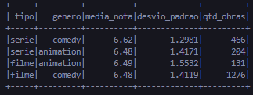

# 📊 Desafio da Sprint – AWS + Desafio Final

## 🎯 Objetivo do Desafio
A finalidade dessa análise é para comparar consistência, engajamento e popularidade. Utilizando conhecimentos aprendidos e praticados anteriormente em ambiente AWS, Docker e Python.

## Análises de filmes/séries do gênero Comédia e Animação
- Consistência das avaliações entre gêneros
- Influência do formato (filme/série) na consistência
- Influência do engajamento na estabilidade das avaliações
- Impacto da popularidade na dispersão das notas
- Influência de franquias na consistência

## ⏬ Etapas de Desenvolvimento
O desenvolvimento deste desafio foi dividido em etapas, dessa forma, seguirei abordando-as semelhantemente para facilitar a compreensão e objetivar os processos.

Neste desafio seguimos com a Arquitetura Medalhão proposta na Sprint 7, agora desenvolvendo a camada Refined, na qual se baseia nos dados tratados e confiáveis da camada [Trusted](../../Sprint-8/Desafio/). Nessa camada realizei a integração entre os dados locais e do TMDB e desenvolvi a [Modelagem Dimensional](./model_starschema.png) (conforme o Star Schema), posteriormente servindo como base para as análises OLAP.

### <a href="./model_starschema.png">Etapa 1 - Modelagem</a>



Nesta etapa, realizei a criação da Modelagem Dimensional, atribuindo as métricas/medidas mensuráveis e as chaves estrangeiras das outras dimensões à Tabela Fato.
A Modelagem Dimensional foi realizada no aplicativo Miro, por maior liberdade de customização, sendo esta no modelo Star Schema.  
Cada dimensão possui cardinalidade 1:N em relação à tabela fato, onde uma obra pode aparecer uma vez por snapshot temporal.
Outros atributos foram ignorados já que não havia necessidade de persistí-los, uma vez que não seriam necessário para as análises, como informações dos artistas.

Uma linha da fato representa uma avaliação de uma obra em uma data.

**Questionamentos Refined Zone:**
|||
|:-:|:-:|
|Qual é o grão do fato?|O Grão do Fato é obra × 1 snapshot. Embora o modelo suporte granularidade temporal, o dataset atual contém apenas um snapshot.|
|Quais fontes têm prioridade?|Os dados locais são a fonte primária e o TMDB atua como enriquecimento complementar.|
|Qual granularidade temporal precisa de retênção?|Snapshot pontual com possibilidade de extensão para granularidade diária.|

Durante o desenvolvimento do diagrama, notei que o campo `belongs_to_collection` estava originalmente multivalorado, então foi removido do modelo dimensional e os valores foram tratados de forma adequada para suportar análises, se transformando em `nk_franquia` (id da franquia) e `nome_franquia`. Por representar um relacionamento do tipo um-para-muitos (1:N), foi modelado como uma dimensão independente (dim_franquia), sendo associado à tabela fato para facilitar a consulta independente.

|Colunas Utilizadas da Trusted Zone|Colunas Adicionadas/Transformadas|
|:-:|:-:|
|imdb_id|sk_obra|
|tmdb_id|sk_franquia|
|titulo_principal|sk_tempo|
|genero|sk_avaliacao|
|nota_media|nk_franquia|
|numero_votos|nome_franquia|
|popularity|tipo (filme/série)|
|adult|data_extracao|
|ano_lancamento|Tabela dim_tempo inteira|
|ano_termino (series)|
|belongs_to_collection (id, name)|

### <a href="./refinedglue.py">Etapa 2 - Implementação e Execução no Glue</a>
Nesta etapa, implementei o código que seria utilizado no AWS Glue posteriormente, utilizando o Spark para processar os dados. Após a implementação do código testado localmente e aplicando-o refatorado para o AWS Glue, utilizei um Crawler para percorrer os arquivos .parquet e criar as tabelas dimensão e fato no banco de dados do AWS Glue Data Catalog, as quais posteriormente usaria no AWS Athena para consultar e realizar as TEMP VIEWS. 

No código, durante a criação da tabela fato, utilizei `F.broadcast()` nos joins das dimensões. Isso evita o "shuffle" (troca de dados entre nós), tornando o Job até 10 vezes mais rápido. Nesse caso, quando você faz um join entre um DataFrame gigante e um pequeno, o Spark envia o DataFrame pequeno para todos os nós. Usar o broadcast() evita o "shuffle" (movimentação pesada de dados pela rede).  
Normalmente, os dados de uma tabela grande ficam divididos, um pedaço em cada computador. Se é preciso cruzar esses dados com outra tabela, o Spark teria que mover os dados de um lado para o outro na rede para que as informações que se "casam" se encontrassem no mesmo lugar, esse movimento pesado é o Shuffle e é a parte mais lenta do processo.  
Usando o Broadcast o driver envia uma cópia completa dessa tabela pequena pra cada nó do cluster. Cada computador (nó) guarda essa cópia na sua própria memória RAM. Assim, cada "trabalhador" terá tudo que precisa.

Para realizar a sequência de Surrogate Key (SK) optei por usar `monotonically_increasing_id()` ao invés de `Windows Functions` sem um `partitionBy`, já que forçaria o Spark a mover todos os dados para um único executor (um único core) para criar a numeração sequencial, trazendo um gargalo imenso em volumes grandes.
Essa função basicamente não segue sequencialmente a atribuição dos IDs, o que aumenta o desempenho e prioriza a unicidade, não a sequência linear. 

Exemplificando o Problema em questão **(Window Function)**:  
    
| Sem PartitionBy | Com PartitionBy |
|-|-|
| Quando você faz algo como `row_number().over(Window.orderBy("data"))`, o Spark entende o seguinte:<br> <br> *"Para numerar de 1 até o infinito na ordem correta, eu preciso que todos os dados do mundo estejam na mesma mesa (partição)."*<br><br> Problema: O Spark move todos os seus gigabytes de dados para um único core de um único servidor.<br> Resultado: Seus outros 99 servidores ficam parados olhando, enquanto aquele único servidor tenta processar tudo sozinho. Geralmente, isso causa o erro de `Out of Memory (OOM)`.| Se usássemos, por exemplo `partitionBy("ano")`, o Spark entenderia que:<br><br> *"Posso enumerar as obras de 2023 em um servidor, as de 2024 em outro, ao mesmo tempo.*<br> Diferença: O trabalho é distribuído. Cada "gaveta" (partição) é processada em paralelo.|

Além disso, apesar de haver uma coluna `sk_obra` associada a cada obra, mantive os IDs de `tmdb_id` e `imdb_id`, para num cenário hipotético caso houvesse necessidade de confirmação de algum dado sobre alguma obra, fosse possível achá-lo nas APIs do TMDB e IMDB e vice-versa, como a pesquisa de alguma obra da API para confirmar se está presente no dataset.

Execução do Job do AWS Glue:


Criação do Crawler no AWS Glue:


Execução do Crawler:


<details><summary>Código Executado</summary>

```py
import sys
from awsglue.transforms import *
from awsglue.utils import getResolvedOptions
from pyspark.context import SparkContext
from awsglue.context import GlueContext
from awsglue.job import Job
from pyspark.sql import functions as F

# ================ CONFIG ================
args = getResolvedOptions(sys.argv, ['JOB_NAME','BUCKET_NAME', 'INPUT_PATH_LOCAL', 'INPUT_PATH_TMDB', 'TARGET_PATH'])

sc = SparkContext()
glueContext = GlueContext(sc)
spark = glueContext.spark_session
job = Job(glueContext)
job.init(args['JOB_NAME'], args)

bucket = args['BUCKET_NAME']
path_local = args['INPUT_PATH_LOCAL']
path_tmdb = args['INPUT_PATH_TMDB'] 
target_path = args['TARGET_PATH'] 

# =========================
# LEITURA e PADRONIZACAO
# =========================

df_local_movies = spark.read.parquet(f"{bucket}/{path_local}/movies/") \
    .withColumnRenamed("id", "imdb_id") \
    .withColumnRenamed("titulo_pincipal", "titulo_principal") \
    .filter(F.lower(F.col("genero")).contains("comedy") | F.lower(F.col("genero")).contains("animation"))

# Filmes
df_tmdb_movies = spark.read.parquet(f"{bucket}/{path_tmdb}/movies/")

# União de Movies local + tmdb
df_movies_joined = df_local_movies.join(df_tmdb_movies, on="imdb_id", how="inner") \
    .select(
        "imdb_id",
        "tmdb_id",
        "genero",
        F.col("adult").alias("adulto"),
        "titulo_principal",
        "ano_lancamento",
        F.lit(None).alias("ano_termino"),
        F.col("popularity").alias("popularidade"),
        "nota_media",
        "numero_votos",
        F.col("belongs_to_collection.id").alias("nk_franquia"),
        F.col("belongs_to_collection.name").alias("nome_franquia")
    ).withColumn("tipo", F.lit("filme"))

# Series
df_local_series = (
    spark.read.parquet(f"{bucket}/{path_local}/series/")
    .withColumnRenamed("id", "imdb_id")
    .withColumnRenamed("titulo_pincipal", "titulo_principal")
    .filter(
        F.lower(F.col("genero")).contains("comedy") | 
        F.lower(F.col("genero")).contains("animation")
    )
)

df_tmdb_series = spark.read.parquet(f"{bucket}/{path_tmdb}/series/")

# União de Series local + tmdb
df_series_joined = df_local_series.join(df_tmdb_series, on="imdb_id", how="inner") \
    .select(
        "imdb_id",
        "tmdb_id",
        "genero",
        F.col("adult").alias("adulto"),
        "titulo_principal",
        "ano_lancamento",
        "ano_termino",
        F.col("popularity").alias("popularidade"),
        "nota_media",
        "numero_votos",
        F.lit(None).alias("nk_franquia"),
        F.lit(None).alias("nome_franquia")
    ).withColumn("tipo", F.lit("serie"))


# =========================
# UNION de Movies + Series
# =========================

df_base = df_movies_joined.unionByName(df_series_joined).cache()
# Conversão do id do IMDB para númérico
df_base = df_base.withColumn("imdb_id", F.regexp_replace("imdb_id", "tt", "").cast("int"))

# ==========================================
# 2. CRIAÇÃO DAS DIMENSÕES
# ==========================================

# Dimensão Franquia
df_dim_franquia = (
    df_base
    .filter(F.col("nk_franquia").isNotNull())
    .select("nk_franquia", "nome_franquia")
    .dropDuplicates(["nk_franquia"])
    .withColumn("sk_franquia", F.monotonically_increasing_id())
    .select("sk_franquia", "nk_franquia", "nome_franquia")
)

# Dimensão Obra
df_dim_obra = (
    df_base
    .select(
        F.col("tmdb_id").alias("nk_tmdb"),
        F.col("imdb_id").alias("nk_imdb"),
        "tipo",
        "genero",
        "adulto",
        "titulo_principal",
        "ano_lancamento",
        "ano_termino"
    )
    .dropDuplicates(["nk_imdb"])
    .withColumn("sk_obra", F.monotonically_increasing_id())
    .select(
        "sk_obra",
        "nk_tmdb",
        "nk_imdb",
        "tipo",
        "genero",
        "adulto",
        "titulo_principal",
        "ano_lancamento",
        "ano_termino"
    )
)

# Dimensão tempo
df_dim_tempo = (
    df_base
    .select(F.current_date().alias("data_completa")).distinct()
    .withColumn("sk_tempo", F.date_format("data_completa", "yyyyMMdd").cast("int"))
    .withColumn("dia_semana", F.date_format("data_completa", "EEEE"))
    .withColumn("mes", F.month("data_completa"))
    .withColumn("nome_mes", F.date_format("data_completa", "MMMM"))
    .withColumn("trimestre", F.quarter("data_completa"))
    .withColumn("semestre", F.when(F.col("mes") <= 6, 1).otherwise(2))
    .withColumn("ano", F.year("data_completa"))
    .select("sk_tempo", "data_completa", "dia_semana", "ano", "mes", "nome_mes", "trimestre", "semestre")
)

# ==========================================
# 3. CRIAÇÃO DA TABELA FATO
# ==========================================
# Pelas minhas pesquisas, a criação da tabela fato é aconselhado a ser criado por último
# Uma vez que:
# O processo ideal é definir a granularidade e criar as dimensões (obra, franquia, tempo) para, só então, estruturar a tabela fato com as chaves estrangeiras que as conectam.

df_fato_avaliacao = (
    df_base
    .dropDuplicates(["imdb_id"]) 
    # Trazer SK Obra
    .join(
        df_dim_obra
        .select("sk_obra", "nk_imdb"), 
        df_base["imdb_id"] == df_dim_obra["nk_imdb"], 
        "left"
        )
    # Trazer SK Franquia
    .join(
        F.broadcast(
            df_dim_franquia
            .select("sk_franquia", "nk_franquia"), 
            df_base["nk_franquia"] == df_dim_franquia["nk_franquia"], 
            "left"
        )
    )
    # Atribuir SK Tempo e Métricas
    .withColumn("data_extracao", F.current_date())
    .withColumn("sk_tempo", F.date_format("data_extracao", "yyyyMMdd").cast("int"))
    .withColumn("sk_avaliacao", F.monotonically_increasing_id())
    .select(
        "sk_avaliacao", "sk_obra", "sk_franquia", "sk_tempo",
        "nota_media",
        "numero_votos",
        "popularidade",
        "data_extracao"
    )
)


# ==========================================
# 4. EXTRAÇÃO
# ==========================================

def write_to_refined(df, table_name):
    target = f"{bucket}/{target_path}/{table_name}/"
    df.coalesce(1).write.mode("overwrite").parquet(target)

write_to_refined(df_dim_obra, "dim_obra")
write_to_refined(df_dim_franquia, "dim_franquia")
write_to_refined(df_dim_tempo, "dim_tempo")
write_to_refined(df_fato_avaliacao, "fato_avaliacao")

df_base.unpersist()
job.commit()
```
</details>

### <a href="analises">Etapa 3 - Análises via SQL no AWS Athena</a>

Se tratando sobre as consultas SQL realizadas no AWS Athena, note que utilizei-as para representar as ideias de análises criadas na Sprint 7.
Pode-se notar o uso de funções 'incomuns', como `STDDEV` (mede desvio padrão) e `UNNEST` + `SPLIT` (transforma string em lista > transforma lista em linhas), `t()` (atribui um alias após uso de UNNEST).

<details><summary><a href="./analises/analise1.sql">Consistência das avaliações entre gêneros</a></summary>

```sql
SELECT
    t.genero AS genero,
    ROUND(AVG(f.nota_media),2) AS media_nota,
    ROUND(STDDEV(f.nota_media),4) AS desvio_padrao,
    COUNT(DISTINCT f.sk_obra) AS qtd_obras
FROM fato_avaliacao f
JOIN dim_obra o 
    ON f.sk_obra = o.sk_obra

LATERAL VIEW explode(split(o.genero, ',')) t AS genero

WHERE t.genero IN ('comedy', 'animation')
GROUP BY t.genero
ORDER BY desvio_padrao ASC
```
Para utilização no AWS Athena, deve-se trocar o comando `LATERAL VIEW explode()` por `CROSS JOIN UNNEST()`, valendo para mesmo propósito.
</details>



<details><summary><a href="./analises/analise2.sql"> Influência do formato (filme/série) na consistência</a></summary>

```sql
SELECT
    o.tipo,
    ROUND(AVG(f.nota_media),2) AS media_nota,
    ROUND(STDDEV(f.nota_media),4) AS desvio_padrao,
    COUNT(f.sk_obra) AS qtd_obras
FROM fato_avaliacao f
JOIN dim_obra o 
    ON f.sk_obra = o.sk_obra
GROUP BY o.tipo
ORDER BY desvio_padrao ASC;
```
</details>



<details><summary><a href="./analises/analise3.sql">Influência do engajamento na estabilidade das avaliações</a></summary>

```sql
SELECT
    CASE 
        WHEN f.numero_votos < 2000 THEN 'baixo'
        WHEN f.numero_votos BETWEEN 2000 AND 10000 THEN 'medio'
        ELSE 'alto'
    END AS faixa_engajamento,
    ROUND(AVG(f.numero_votos),2) AS media_votos,
    ROUND(AVG(f.nota_media),2) AS media_nota,
    ROUND(STDDEV(f.nota_media),4) AS desvio_padrao,
    COUNT(sk_obra) AS qtd_obras

FROM fato_avaliacao f
GROUP BY faixa_engajamento
ORDER BY desvio_padrao ASC;
```
</details>



<details><summary><a href="./analises/analise4.sql">Impacto da popularidade na dispersão das notas</a></summary>

```sql
SELECT
    CASE 
        WHEN f.popularidade < 10 THEN 'baixa'
        WHEN f.popularidade BETWEEN 10 AND 30 THEN 'media'
        ELSE 'alta'
    END AS faixa_popularidade,
    ROUND(AVG(f.popularidade),2) AS media_popularidade,
    ROUND(AVG(f.nota_media), 2) AS media_nota,
    ROUND(STDDEV(f.nota_media),4) AS desvio_padrao,
    COUNT(f.sk_obra) AS qtd_obras

FROM fato_avaliacao f
JOIN dim_obra o 
    ON f.sk_obra = o.sk_obra
GROUP BY faixa_popularidade
ORDER BY desvio_padrao ASC;
```
</details>



<details><summary><a href="./analises/analise5.sql">Influência das Franquias na consistência</a></summary>

```sql
SELECT
    fr.nome_franquia,
    ROUND(AVG(f.nota_media),2) AS media_nota,
    ROUND(STDDEV(f.nota_media),4) AS desvio_padrao,
    COUNT(f.sk_obra) AS qtd_obras
FROM fato_avaliacao f
JOIN dim_franquia fr 
    ON f.sk_franquia = fr.sk_franquia
GROUP BY fr.nome_franquia
HAVING COUNT(*) >= 2
ORDER BY desvio_padrao ASC;
```
O `HAVING COUNT(*) >= 2` foi usado para não haver ruídos e lixo estatístico. Dessa forma, Franquias com apenas uma obra foram desconsideradas por não permitirem cálculo de variabilidade.
</details>



### Síntese:  
Existe uma clara correlação na questão de **Engajamento vs. Estabilidade**, pode-se compreender que quanto maior o engajamento, mais estável é a nota das obras. Isso sugere que obras populares tendem a ter uma recepção mais homogênea e positiva do público.  
Se tratando sobre a **Popularidade vs Dispersão** das Notas, uma alta popularidade traz também notas mais altas e muito mais consistentes (desvio padrão baixissimo de 0.59). Obras de baixa popularidade tem muita variação de opinião (desvio de 1.41), o que indica um público mais nichado ou notas mais "imprevisíveis".  
Para a correlação de **Franquias vs Obras isoladas**, as obras que fazem parte de franquias como Stargirl ou Hocus POcus, mostram desvios bem menos do que a categoria "Não se Aplica" (1.40). Franquias tendem a ter e manter um padrão de qualidade (ou de expectativa do público) mais previsivel do que obras isoladas.  
Para **Gênero e Formato**, foi possível observar que Comédia e Animação têm médias e desvios padrão quase idênticos. Não há uma diferença significativa de comportamento entre eles, pelo menos não neste dataset filtrado. No entanto, séries tem uma média ligeiramente superior (6.57) e são um pouco mais consistentes (menor desvio padrão) que filmes.  
Ao cruzar os dados, verificamos que o formato de Série de fato eleva a qualidade percebida, mas o destaque absoluto vai para as Séries de Comédia, que superam as de Animação tanto em nota (6.62) quanto em previsibilidade (1.29 de desvio). As Séries de Animação, embora sólidas, apresentam uma dispersão de notas similar à dos filmes de massa, indicando uma recepção mais variada do público.  

Como pode ser observado abaixo:
<details><summary><a href="./analises/analise6.sql">Análise de Variabilidade Inter-Gêneros e Formatos</a></summary>

```sql
SELECT 
    o.tipo, 
    t.genero, 
    ROUND(AVG(f.nota_media), 2) AS media_nota, 
    ROUND(STDDEV(f.nota_media), 4) AS desvio_padrao, 
    COUNT(f.sk_obra) AS qtd_obras
FROM fato_avaliacao f 
JOIN dim_obra o
    ON f.sk_obra = o.sk_obra

LATERAL VIEW explode(split(o.genero, ',')) t AS genero

WHERE t.genero IN ('animation', 'comedy')
GROUP BY o.tipo, t.genero
ORDER BY o.tipo DESC, media_nota DESC
```
</details>

