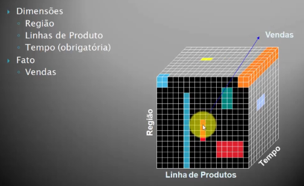
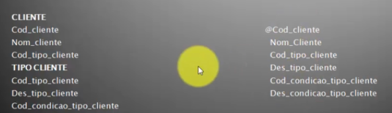
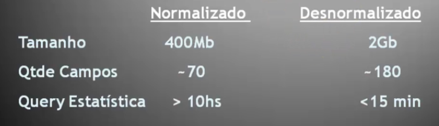
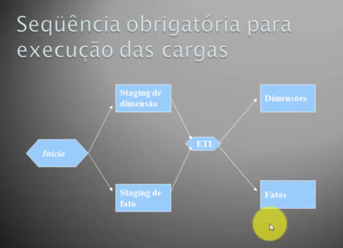

# 📝 Resumo

## 🔍 Índice
- [Competências Aplicadas](#-competências-aplicadas)
- [Exercícios](#-exercícios)
- [Evidências](#%E2%80%8D-evidências)
- [Desafio da Sprint](#-desafio-da-sprint)
- [Certificados](#-certificados)

## 🧠 Competências aplicadas
- Modelagem dimensional para Data Warehouse (fato, dimensão, granularidade)
- Construção e arquitetura de Data Warehouse (DW)
- Entendimento de OLTP vs OLAP (transacional vs analítico)
- Definição de métricas e indicadores de negócio (KPIs)
- Processos de ETL (extração, transformação e carga de dados)
- Organização de dados em Staging Area
- Aplicação de operações OLAP (Drill Down, Slice and Dice, Ranking)
- Tabelas fato e dimensões (incluindo SCD tipos 1 e 2)
- Desnormalização de dados para performance analítica
- Modelagem de dados multidimensionais (cubo)
- Estruturação de hierarquias (tempo, geografia, etc.)

## 💠 Curso: Modelagem Desafio
### Modelagem de Dados para Data Warehouse
#### Model Data Ware House - Arquitetura e Construção:

- **O que é Data Warehouse?**  
    É um repositório central dos dados da organização com o objetivo de prover suporte à decisão. Uma vez que o DW for construído, tudo parte do DW para tomar decisões.  
    É `Orientado por assunto`, onde contêm informações sobre os processos de negócio da empresa.  
    É `Não Volátil`, onde permite apenas a carga de novos dados e consultas.  
    É `Variável no tempo`, onde contém dados não atualizáveis que se referem a algum momento específico.
    Considerado o único ambiente `integrado` da organização, contendo dados em um estado uniforme, ou seja, existe uma consistência entre nomes, unidades de memória e etc.

- **Objetivos**  
    - Tornar a informação mais acessível e consistente para toda a organização.  
    - Ser uma fonte segura para proteger a informação da empresa.
    - Deve ser a base para a tomada de decisão.

- **Fatores críticos para o sucesso**  
    - Alta direção como patrocinadora do projeto. Se o Administrativo não quiser, não terá um DW.
    - Escolha de consultoria adequada e experiente.
    - Criação de equipe interna efetiva.
    - Utilização de campanhas culturais diversas.
    - Documentação.
    - Escolha de ferramentas adequadas.

- **Ferramentas de Mercado para tomada de decisão**  
    - Open Source:
        - Jmagallanes
        - Pentaho
        - Talend (ETL)
    - Proprietárias:
        - Power BI
        - Tableau
        - Microstrategy
        - Qlik View e Qlik Sense
        - Cognos
        - SAP BW
        - ODI - ORACLE (ETL)
        - OBIEE

- **Processo de construção de Data Warehouse**  
    - Perguntas que desejam respostas:
        - Como irei transferir os dados da base operacional para a base gerencial (Data Warehouse)
        - É apenas copiar os dados ou necessito compreender o modelo de dados que serão armazenados?
        - O modelo de dados do Data Warehouse é como se estivéssemos modelando para base de dados relacional?
    
- **OLTP vs OLAP**
    - **OLTP**:    
        Significa `On Line Transactional Processing`(processamento 'on line' de transações).  
        São processamentos que executam as operações do dia-a-dia da organização. Ênfase ao suporte do negócio, através de um processamento rápido, acurado e eficiente dos dados, ex: movimento bancário.  
        Um Modelo Relacional de banco de dados é um modelo OLTP.

    - **OLAP**:  
        Significa `On Line Analytical Processing` (processamento 'on line' de análise).  
        É para múltiplas respostas, um modelo flexível. Processamentos que suportam a tomada de decisões.  
        Permite analisar tendências e padrões em grande quantidade de dados, como ao longo do tempo (histórico) e em diferentes localizações (geográficos).  
        Conhecido como modelo de cubo (modelo multidimensional) ao qual ele pré-processa a estrutura e as informações.  
        Cada célula do cubo pode conter outro cubo (meta cubo).  
        Guarda o histórico dos dados.
            
    - Diferenças:
    
        | OLAP | OLTP |
        |:-:|:-:|
        |orientados ao assunto|dados orientados à aplicação
        |snapshots|última versão dos dados
        |somente para leitura|dados atualizáveis
        |não tão crítico|desempenho é fator crítico
        |orientado a conjunto|acesso orientado a linha
        |dados históricos|dados voláteis
        |disponibilidade não tão alta|alta disponibilidade
        |redundância gerenciada|ausência de redundância

- **Operações OLAP**
    - `Ranging`: uma montagem de consulta. Uma consulta comum.
    - `Ranking`: Associado à classificação, ordenar. Permite a classificação de uma dimensão através de um fato. Aplica-se para saber os maiores ou os menores. Exemplo: TOP(contribuinte, ICMS, 5), retorna os 5 maiores contribuintes com valor de ICMS.
    - `Drilling`: Procurar, escavar. Capacidade de navegar de dados resumidos para detalhados (mais específicos, nivel transacional). Ele permite analisar "por que" um número alto mudou, descendo em hierarquias como Ano > Mês > Dia ou Região > Loja > Vendedor.
    - `Slice and Dice`: Rotacionar linhas e colunas. Fatiar e Girar. Uma filosofia das ferramentas OLAP que permite ao usuário acessar todas as operações OLAP através da interface gráfica, sem precisar recorrer à linguagens de comando.

- **Construindo o DW**  
    - Fluxo: Matriz de Necessidades > Consolida os dados > Ferramenta OLAP e Data Discovery
    - Principais etapas do desenvolvimento (isso é cíclico):
        - 

Identificação dos indicadores

            Através do planejamento estratégico da organização, todas as informações de caráter estratégico e tático necessárias para apoio a tomada de decisão são identificadas.  
            A existência de um planejamento estratégico na organização agiliza esse processo de identificação dos indicadores, uma vez que já estão elaborados e são conhecidos por toda organização.
        

        - Transferir dados do operacional
        - 

Modelagem Dimensional

            O modelo dimensional de um DW tem como objetivo ser intuitivo para um administrador do negócio além de realizar consultas com alta performance.  
            `Dimensão:` informações descritivas relacionadas aos processos de negócio. Contém os descritores textuais do negócio. Representam objetos físicos do mundo real como locais, conceitos e etc. São os `eixos do cubo`. 
            - Ex: Tempo, produto, tipo de embalagem, Dados de empresa, cliente, produto, fornecedor.  

            `Tabela Fato`: Métricas dos processos de negócio que devem ser analisadas: 
            - Ex: vendas, faturamento, despesa, estoque.  

            `Fatos`: Termo utilizado para medição do negócio. Representam valores ou ocorrências de eventos. São as `células do cubo`, ou seja, a `interseção dos eixos`.
            - Exemplo: quantidade de produtos vendidos, preço de compra, preço de venda, lucro, etc.

            `Dados Multidimensionais`: Apenas relacionamentos 1:N ou N:N devem ser trazidos para o mundo multidimensional. Relacionamentos 1:1 geram esparcividade.  
            - Exemplo: Cliente e Sexo. Não pode ter duas dimensões (tabelas) separadas, pois um cliente só tem um sexo.  

        

        - ETL (carga)
        - Criação dos relatórios (ferramenta OLAP e Data Discovery)
        - Pós-implantação
    - Transferência dos dados do Operacional (Staging Area):
        - Staging Area também é chamada de Area auxiliar/Área fria
        - Serve como ponto unico para a carga efetiva no data warehouse
        - A cada carga seu conteúdo é limpo 
        - Fornece unicidade e performance para a carga
        - Evita acesso à produção em caso de recarga durante o dia
    - Identificando dimensões:  
    

    - **Construindo Tabela Dimensão**  
        - Fundamentos Básicos: Modelagem Dimensional
            - Desnormalização: anti-forma normal
            - Dimensões: chaves artificiais e histórico
            - Hierarquias
            - Fatos
            - Tempo
            - Granularidade do fato
            - Agregados
        - Desnormalização: Só a 1°FN deve ser respeitada. As demais FN obrigatoriamente devem ser desrespeitadas. A desnormalização simplifica o modelo, pois quem vai gerar as queries são as ferramentas OLAP e não uma pessoa, mas causa excesso de uso de disco.
            - Vantagens: excelente tempo de 'query response'
            - Exemplo:  
                
            - Diferenças:
                
        - Chaves Artificiais: Permite o controle de histórico dos dados seja facilmente implementado. Gera independência de relacionamento com outras tabelas. Devem ser apenas números e não carregar em si nenhum significado.

    - **Tipos de Dimensões**
        - `Slow Changing Dimensions`:  
            - Tipo 1: Sobrescrever os dados. O novo registro substitui o registro original. Só existe um registro no banco de dados: os dados atuais. Não mantém o histórico.  
            - Tipo 2: Controle de versão. Mantém o histórico. Um novo registro é adicionado na tabela de dimensão. Dois registros existentes no banco de dados: os dados atuais e dados da história anterior. Recomendável para 99% dos casos.
            - Tipo 3: Criação de Campos. Criar campos dinamicamente na tabela (em tempo de carga) para que os valores anteriores sejam guardados. Os dados originais são modificados para incluir novos dados. Um registro existe no banco de dados, novas informações são unidas com informações antigas na mesma linha. Aumenta o custo de manutenção. **Totalmente desaconselhável**.

        - `Fast Changing Monster Dimensions`:
            - Algumas dimensões que possuem grande volume de registros e muitos campos, crescem rapidamente, explodindo o espaço físico de armazenamento. **Solução**: Colocar campos que trocam de valores mais rapidamente em outra tabela, sem alterar a versão do registro.
            - Dimensões Degeneradas: Existem apenas como referência a uma entidade. São atributos de controle (como números de fatura, pedido ou transação) armazenados diretamente na tabela de fatos, sem possuir uma tabela de dimensão separada. Conceito criado por Ralph Kimball, agiliza a consulta e economiza armazenamento ao agrupar itens de transações sem adicionar complexidade desnecessária ao modelo estrela
                - Exemplo: Considere que uma tabela de fato com os itens das notas fiscais de uma empresa varejista. O que fazer com o numero da nota fiscal? Ele em si, não representa nada. Apenas serve para agrupar os itens de uma mesma compra. Não existe fisicamente uma dimensão nota fiscal, embora exista uma coluna da tabela de fatos com o número da nota propriamente dito.
            - Junk Dimensions: são agrupamentos de campos que não se encaixam em nenhuma dimensão
                - Exemplo: Pode ser um conjunto de Flags. A combinação de valores de cada flag é um elemento da dimensão. Um certo número de dimensões muito pequenas podem ser agrupados para formar uma única dimensão, uma dimensão lixo - os atributos são estreitamente relacionados.
            - Dimensão Ponte (Bridge Table): Uma tabela com chave composta capturando um relacionamento N:N (muitos-para-muitos) que não possa ser acomodado pela granualidade natural de uma tabela de fatos ou tabela de dimensão. Serve como uma ponte para a tabela de fatos e a tabela de dimensão de forma a permitir dimensões multivaloradas. Necessita
            - Hierarquias
                - Exemplo: País > Região > UF > Cidade  
                As tabelas de País, Região, UF e Cidade são armazenadas separadas no sistema fonte (normalizado). No DW elas compõe uma única tabela, a dimensão geografia. Cada nível de hierarquia deve ser representado individualmente.  
                Usada para Permitir Drill:  
                    - Drill Down: detalha a informação
                    - Drill Up: Sumariza a informação
                    - Drill Across: Muda de dimensão, mantém fato
                    - Drill Through: Vê registros do ambiente transacional que originaram aquele fato
            - Inteligência de Tempo: Um MDDB reconhece e geencia perfeitamente os diversos agrupamentos de tempo
                - Dia, Mês, Ano
                - Dia, Mês, Trimestre, Semestre, Ano
                - Dia, Mês, Estação, Ano
                - Dia, Semana
            O gerenciamento dos dados é automático ao lidarmos com o tempo.

    - **Tabela Fato**
        - Importante que a Tabela Fato tenha atributos que serão as Métricas e Chaves das dimensões que medem as métricas
        - Fato Aditivas (mais comum): todas as dimensões podem ser utilizadas para sumarizações
        - Fato Semi-Aditivas: Algumas dimensões podem ser utilizadas para sumarizações. Ex: Saldo bancário - faz sentido somar o seu saldo caso ele tenha conta em mais de um banco, mas não faz sentido somar seu saldo todos os dias.
        - Fato Não-Aditivas: Nenhuma dimensão pode ser utilizada para sumarização. Ex: % margem de lucro.
        - Tabelas Fato sem Fatos: Uma tabela que não tem fatos, captura alguns relacionamentos muitos-para-muitos entre chaves de dimensões.
            - Exemplo: uma tabela de fatos, tipicamente sem fatos, que registra todos os produtos que estão em promoção numa determinada loja, independentemente de ser vendidos ou não. Consulta: Quais produtos estavam em promoção, mas não venderam?
        - Grão: Conceito que identifica a unidade de medida das métricas. Nível de detalhe dos dados.
            - Menor Grão: Mais detalhe, mais dados, analise mais longa, informação mais detalhada, mais "grão" de dados.
            - Maior Grão: Menos detalhe, menos dados, análise mais rápida, informação menos detalhada, menos "grão" de dados.

        

# ✍ Exercícios
Não houve exercícios, apenas Desafio.

# 👁‍🗨 Evidências
Por não haver exercícios, consequentemente as únicas evidências são do Desafio, contidas na pasta dele.

# 🎯 Desafio da Sprint
O desenvolvimento do desafio da sprint e seus respectivos arquivos relacionados encontram-se em sua pasta, assim como seu README que fora usado para dissertar sobre os passos executados e resultados.
O Readme do Desafio foi dividido em etapas, seguindo a lógica proposta pela Compass e tais quais apresentam e explicam as resoluções utilizadas e os resultados obtidos:
- 📁[Pasta do Desafio](../Sprint-9/Desafio/)
- 📝[README do Desafio](../Sprint-9/Desafio/README.md)
    
# ✅ Certificados
Não houve certificados além da Udemy.